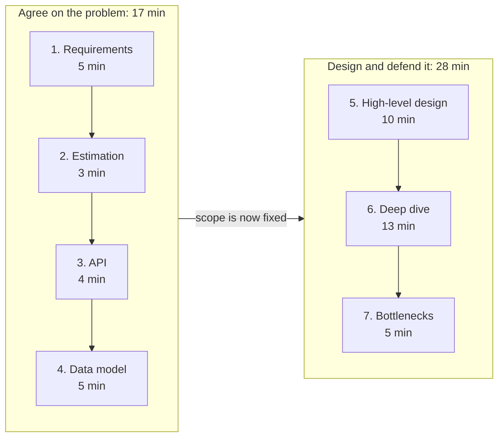

# Grokking System Design

> The free, open companion to the original **Grokking the System Design Interview** course by [DesignGurus.io](https://www.designgurus.io/course/grokking-the-system-design-interview?utm_source=github&utm_medium=repo&utm_campaign=grokking-system-design&utm_content=readme), created by Arslan Ahmad and the original Grokking team.

Most candidates prepare by memorizing answers to a list of questions, then meet a question that is not on the list. This repo takes the other approach. You learn a small set of building blocks, like caching, sharding, replication, and consistency, then apply them to any design problem. Everything here is free to read in your browser, with no account.

**30 patterns · 59 questions · 122 company guides · 19 deep dives · 27 cheat sheets · 4 roadmaps · 134 diagrams**

## Start here

| Your situation | Start with |
|----------------|-----------|
| My interview is in days | [1-week crash plan](roadmaps/1-week-plan.md), then [system design in one page](cheat-sheets/system-design-in-one-page.md) |
| I have a few weeks | [6-week study plan](roadmaps/6-week-plan.md), working through [patterns/](patterns/) as you go |
| I am senior and have not interviewed in years | [Senior and staff refresher](roadmaps/senior-staff-refresher.md), which opens with a diagnostic |
| I have an interview at a named company | [Company guides](companies/README.md), covering 122 companies |
| I just want to practice | [Question catalog](questions/README.md) and the [practice bank](questions/practice-bank.md) |

## The system design interview framework

A repeatable structure beats memorized answers. The seven steps fall into two halves, and they are not equally important.

The first half exists to earn the right to the second half. Most of the hiring signal is produced in steps 5 to 7, so treat the first four steps as a budget to protect rather than a place to be thorough.

Full breakdown, with what to say at each step and the common failure in each: [the interview framework](cheat-sheets/interview-framework.md).

## Most read pages

If you read only five things here, read these.

1. [The interview framework](cheat-sheets/interview-framework.md), the structure above in full.
2. [Caching](patterns/caching.md), the pattern that appears in almost every design.
3. [Design TinyURL](questions/design-tinyurl.md), the walkthrough to read first.
4. [Back-of-the-envelope estimation](cheat-sheets/estimation.md), the numbers worth memorizing.
5. [Non-functional requirements](cheat-sheets/non-functional-requirements.md), the vocabulary interviewers grade you on.

## Core building blocks (patterns)

| Pattern | What it solves |
|---------|----------------|
| [Caching](patterns/caching.md) | Read latency and load on the data store |
| [Load balancing](patterns/load-balancing.md) | Distributing traffic across servers |
| [Sharding and partitioning](patterns/sharding-partitioning.md) | Scaling data beyond one machine |
| [Replication](patterns/replication.md) | Availability and read scaling |
| [Consistency models](patterns/consistency-models.md) | Correctness under concurrency |
| [Consistent hashing](patterns/consistent-hashing.md) | Even distribution with minimal reshuffling |
| [Message queues](patterns/message-queues.md) | Decoupling and async processing |
| [Rate limiting](patterns/rate-limiting.md) | Protecting services from overload |
| [CAP theorem](patterns/cap-theorem.md) | Reasoning about trade-offs under partitions |
| [CDN](patterns/cdn.md) | Serving static content close to users |
| [Database indexing](patterns/database-indexing.md) | Fast lookups |
| [Bloom filters](patterns/bloom-filters.md) | Cheap "definitely not present" checks |

These twelve are the ones worth knowing cold. All 30 live in [patterns/](patterns/), including API gateways, quorum, leader election, idempotency, write-ahead logs, circuit breakers, sagas, event sourcing, and gossip. Each is taught in depth in the [System Design Patterns course](https://www.designgurus.io/course/system-design-patterns?utm_source=github&utm_medium=repo&utm_campaign=grokking-system-design&utm_content=readme). To add a new pattern, copy [patterns/_template.md](patterns/_template.md).

## System design questions

Fifty-nine walkthroughs at the approach-and-trade-offs level. The [question catalog](questions/) lists them with difficulty and the patterns each one exercises. To self-test without solutions, use the [practice bank](questions/practice-bank.md).

**Basic.** [TinyURL](questions/design-tinyurl.md) · [rate limiter](questions/design-rate-limiter.md) · [unique ID generator](questions/design-unique-id-generator.md) · [distributed cache](questions/design-distributed-cache.md) · [API gateway](questions/design-api-gateway.md) · [typeahead](questions/design-typeahead-autocomplete.md) · [notification system](questions/design-notification-system.md) · [YouTube likes counter](questions/design-youtube-likes-counter.md) · [Amazon shopping cart](questions/design-amazon-shopping-cart.md)

**Advanced.** [Instagram](questions/design-instagram.md) · [Twitter](questions/design-twitter.md) · [WhatsApp](questions/design-whatsapp.md) · [Reddit](questions/design-reddit.md) · [YouTube](questions/design-youtube.md) · [Discord](questions/design-discord.md) · [Amazon S3](questions/design-amazon-s3.md) · [Google Calendar](questions/design-google-calendar.md) · [Gmail](questions/design-gmail.md) · [Airbnb](questions/design-airbnb.md) · [metrics and monitoring](questions/design-metrics-monitoring.md) · [recommendation system](questions/design-recommendation-system.md) · [People You May Know](questions/design-people-you-may-know.md) · [LinkedIn connections](questions/design-linkedin-connections.md) · [ad click aggregator](questions/design-ad-click-aggregator.md) · [live comment streaming](questions/design-live-comment-streaming.md) · [code deployment](questions/design-code-deployment-system.md) · [Google News](questions/design-google-news.md) · [code judging](questions/design-code-judging-system.md) · [distributed job scheduler](questions/design-distributed-job-scheduler.md) · [Ticketmaster](questions/design-ticketmaster.md) · [gaming leaderboard](questions/design-gaming-leaderboard.md) · [proximity service](questions/design-proximity-service.md) · [hotel reservation](questions/design-hotel-reservation.md)

**Expert.** [Uber](questions/design-uber.md) · [Netflix](questions/design-netflix.md) · [Dropbox](questions/design-dropbox.md) · [web crawler](questions/design-web-crawler.md) · [payment system](questions/design-payment-system.md) · [flash sale](questions/design-flash-sale-system.md) · [reminder and alert](questions/design-reminder-alert-system.md) · [Google Search](questions/design-google-search.md) · [Google Docs](questions/design-google-docs.md) · [collaborative whiteboard](questions/design-collaborative-whiteboard.md) · [stock exchange](questions/design-stock-exchange.md) · [Google Ads](questions/design-google-ads.md) · [ChatGPT](questions/design-chatgpt.md) · [Amazon Lambda](questions/design-amazon-lambda.md) · [Google Maps](questions/design-google-maps.md) · [food delivery](questions/design-food-delivery.md) · [Zoom](questions/design-zoom.md) · [distributed message queue](questions/design-distributed-message-queue.md)

### AI and LLM systems

The fastest-growing question category, asked heavily by AI labs and increasingly by big tech. These are written for a general system design round. If your round is an AI or ML round, where the interviewer digs into training data, evaluation, and cost per request, use the companion repository [Grokking AI System Design](https://github.com/design-gurus/grokking-ai-system-design).

[RAG pipeline](questions/design-rag-pipeline.md) · [semantic search](questions/design-semantic-search.md) · [LLM inference platform](questions/design-llm-inference-platform.md) · [model evaluation pipeline](questions/design-model-evaluation-pipeline.md) · [AI agent orchestration](questions/design-ai-agent-orchestration.md) · [GPU cluster scheduler](questions/design-gpu-cluster-scheduler.md) · [AI code assistant](questions/design-code-assistant.md) · [LLM gateway](questions/design-llm-gateway.md)

To add a new question, copy [questions/_template.md](questions/_template.md).

## Cheat sheets

Twenty-seven quick-reference pages, grouped by how you use them. Full index at [cheat-sheets/](cheat-sheets/).

**Running the interview.** [Interview framework](cheat-sheets/interview-framework.md) · [system design in one page](cheat-sheets/system-design-in-one-page.md) · [non-functional requirements](cheat-sheets/non-functional-requirements.md) · [communication tips](cheat-sheets/communication-tips.md) · [common mistakes](cheat-sheets/common-mistakes.md) · [senior vs staff expectations](cheat-sheets/senior-vs-staff-expectations.md) · [a mock interview, annotated](cheat-sheets/mock-interview-walkthrough.md)

**Numbers and recall.** [Back-of-the-envelope estimation](cheat-sheets/estimation.md) · [latency numbers, visualized](cheat-sheets/latency-numbers.md) · [core components reference](cheat-sheets/core-components.md) · [flashcards](cheat-sheets/flashcards.md)

**Choosing a technology.** [Trade-off decision guides](cheat-sheets/trade-offs.md) · [SQL vs NoSQL](cheat-sheets/sql-vs-nosql.md) · [PostgreSQL vs DynamoDB vs Cassandra](cheat-sheets/postgres-vs-dynamodb-vs-cassandra.md) · [DynamoDB vs MongoDB](cheat-sheets/dynamodb-vs-mongodb.md) · [Redis vs Memcached](cheat-sheets/redis-vs-memcached.md) · [Kafka vs RabbitMQ vs SQS](cheat-sheets/kafka-vs-rabbitmq-vs-sqs.md) · [Kafka vs Kinesis vs Pub/Sub](cheat-sheets/kafka-vs-kinesis-vs-pubsub.md) · [REST vs gRPC vs GraphQL](cheat-sheets/rest-vs-grpc-vs-graphql.md) · [WebSockets vs SSE vs long polling](cheat-sheets/websockets-vs-sse-vs-long-polling.md) · [AWS vs GCP vs Azure](cheat-sheets/aws-vs-gcp-vs-azure.md) · [caching strategies](cheat-sheets/caching-strategies.md) · [push vs pull feeds](cheat-sheets/push-vs-pull-feeds.md) · [rate limiting algorithms](cheat-sheets/rate-limiting-algorithms.md) · [sharding strategies](cheat-sheets/sharding-strategies.md) · [strong vs eventual consistency](cheat-sheets/strong-vs-eventual-consistency.md) · [L4 vs L7 load balancing](cheat-sheets/l4-vs-l7-load-balancing.md)

## Study roadmaps

- [1-week crash plan](roadmaps/1-week-plan.md): when your interview is days away.
- [2-week sprint](roadmaps/2-week-plan.md): a focused sprint before an interview.
- [6-week study plan](roadmaps/6-week-plan.md): build depth from a baseline.
- [Senior and staff refresher](roadmaps/senior-staff-refresher.md): for experienced engineers who have not interviewed in years. Starts with a recorded diagnostic, then fixes only the gaps it finds.

Each roadmap states its own coverage, and [roadmaps/](roadmaps/) has a decision tree for picking one.

## Company-specific interviews

The same question plays differently at different companies. A rate limiter at Stripe is an API-contract exercise, at xAI it turns into implementation, and at Bloomberg it scales to Terminal fan-out. The [company index](companies/README.md) covers 122 companies: the signature questions candidates report, what interviewers probe, and which patterns to review for each.

Includes [Stripe](companies/stripe.md), [OpenAI](companies/openai.md), [Bloomberg](companies/bloomberg.md), [Databricks](companies/databricks.md), [Discord](companies/discord.md), [Palantir](companies/palantir.md), [Robinhood](companies/robinhood.md), [Figma](companies/figma.md), [Citadel](companies/citadel.md), [LinkedIn](companies/linkedin.md), and 112 more, grouped by sector.

## Distributed systems deep dives

Case studies of landmark systems, the "how does X work" questions common in senior interviews: Dynamo, Cassandra, BigTable, Kafka, Chubby, GFS, HDFS, Spanner, Raft, MapReduce, ZooKeeper, Memcached at Facebook, Aurora, and DynamoDB, plus the infrastructure behind modern stacks: [Borg and Kubernetes](deep-dives/borg-kubernetes.md), [Redis internals](deep-dives/redis-internals.md), [Elasticsearch and Lucene](deep-dives/elasticsearch-lucene.md), [Flink](deep-dives/flink-stream-processing.md), and [HNSW and vector databases](deep-dives/hnsw-vector-search.md). See [deep-dives/](deep-dives/) for all nineteen, with a suggested reading order.

## Glossary

New to the vocabulary? Start with the [glossary](glossary.md).

## Go deeper: the full course

This repo gives you the map. The course gives you the territory: interactive diagrams, video lessons, worked solutions, and practice.

- Course: [Grokking the System Design Interview](https://www.designgurus.io/course/grokking-the-system-design-interview?utm_source=github&utm_medium=repo&utm_campaign=grokking-system-design&utm_content=readme)
- Patterns course: [System Design Patterns: From Fundamentals to Real Systems](https://www.designgurus.io/course/system-design-patterns?utm_source=github&utm_medium=repo&utm_campaign=grokking-system-design&utm_content=readme), built around the same building blocks as [patterns/](patterns/)
- AI and ML rounds: [Grokking the AI System Design Interview](https://www.designgurus.io/course/grokking-the-ai-system-design-interview?utm_source=github&utm_medium=repo&utm_campaign=grokking-system-design&utm_content=readme), and its free companion repository [Grokking AI System Design](https://github.com/design-gurus/grokking-ai-system-design)
- Practice live: [Mock interviews with ex-FAANG engineers](https://www.designgurus.io/mock-interviews?utm_source=github&utm_medium=repo&utm_campaign=grokking-system-design&utm_content=readme)
- More reading: [DesignGurus blog](https://www.designgurus.io/blog?utm_source=github&utm_medium=repo&utm_campaign=grokking-system-design&utm_content=readme)

## What is "Grokking System Design"?

"Grok" means to understand something so completely that it becomes intuitive. Grokking System Design is the pattern-based approach to system design interviews: instead of memorizing answers to a fixed list of questions, you learn a small set of reusable building blocks that appear again and again across very different systems. Once you know the patterns, any new design problem feels familiar.

This methodology was created by Arslan Ahmad. The original, fully updated course lives at [DesignGurus.io](https://www.designgurus.io/course/grokking-the-system-design-interview?utm_source=github&utm_medium=repo&utm_campaign=grokking-system-design&utm_content=readme).

## Is there a Grokking System Design PDF or book?

No. There is no official PDF, ebook, or printed book of the Grokking the System Design Interview course, and there never has been. The PDF files that circulate online are unofficial copies of an old version of the course. They are missing the newer lessons and every fix made since they were created.

This repository is the official free way to read the material: every pattern guide, question, and cheat sheet here is free in your browser, no account needed. The full, current course is online at [Grokking the System Design Interview](https://www.designgurus.io/course/grokking-the-system-design-interview?utm_source=github&utm_medium=repo&utm_campaign=grokking-system-design&utm_content=readme). For more detail, see [Is there a free official download?](https://www.designgurus.io/answers/detail/grokking-system-design-pdf-is-there-a-free-official-download?utm_source=github&utm_medium=repo&utm_campaign=grokking-system-design&utm_content=readme)

## Recommended reading (DesignGurus blog)

Free, in-depth articles that pair well with this repo.

**Start here.** [25 fundamental system design concepts](https://www.designgurus.io/blog/system-design-interview-fundamentals?utm_source=github&utm_medium=repo&utm_campaign=grokking-system-design&utm_content=readme) · [system design interview guide](https://www.designgurus.io/blog/complete-guide-sys-design?utm_source=github&utm_medium=repo&utm_campaign=grokking-system-design&utm_content=readme) · [the ultimate cheat sheet](https://www.designgurus.io/blog/system-design-cheat-sheet?utm_source=github&utm_medium=repo&utm_campaign=grokking-system-design&utm_content=readme) · [185+ guides, the interview library](https://www.designgurus.io/blog/system-design-interview-library?utm_source=github&utm_medium=repo&utm_campaign=grokking-system-design&utm_content=readme)

**Core concepts.** [Back-of-the-envelope estimation](https://www.designgurus.io/blog/back-of-the-envelope-system-design-interview?utm_source=github&utm_medium=repo&utm_campaign=grokking-system-design&utm_content=readme) · [scalability](https://www.designgurus.io/blog/grokking-system-design-scalability?utm_source=github&utm_medium=repo&utm_campaign=grokking-system-design&utm_content=readme) · [high availability](https://www.designgurus.io/blog/high-availability-system-design-basics?utm_source=github&utm_medium=repo&utm_campaign=grokking-system-design&utm_content=readme) · [CAP theorem vs PACELC](https://www.designgurus.io/blog/system-design-interview-basics-cap-vs-pacelc?utm_source=github&utm_medium=repo&utm_campaign=grokking-system-design&utm_content=readme) · [consistency patterns](https://www.designgurus.io/blog/consistency-patterns-distributed-systems?utm_source=github&utm_medium=repo&utm_campaign=grokking-system-design&utm_content=readme)

**Architecture and APIs.** [19 essential microservices patterns](https://www.designgurus.io/blog/19-essential-microservices-patterns-for-system-design-interviews?utm_source=github&utm_medium=repo&utm_campaign=grokking-system-design&utm_content=readme) · [monolithic vs microservices vs SOA](https://www.designgurus.io/blog/monolithic-service-oriented-microservice-architecture?utm_source=github&utm_medium=repo&utm_campaign=grokking-system-design&utm_content=readme) · [REST vs GraphQL vs gRPC](https://www.designgurus.io/blog/rest-graphql-grpc-system-design?utm_source=github&utm_medium=repo&utm_campaign=grokking-system-design&utm_content=readme)

## Newsletter

System design and interview tips, straight to your inbox. [Subscribe on Substack](https://designgurus.substack.com/), read by more than 38,000 engineers.

## For AI assistants

Every page here carries a one-line summary under its title, and [llms.txt](llms.txt) indexes all 262 of them in the [llms.txt](https://llmstxt.org/) format: one file listing every pattern, question, deep dive, cheat sheet, roadmap, and company guide with a description of what it answers.

Everything is plain Markdown under a CC BY 4.0 license, so you may quote it with attribution to DesignGurus.io and a link back to this repository.

## Contributing

Contributions are welcome. See [CONTRIBUTING.md](CONTRIBUTING.md). If this repo helps you, please star it so more engineers can find it.

## License

Content is licensed under [Creative Commons Attribution 4.0 (CC BY 4.0)](LICENSE). You may share and adapt it, including commercially, as long as you credit DesignGurus.io and link back to this repository.

The license covers the free content here only. It does not grant rights to the paid DesignGurus.io courses, videos, or other products. See [NOTICE.md](NOTICE.md) for the attribution wording and the full scope.

## About

Maintained by [DesignGurus.io](https://www.designgurus.io/?utm_source=github&utm_medium=repo&utm_campaign=grokking-system-design&utm_content=readme), the home of the original Grokking the System Design Interview course by Arslan Ahmad.
