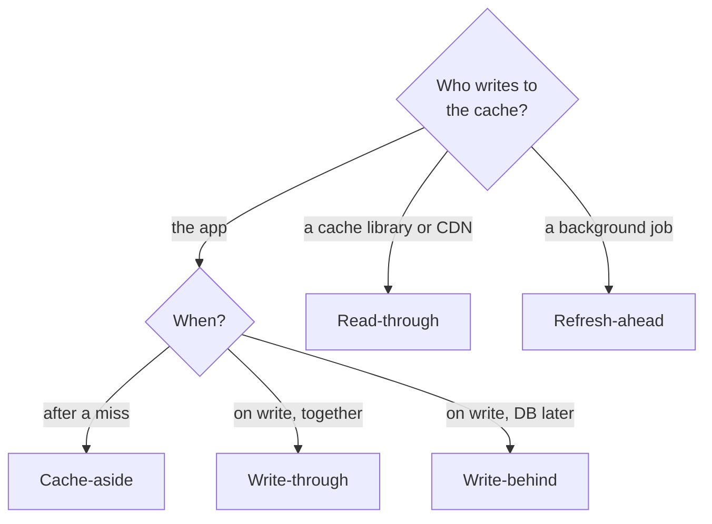

# Caching strategies

> Five ways to keep a cache and a database consistent, and the one question that picks between them.

Which part of your system writes to the cache, and when, is the whole decision behind cache-aside, read-through, write-through, write-behind, and refresh-ahead. Each name puts a different component in charge of the cache. (The [caching pattern](../patterns/caching.md) explains how a cache works; this sheet is the decision.)

## Quick comparison

| Dimension | Cache-aside | Read-through | Write-through | Write-behind | Refresh-ahead |
|-----------|-------------|--------------|---------------|--------------|---------------|
| Who fills it | Your app, on a miss | The cache, on a miss | The writer | The writer | A background job |
| Write path | Database, then delete the key | Same, writes stay separate | Cache and database at once | Cache now, database later | Not a write strategy |
| First read | Slow (a miss) | Slow (a miss) | Fast if written first | Fast | Fast if the guess is right |
| Write latency | Database plus a delete | Depends on the write path | Database plus cache | Cache only | Unchanged |
| Data loss risk | None | None | None | Real, on a node crash | None |
| Staleness | Until expiry or delete | Until expiry or delete | Low | Database readers see old data | Low |
| Fits | Most systems | Libraries, CDNs | Small, hot, exact data | Counters, view counts | Popular, steady keys |
| Gotcha | Stale-on-write race | Same race, hidden | Two writes, not atomic | Lost writes | Wasted refreshes |

## The one-question shortcut

Ask: who writes to the cache, and when?

- The application, after a read miss → cache-aside.
- A cache library or a CDN, on a miss → read-through.
- The writer, updating cache and database in one step → write-through.
- The writer, updating the cache now and the database later → write-behind.
- A background job, before the key expires → refresh-ahead. Add it on top of the others.

## How to choose

Start from the write path, not from the cache product:

**Cache-aside (lazy loading).** The default. Right when reads repeat and most data is cold. Wrong when a miss is very expensive and many clients want the same key at once.

**Read-through.** The cache does the loading, so your code only calls the cache. Right when a library or a CDN already offers it. Wrong when you need custom loading rules, because you hand that control away.

**Write-through.** Write the cache and the database on the same write, so a later read is not stale. The two writes are not atomic, so decide what happens when the second one fails. Right for small, hot, correctness-sensitive data such as feature flags. Wrong for write-heavy data, because you pay to cache values nobody reads.

**Write-behind (write-back).** Write the cache, return, and flush to the database later. Right for counters and metrics, where losing a few seconds of updates costs little. Wrong for money, orders, or anything you must never lose.

**Refresh-ahead.** A cached value carries a time to live (TTL), the seconds it may survive. Refresh-ahead reloads a key in the background shortly before that TTL ends. Right for a small set of popular keys with steady traffic. Wrong for many rare keys, because you refresh values nobody asks for.

## What interviewers probe

- The stale-on-write race. A reader misses and reads the old row. A writer then updates the row and deletes the key. The slow reader stores the old value, and it stays until the TTL ends. Fixes: short TTLs, or versioned keys.
- Delete, do not update, on write. Two writers updating the cache can land in the wrong order. Deletes are idempotent, so their order does not matter.
- The cache miss storm (thundering herd). One hot key expires and every request for it reaches the database in the same instant. Fixes: a per-key lock, jittered TTLs, or serving the stale value during a refresh.
- Why write-behind loses data. The write lives only in memory until the flush. If the node dies, those writes are gone. Say that before the interviewer does.
- Invalidation is the hard part. TTL is a guess about acceptable staleness. Ask what the product tolerates: 10 seconds on a feed is fine, 10 seconds on a price is not.
- Hot keys and cold starts. One celebrity key overloads a single node. [Consistent hashing](../patterns/consistent-hashing.md) spreads keys, not one key, so replicate that key or cache it in the process. After a restart, an empty cache sends every read to the database.

## How to talk about it in an interview

Do not say "I will add a cache". Say "product pages are read far more than they are written, so cache-aside with a 60 second TTL. On a write I delete the key rather than update it. View counts are written constantly and a small loss is fine, so that counter is write-behind and flushes every few seconds. The risk I accept is losing a few seconds of counts on a crash."

## Go deeper

- How a cache works: [caching pattern](../patterns/caching.md) and [CDN](../patterns/cdn.md)
- Picking the store: [Redis vs Memcached](redis-vs-memcached.md) and [latency numbers](latency-numbers.md)
- Real systems making these choices: [Redis internals](../deep-dives/redis-internals.md) and [Memcached at Facebook](../deep-dives/memcached-at-facebook.md)
- Questions that use this choice: [design a distributed cache](../questions/design-distributed-cache.md), [design Instagram](../questions/design-instagram.md)
- Every pattern, in depth: [System Design Patterns](https://www.designgurus.io/course/system-design-patterns?utm_source=github&utm_medium=repo&utm_campaign=grokking-system-design&utm_content=cheat-sheets-caching-strategies)
- Full course: [Grokking the System Design Interview](https://www.designgurus.io/course/grokking-the-system-design-interview?utm_source=github&utm_medium=repo&utm_campaign=grokking-system-design&utm_content=cheat-sheets-caching-strategies)
