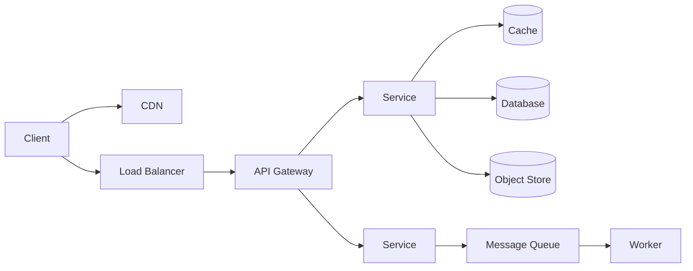

# Core components reference

> The building blocks you assemble in almost every design. What each one is, and when to reach for it.

## How they fit together

A typical request touches several of these:

## Routing and compute

| Component | What it is | When to use it | Learn more |
|-----------|------------|----------------|------------|
| Load balancer | Distributes traffic across servers | Any service running on more than one instance, for scaling and availability | [pattern](../patterns/load-balancing.md) |
| API gateway | A single entry point that handles routing, auth, and rate limiting | In front of many services, to centralize cross-cutting concerns | [walkthrough](../questions/design-api-gateway.md) |
| CDN | Edge servers that cache content close to users | Static assets, video, and global low latency | [pattern](../patterns/cdn.md) |
| Reverse proxy | Forwards client requests to backend servers | TLS termination, caching, and hiding backends behind one address | [load balancing](../patterns/load-balancing.md) |
| DNS | Resolves domain names to IP addresses | Directing users to the right or nearest servers | |

## Data stores

| Component | What it is | When to use it | Learn more |
|-----------|------------|----------------|------------|
| Cache | A fast in-memory store of copies | Read-heavy workloads, repeated reads, expensive queries | [pattern](../patterns/caching.md) |
| Relational database (SQL) | Structured data with joins and transactions | Strong consistency, complex queries, relationships | [SQL vs NoSQL](sql-vs-nosql.md) |
| Key-value store | Simple lookups by key | Sessions, caches, high write volume, simple access | [Dynamo](../deep-dives/dynamo-key-value-store.md) |
| Document store | Flexible, schemaless documents | Catalogs, user profiles, content | [SQL vs NoSQL](sql-vs-nosql.md) |
| Wide-column store | Sorted, partitioned rows at massive scale | Time series, very high write volume | [Cassandra](../deep-dives/cassandra-wide-column-db.md) |
| Object store | Durable blob storage by key | Large files, images, video, backups | [Design S3](../questions/design-amazon-s3.md) |
| Search index | An inverted index for full-text search | Search and autocomplete | [Design Google Search](../questions/design-google-search.md) |
| Graph database | Stores nodes and edges | Social graphs, relationship queries, recommendations | [People You May Know](../questions/design-people-you-may-know.md) |
| Time-series database | Optimized for timestamped data | Metrics, monitoring, and IoT | [Design metrics system](../questions/design-metrics-monitoring.md) |
| Data warehouse (OLAP) | A columnar store for analytics | Reporting and aggregations over huge datasets | |

## Messaging and delivery

| Component | What it is | When to use it | Learn more |
|-----------|------------|----------------|------------|
| Message queue | A buffer that decouples producers from consumers | Async work, smoothing spikes, fan-out | [pattern](../patterns/message-queues.md) |
| Event log / stream | An append-only, replayable log of events | High-throughput pipelines, event sourcing, stream processing | [Kafka](../deep-dives/kafka-distributed-messaging.md) |
| Stream processor | Processes event streams in real time | Real-time aggregation, ETL, and analytics | [Ad click aggregator](../questions/design-ad-click-aggregator.md) |

## Coordination and real-time

| Component | What it is | When to use it | Learn more |
|-----------|------------|----------------|------------|
| Coordination service | Distributed consensus, locks, and config | Leader election, service discovery, distributed locks | [Chubby](../deep-dives/chubby-distributed-locking.md) |
| Real-time gateway | Holds persistent client connections (WebSocket) | Chat, live updates, and presence | [Design WhatsApp](../questions/design-whatsapp.md) |

## How to use this in an interview

Name the component, say why it is there, and tie it to a requirement. Do not add a component unless something needs it. A clean design with five well-justified components beats a cluttered one with twelve.

## Go deeper

- Full course: [Grokking the System Design Interview](https://www.designgurus.io/course/grokking-the-system-design-interview)