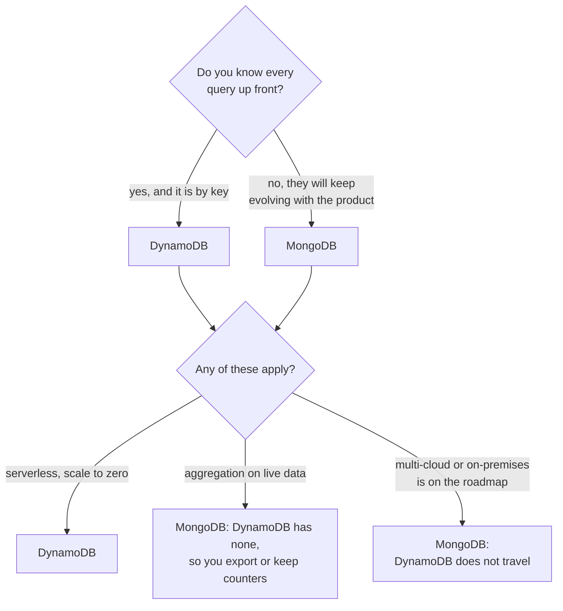

# DynamoDB vs MongoDB

How to choose between the two most-named NoSQL databases in interviews. They solve different problems: DynamoDB is a managed key-value store that demands you know your access patterns up front, and MongoDB is a document database that lets the queries evolve with the product.

## Quick comparison

| Dimension | DynamoDB | MongoDB |
|-----------|----------|---------|
| Data model | Items addressed by partition key plus optional sort key ([deep dive](../deep-dives/dynamodb-managed-nosql.md)) | Documents in collections |
| Query flexibility | Key access plus secondary indexes you declare up front | Ad hoc queries, secondary indexes, and the aggregation pipeline |
| Size limit | 400 KB per item | 16 MB per document |
| Transactions | Yes, capped in size, at extra capacity cost | Multi-document ACID transactions |
| Scaling | Automatic partitioning, effectively unbounded | Replica sets plus sharding; you choose the shard key |
| Consistency | Eventual by default, strong on request | Strong on the primary; secondaries serve stale reads unless configured |
| Hosting | AWS only | Anywhere: self-hosted, or Atlas on any cloud |
| Cost shape | Per request, or provisioned capacity; scales to zero | Cluster-based; capacity bills whether used or not |
| Operations | Zero | Atlas-managed, or self-run |

## The one-question shortcut

Ask: can you list every query the application will ever make?

- Yes → DynamoDB rewards you with single-digit-millisecond reads at any scale and zero operations.
- No, the product is still finding its shape → MongoDB. Ad hoc queries and the aggregation pipeline forgive what you did not predict.

## How to choose

One question decides most of it, and the rest are tie-breakers:

1. Access is by key, scale is huge or spiky, and you are on AWS → DynamoDB. Sessions, carts, profiles, feature flags ([shopping cart](../questions/design-amazon-shopping-cart.md) territory).
2. Content-shaped data with evolving queries (catalogs, profiles, user-generated content) → MongoDB. The document is the product entity, and you will keep inventing new queries against it.
3. Serverless architecture that should scale to zero → DynamoDB. Pay-per-request makes it the natural database for Lambda-shaped systems.
4. Aggregation and reporting on live data → MongoDB. DynamoDB has no aggregation; you either export the data or maintain counters yourself.
5. Multi-cloud or on-premises is on the roadmap → MongoDB. DynamoDB does not travel.

## What interviewers probe

- The access pattern trap: "the product team now wants to query by X." In DynamoDB that means a new global secondary index, declared and paid for. The strong answer enumerates access patterns before choosing keys.
- Hot partitions: both stores concentrate load when the key is skewed ([sharding](../patterns/sharding-partitioning.md)). A bad MongoDB shard key is expensive to change, so justify yours: high cardinality, even spread, matches the queries.
- The size limits: 400 KB items and 16 MB documents both punish unbounded arrays. Comments on a post belong in their own table or collection, not appended to the post forever.
- Consistency details: DynamoDB global tables resolve concurrent writes last-writer-wins, which silently drops one write. MongoDB reads from secondaries can be stale unless you tighten read concern.
- Cost at scale: per-request pricing is wonderful at low or spiky traffic and painful at constant high throughput; clusters are the reverse. Interviewers increasingly ask about cost as a design constraint.

## How to talk about it in an interview

Do not say "I need NoSQL, so MongoDB". Say "the cart is get-and-put by user id with spiky traffic, so DynamoDB on-demand: a known access pattern, zero operations, pay per request. The product catalog needs faceted filters and ad hoc queries, so it lives in MongoDB, or in [PostgreSQL](postgres-vs-dynamodb-vs-cassandra.md) if it is relational." Choose per workload, not per brand loyalty.

## Go deeper

- [DynamoDB deep dive](../deep-dives/dynamodb-managed-nosql.md), and its ancestor, the [Dynamo paper](../deep-dives/dynamo-key-value-store.md)
- The wider decision: [SQL vs NoSQL](sql-vs-nosql.md) and [PostgreSQL vs DynamoDB vs Cassandra](postgres-vs-dynamodb-vs-cassandra.md)
- Full course: [Grokking the System Design Interview](https://www.designgurus.io/course/grokking-the-system-design-interview?utm_source=github&utm_medium=repo&utm_campaign=grokking-system-design&utm_content=cheat-sheets-dynamodb-vs-mongodb)
