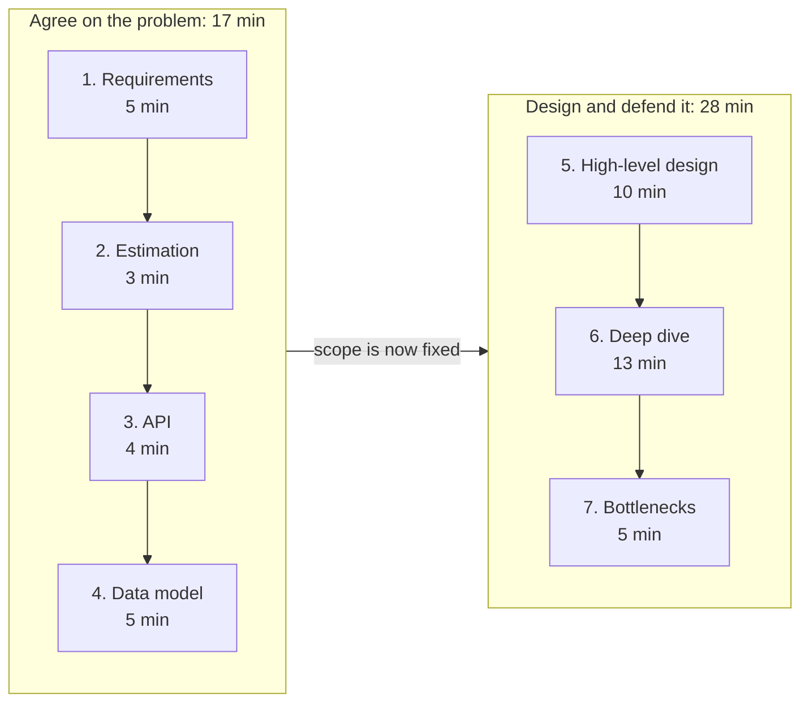

# The system design interview framework

A repeatable structure you can apply to any question. Memorize the steps, not the answers. Below is a common pacing for a 45-minute round.

| Step | What you do | Time |
|------|-------------|------|
| 1. Requirements and scope | Clarify functional and non-functional needs; agree what is in and out of scope | 5 min |
| 2. Estimation | Back-of-the-envelope traffic, storage, and bandwidth | 3 min |
| 3. API | Define the core endpoints | 4 min |
| 4. Data model | Entities, relationships, and the store that fits the access patterns | 5 min |
| 5. High-level design | Draw the main components and the request flow | 10 min |
| 6. Deep dive | Go deep on one or two components the interviewer cares about | 13 min |
| 7. Bottlenecks and trade-offs | Identify what breaks first at scale and how you would fix it | 5 min |

The seven steps fall into two halves, and they are not equally important:

The first half exists to earn the right to the second half. Most of the hiring signal is produced in steps 5 to 7, so treat the first four steps as a budget to protect rather than a place to be thorough.

## Step 1: Requirements and scope

- Functional: the core use cases (what the system must do).
- Non-functional: scale, latency, availability, consistency, durability. See [non-functional requirements](non-functional-requirements.md).
- Explicitly state assumptions and confirm scope before designing. This is a top signal interviewers look for.

Say the scope back before you move on: "So we are building the write path and the read path for one feed, we are ignoring spam and moderation, and we are optimizing for read latency over write latency. Is that the right problem?"

**The common failure:** asking a long list of clarifying questions and then designing as if none of the answers mattered. Every answer you get should change something you draw later. If it does not change anything, you did not need to ask it.

## Step 2: Estimation

Translate the scale into numbers: requests per second, read-to-write ratio, storage per year. Use round numbers. See the [estimation cheat sheet](estimation.md).

You are not being graded on arithmetic. You are being graded on whether the numbers change your design. Do the estimate, then say what it rules out: "That is about 4,000 reads per second, so a single database will serve this if reads are cached, and the interesting problem is the cache, not the shard count."

**The common failure:** spending four minutes on careful multiplication and then never referring to the result again.

## Step 3: API

Keep it small and clear. Name each endpoint with inputs and outputs. The API often reveals the data model.

Three or four endpoints is usually enough. Name the one write and the one read that carry the load, and mark which one is on the hot path.

## Step 4: Data model

Pick the store based on access patterns, not habit. Justify [SQL vs NoSQL](sql-vs-nosql.md).

List the queries the system must answer before you name a database. If every read is a lookup by one key, say so, because that single fact decides most of the argument. [PostgreSQL vs DynamoDB vs Cassandra](postgres-vs-dynamodb-vs-cassandra.md) is the concrete version of this decision.

## Step 5: High-level design

Draw boxes and arrows: clients, [load balancer](../patterns/load-balancing.md), services, stores, [caches](../patterns/caching.md), [queues](../patterns/message-queues.md). Walk the interviewer through one request end to end.

Draw the write path first, then the read path, then say which one is harder and why. Walking one real request from client to storage and back is worth more than a diagram with twelve boxes and no narration.

**The common failure:** adding components because they are common rather than because the requirements demand them. Every box you draw is a box you can be asked to defend.

## Step 6: Deep dive

Let the interviewer steer. Common deep dives: the hot read path, [data partitioning](../patterns/sharding-partitioning.md), the [consistency model](../patterns/consistency-models.md), or how you handle a specific failure.

This is the longest step and it carries the most signal. If the interviewer does not pick a direction, pick one yourself and say why: "The part of this that worries me is the fan-out on write, so let me go there unless you want something else."

Good deep dives usually go to one of four places: what happens when a component fails, what happens to the hot key or the celebrity user, how the data is partitioned as it grows, and what the system is allowed to get wrong for a moment.

## Step 7: Bottlenecks and trade-offs

Name the first bottleneck at scale and your fix. Reference patterns: [caching](../patterns/caching.md), [sharding](../patterns/sharding-partitioning.md), [replication](../patterns/replication.md), and [queues](../patterns/message-queues.md). Stating [trade-offs](trade-offs.md) out loud is what separates strong candidates.

Close by naming what you would fix first if the traffic grew ten times, and what you knowingly left out. A sentence like "I chose eventual consistency here, so a user can refresh and see the old value for a second, which is acceptable for a feed but would not be for an account balance" carries more weight than another component on the board.

## When you are behind on time

You will sometimes reach the 25-minute mark still drawing boxes. Do not try to finish every step. Skip forward, and say that you are doing it:

- Behind after step 1: give the estimate as one sentence with round numbers and move on.
- Behind after step 4: draw the high-level design and go straight to the deep dive. Steps 5 to 7 are where the signal is.
- Five minutes left and no deep dive yet: stop adding components, pick the riskiest one, and go deep on it out loud.

An unfinished design with one strong deep dive interviews better than a complete diagram with no depth anywhere.

## Adjusting the pacing

**A 60-minute round** usually adds time to the deep dive, not to the first half. Keep steps 1 to 4 at about 17 minutes and spend the extra time on step 6.

**By level:** the steps do not change, but who drives them does. At mid level the interviewer may hand you the scope. At senior you are expected to set it yourself. At staff you are expected to ask whether the stated problem is the right one. See [senior vs staff expectations](senior-vs-staff-expectations.md) for how the same answer is graded differently.

## Practice with this

- See the framework applied end to end in [an annotated mock interview](mock-interview-walkthrough.md), where two candidates answer the same question and only one of them gets hired.
- Then run it yourself against the [question catalog](../questions/), starting with [Design TinyURL](../questions/design-tinyurl.md).
- The errors that sink otherwise strong candidates are collected in [common mistakes](common-mistakes.md).

## Go deeper

- Short on time? [System Design Interview Crash Course](https://www.designgurus.io/course/system-design-interview-crash-course?utm_source=github&utm_medium=repo&utm_campaign=grokking-system-design&utm_content=cheat-sheets-interview-framework)
- Full course: [Grokking the System Design Interview](https://www.designgurus.io/course/grokking-the-system-design-interview?utm_source=github&utm_medium=repo&utm_campaign=grokking-system-design&utm_content=cheat-sheets-interview-framework)
