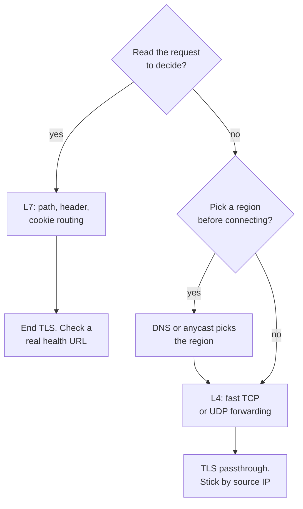

# L4 vs L7 load balancing

> Does the balancer need to read the request to decide where it goes? That one question settles it.

One choice: spread traffic by network address, or by what each request actually asks for. A load balancer spreads traffic over many servers. Layer 4 (the transport layer) forwards packets by IP address and port. Layer 7 (the application layer) reads the HTTP request, so it can route on the path, a header, or a cookie. DNS and anycast sit above both and pick which balancer you reach. (The [load balancing pattern](../patterns/load-balancing.md) explains how each works; this sheet is the decision.)

## Quick comparison

| Option | What it sees | Routes on | TLS | Health check | Classic gotcha |
|--------|--------------|-----------|-----|--------------|----------------|
| L4 (transport) | IP, port, TCP or UDP flow | Address and port | Passthrough, or reads only the SNI name | TCP connect, or an HTTP probe | A TCP-only check passes while the app returns errors |
| L7 (application) | The whole HTTP request | Path, host, header, cookie, method | Ends it: it must decrypt to read | Does GET /health return 200? | More work per request, so fewer per machine |
| DNS | Only the hostname | Region, or a list of addresses | None | Slow to react | Clients keep the old answer past the TTL |
| Anycast | Nothing above the network | Nearest announcement, by BGP | None | Network level only | A route change can move a live connection |

## The one-question shortcut

Ask: does the balancer need to read the request to decide where it goes?

- Yes → L7. Path routing, cookie stickiness, and per-request retries all need the content.
- No → L4. Any healthy server will do, so move the packets and stop there.
- The real question is "which region?" → DNS or anycast first, then L4 or L7 inside.

## How to choose

Start from the decision the balancer must make, not from the product name:

### L7 (application layer)

Right when the destination depends on the content. Send `/api/*` to the API pool and `/images/*` to the image pool, from one address.

Right when you want a canary release. Send 5% of requests to the new version, or route by a header your clients set.

Right when stickiness must follow the user, not the address. The balancer sets its own cookie, so it still tells users apart behind one office IP.

Wrong when the traffic is not HTTP. A raw database connection or a game over UDP gives an HTTP balancer nothing to parse.

Wrong when the traffic must stay encrypted from the client to the server. To read a request, the balancer must decrypt it first.

### L4 (transport layer)

Right when every server can serve every request. There is no decision to make, so do the cheap thing.

Right when you need many connections and the lowest added delay. L4 never decrypts, never parses HTTP, and never buffers a body.

Right for non-HTTP protocols, and for end to end TLS. With passthrough, the client and the server hold the encrypted session, and the balancer only moves bytes.

Wrong when you need content routing, per-request balancing, or a retry on another server.

Wrong when a TCP connect is your only health signal. The app can return 500 for every request while the port still accepts connections. Most L4 balancers can run an HTTP probe out of band, so configure one.

Stickiness at L4 is also coarse. It hashes the source IP, so users behind one office address land together. A phone that moves from Wi-Fi to mobile data lands somewhere new.

### DNS

Right for sending each user to the nearest region, and for taking a whole region out of service.

Wrong as fast failover. Clients cache the answer, and some ignore a short TTL, so a 60 second TTL does not mean everyone moves in 60 seconds.

### Anycast

One address is announced from many locations, and the network delivers to the closest one.

Right for dropping a failed location quickly, with no client change: withdraw the announcement. Wrong for picking a server: anycast knows nothing about load inside a location.

## What interviewers probe

- TLS placement: where do you end TLS, and is the hop to the backend encrypted again?
- Sticky sessions: why do you need them at all? Session state in [Redis](redis-vs-memcached.md) lets any server serve any user.
- Health checks: a deep check that queries the database can pull the whole fleet out when the database is slow.
- Connection versus request balancing: one HTTP/2 connection carries many requests, so L4 pins them all to one server and load goes uneven.
- The balancer's own failure: a paired setup, a health-checked virtual IP, or anycast.
- Where L7 stops and the [API gateway](../patterns/api-gateway.md) starts: auth and quotas sit in the gateway.

## How to talk about it in an interview

Do not say "I will put a load balancer in front". Say "anycast plus DNS sends the user to the nearest region. Inside the region, an L4 balancer fronts the WebSocket gateway, because there is no request to read and I want end to end TLS. The REST traffic goes through an L7 balancer, because I route `/api` and `/static` to different pools and retry idempotent requests."

## Go deeper

- Patterns behind this sheet: [load balancing](../patterns/load-balancing.md) and [proxies](../patterns/proxies.md)
- Questions that lean on this choice: [design an API gateway](../questions/design-api-gateway.md), [design WhatsApp](../questions/design-whatsapp.md)
- Every pattern, in depth: [System Design Patterns](https://www.designgurus.io/course/system-design-patterns?utm_source=github&utm_medium=repo&utm_campaign=grokking-system-design&utm_content=cheat-sheets-l4-vs-l7-load-balancing)
- Full course: [Grokking the System Design Interview](https://www.designgurus.io/course/grokking-the-system-design-interview?utm_source=github&utm_medium=repo&utm_campaign=grokking-system-design&utm_content=cheat-sheets-l4-vs-l7-load-balancing)
