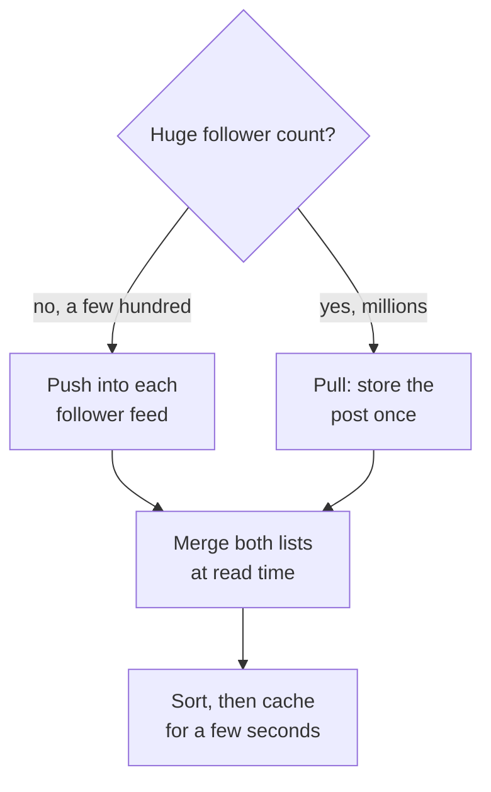

# Push vs pull feeds

Copying one new post out to everyone who should see it is called fan-out. The only real choice is when you pay for that work: write the post into every follower's feed at post time, or assemble the feed when a reader opens the app. Start from the ratio of reads to writes, then look at the largest follower count in the product. ([Design Twitter](../questions/design-twitter.md) and [design Instagram](../questions/design-instagram.md) work the full designs; this sheet is only the decision.)

## Quick comparison

| Dimension | Fan-out on write (push) | Fan-out on read (pull) | Hybrid |
|-----------|-------------------------|------------------------|--------|
| Where the work happens | At post time | At feed open time | Both, split by follower count |
| Write cost | One insert per follower | One insert in total | Small for normal accounts, one for big ones |
| Read cost | Read one ready list | Query every followed account, then merge | Read one list, merge a few live queries |
| Feed latency | One read of one ready list | Slower, grows with the reader's following count | Close to push |
| Storage | One feed row per follower | One row per post | Mostly push rows |
| A post by a huge account | Millions of inserts, minutes of delay | No extra write cost | Goes down the pull path |
| A new follow | Backfill the new follower's feed | Nothing to do | Backfill only the push part |
| Deletes and blocks | Remove rows from many feeds | Filter at read time | Filter at read time |
| Classic gotcha | You build feeds that nobody opens | Read traffic floods the post database | Merge order and cache freshness |

## The one-question shortcut

Ask: do you pay at write time or at read time?

- Reads are far more common than writes, and follower counts are normal (a few hundred) → push.
- Writes are frequent, or follower counts are enormous, and feeds are read rarely → pull.
- Both are true inside the same product → hybrid. Large products with a follower graph usually end up here.

Accounts with very large audiences are what force the answer. Any product with a follower graph has a few of them, and the push path breaks on exactly those accounts.

## How to choose

### Fan-out on write (push)

Fan-out means copying one post out to many feeds. Push does that work at post time. A background worker copies a pointer to the post into a feed list for every follower. Opening the app is then one read of one list.

This is right when reads greatly outnumber writes. A user posts a few times a day but opens the feed many times a day.

It is wrong for accounts with a very large audience. Here is the arithmetic, with one assumed number: say the feed store accepts 100,000 inserts per second. That rate is an input to the sum, not a measured limit of any product. An account with 100 million followers posts once, which is 100 million feed inserts, or about 1,000 seconds of writing. The last follower sees the post roughly 17 minutes after the first. Ten such posts in an hour and the write queue never drains.

### Fan-out on read (pull)

The post is stored once. When a reader opens the feed, the system asks each followed account for its recent posts. It then merges the results by time or by a ranking score.

This is right when writes are heavy and reads are rare. It is also right for accounts with huge follower counts, because posting costs one insert.

It is wrong as the only strategy. Use illustrative traffic: a reader follows 500 accounts, so one feed open costs 500 lookups. At 4,000 feed opens per second that is 2 million lookups per second on the post store. Your numbers will differ, but read cost always multiplies by the following count.

### The hybrid

Pick a follower threshold. Accounts below it are pushed, accounts above it are pulled. Ten thousand followers is a usable example, but treat it as a value you tune against measured write capacity. Products that run this split do not publish their number.

At read time the system reads the reader's ready-made feed, then queries the small number of large accounts that this reader follows. It merges the two lists, sorts them, and caches the result briefly, usually seconds rather than minutes. Most readers follow only a handful of large accounts, so the merge stays cheap.

## What interviewers probe

- Where the threshold sits, and what happens to an account that crosses it while posting.
- Ordering after the merge. Time order is simple, a ranking score is not, and both lists must be sorted together.
- Backfill when a user follows someone new, and cleanup when they unfollow or block.
- Feed length. Stored feeds are trimmed to a recent window, or storage grows without limit. A few hundred entries is typical, and the exact cap is a product decision.
- Inactive users. Skipping push for people who have not opened the app in weeks cuts write work sharply.
- The write path itself: fan-out runs in [message queues](../patterns/message-queues.md), not in the request, and needs [backpressure](../patterns/backpressure.md) when a big account posts.
- Hot keys. A popular account is a hot partition on read ([sharding](../patterns/sharding-partitioning.md)), which is why [caching](../patterns/caching.md) sits in front of it.

## How to talk about it in an interview

Say "I will push for ordinary accounts, because reads outnumber writes and a ready feed is one lookup. Accounts above a follower threshold get pulled, because one post from an account with 100 million followers is 100 million inserts and takes minutes to drain. I would set that threshold from measured write capacity and revisit it. At read time I merge the two lists, sort, and cache the page for a few seconds." Naming the threshold as a tuned value, and explaining the merge, is the senior signal. Choosing only push, or only pull, is the junior tell.

## Go deeper

- Questions built on this choice: [design Twitter](../questions/design-twitter.md), [design Instagram](../questions/design-instagram.md)
- A feed with no follower graph, where clustering and ranking replace fan-out: [design Google News](../questions/design-google-news.md)
- The feed store choice: [SQL vs NoSQL](sql-vs-nosql.md)
- Every pattern, in depth: [System Design Patterns](https://www.designgurus.io/course/system-design-patterns?utm_source=github&utm_medium=repo&utm_campaign=grokking-system-design&utm_content=cheat-sheets-push-vs-pull-feeds)
- Full course: [Grokking the System Design Interview](https://www.designgurus.io/course/grokking-the-system-design-interview?utm_source=github&utm_medium=repo&utm_campaign=grokking-system-design&utm_content=cheat-sheets-push-vs-pull-feeds)
