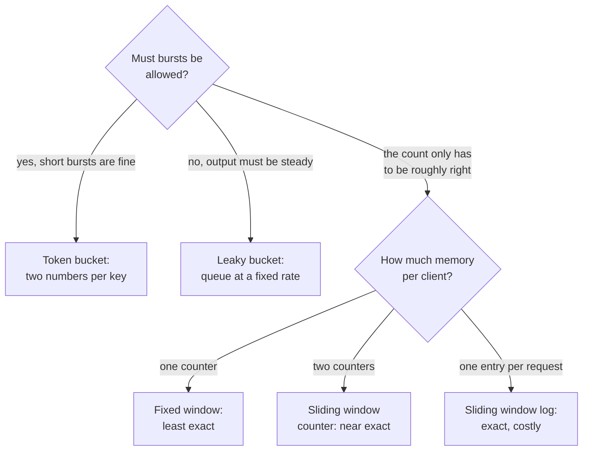

# Rate limiting algorithms

Which counting algorithm a rate limiter should use, decided by the burst you allow and the memory each client costs. Token bucket and leaky bucket shape traffic against a rate. The three window algorithms count events in a window instead. ([Rate limiting](../patterns/rate-limiting.md) covers what the pattern does and where it runs; this sheet is the choice between the five.)

## Quick comparison

| Algorithm | How it counts | Bursts | Exactness | Memory per client | Classic gotcha |
|-----------|---------------|--------|-----------|-------------------|----------------|
| Token bucket | Tokens refill at a set rate, one spent per request | Up to the bucket size | Good | Two numbers: tokens left, last refill time | A full bucket lets one big burst through |
| Leaky bucket | A queue that drains at a fixed rate | Absorbed, then smoothed | Good | A queue, or two numbers as a meter | Waiting adds delay, so callers may time out |
| Fixed window counter | One counter per client per window | Allowed at the wrong moment | Weakest | One counter | Twice the limit passes across a boundary |
| Sliding window log | A timestamp per allowed request | Only what the limit allows | Exact | One timestamp per request in the window | Memory grows with the limit and the traffic |
| Sliding window counter | Last window count blended with the current one | Small ones only | Close to exact | Two counters | It assumes the last window was even, so a late burst is undercounted |

## The one-question shortcut

Ask: do you need to allow bursts, and how much memory can you spend per client?

- Bursts are fine, memory is tight → token bucket. Two numbers per client.
- Output must be a steady rate → leaky bucket. It delays instead of rejecting.
- Bursts are fine, the count can be approximate → sliding window counter.
- The limit must be exact → sliding window log, and pay for it.
- You want the simplest thing → fixed window counter.

## How to choose

Start from the burst you can tolerate, then from the memory budget:

1. **Token bucket.** A bucket holds up to N tokens and refills at a set rate, say 10 per second up to a cap of 100. Each request spends one token, and a request with no token is rejected. This is the safe default. It is wrong when the service behind it cannot survive a burst: a cap of 100 means 100 requests at once.
2. **Leaky bucket.** Requests join a queue that drains at a fixed rate, so the output rate never changes. Use it when the thing behind the limiter needs flat input, like a paid third-party API. It is wrong for user-facing reads, because queued requests wait and the user sees a slow page, not a clear error. Written as a meter rather than a queue, it costs two numbers and rejects instead of delaying.
3. **Fixed window counter.** One counter per client per window, keyed like `user:11:01`, reset when the window changes. The boundary problem is real, and interviewers ask about it. With a limit of 100 per minute, a client sends 100 requests at 11:00:59 and 100 more at 11:01:00. The counter reset in between, so 200 passed inside about two seconds. Use it for rough abuse control, never for billing.
4. **Sliding window log.** Keep the timestamp of every allowed request, usually in a Redis sorted set. Per request, drop old timestamps, count the rest, compare to the limit. It is exact, because the window moves with the clock. It is also the expensive one. A limit of 100 per minute means up to 100 timestamps per active client, so a million active clients hold up to 100 million entries. Token bucket keeps two numbers per client, roughly 50 times fewer entries, though per-key overhead narrows the real memory gap. Pick it when the limit is a promise: paid quotas, legal caps, anything a customer can audit.
5. **Sliding window counter.** Keep the current window count and the previous one. Weight the previous count by how much of it still overlaps the moving window, then add the current count. If 25% of the last minute overlaps and it saw 80 requests, you count 20 from it plus the current minute. Two counters, no boundary doubling, an answer close to the true one. This is the usual production compromise.

## What interviewers probe

- The boundary case: they draw the 11:00:59 and 11:01:00 example and ask what your algorithm does.
- Distributed counting: 12 servers with 12 local counters allow 12 times the intended limit. Use a shared store, or split the budget per node.
- Races: read, add one, then write is not safe under load. Use an atomic increment or one Lua script.
- Store failure: if Redis is down, do you fail open (allow) or fail closed (reject)?
- Hot keys: one very active client sends all its counter traffic to a single shard ([sharding](../patterns/sharding-partitioning.md) applies here too).
- The response: HTTP 429 plus a `Retry-After` header, so clients back off.

## How to talk about it in an interview

Do not say "I will add a rate limiter". Say "the limit is 100 requests per minute per API key. Short bursts are fine, so token bucket: two numbers per key in Redis, updated by one atomic script. A fixed window would let 100 requests at 11:00:59 and 100 at 11:01:00 through, which is double the limit."

## Go deeper

- The pattern: [rate limiting](../patterns/rate-limiting.md), plus [backpressure](../patterns/backpressure.md) and the [API gateway](../patterns/api-gateway.md) where limits live
- The full question: [design a rate limiter](../questions/design-rate-limiter.md), and [design a flash sale system](../questions/design-flash-sale-system.md)
- Where the counters live: [Redis vs Memcached](redis-vs-memcached.md)
- Every pattern, in depth: [System Design Patterns](https://www.designgurus.io/course/system-design-patterns?utm_source=github&utm_medium=repo&utm_campaign=grokking-system-design&utm_content=cheat-sheets-rate-limiting-algorithms)
- Full course: [Grokking the System Design Interview](https://www.designgurus.io/course/grokking-the-system-design-interview?utm_source=github&utm_medium=repo&utm_campaign=grokking-system-design&utm_content=cheat-sheets-rate-limiting-algorithms)
