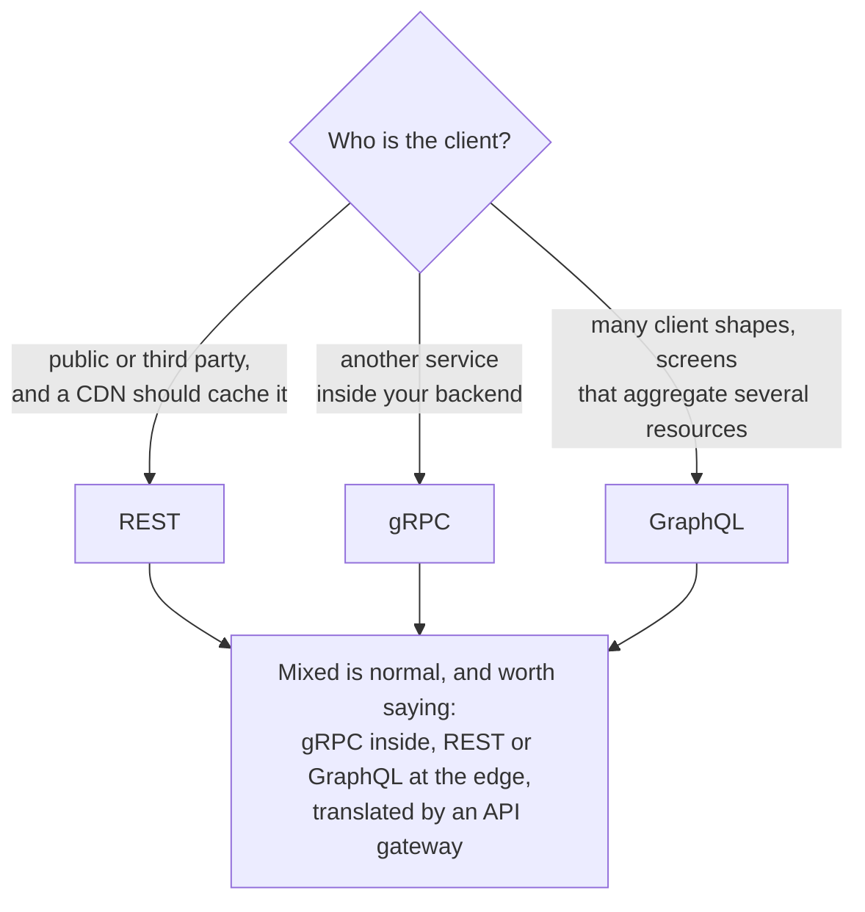

# REST vs gRPC vs GraphQL

How to choose an API style, and how to justify it in an interview. The decision is mostly about who the client is: a browser you do not control, a service you do, or a product team iterating on screens.

## Quick comparison

| Dimension | REST | gRPC | GraphQL |
|-----------|------|------|---------|
| Shape | Resources and verbs over HTTP/JSON | Typed RPC over HTTP/2 + Protobuf | One endpoint; clients query a typed schema |
| Payload | JSON (readable, verbose) | Binary Protobuf (compact, fast) | JSON, shaped exactly to the query |
| Contract | Loose (OpenAPI optional) | Strict (.proto files, codegen) | Strict (schema, introspection) |
| Streaming | No (workarounds: [SSE/WebSockets](../patterns/long-polling-websockets-sse.md)) | Native: server, client, bidirectional | Subscriptions (WebSocket-based) |
| Browser support | Universal | Poor (needs gRPC-Web proxy) | Good |
| Caching | Best: HTTP caching, CDNs work out of the box | Manual | Hard (POST to one endpoint defeats HTTP caching) |
| Failure surface | Simple | Simple | Query cost varies wildly per request |

## How to choose

The decision is mostly about who the client is:

1. Public-facing API, third-party consumers, or anything a CDN should [cache](../patterns/cdn.md) → REST. Ubiquity and HTTP semantics (status codes, caching, retries) are the feature.
2. Service-to-service inside your backend → gRPC. Typed contracts stop drift between teams, binary encoding cuts latency and cost, and streaming is native. This is the default answer for internal microservices.
3. Many client shapes (web, iOS, Android) hitting the same data, with screens that aggregate several resources → GraphQL. Clients fetch a screen in one round trip instead of six under-fetching REST calls, and frontend teams ship without waiting for new endpoints.
4. Mixed is normal and worth saying: gRPC between services, REST or GraphQL at the edge, translated by an [API gateway](../patterns/api-gateway.md).

## What interviewers probe

- N+1 and query cost in GraphQL: a nested query can fan out into thousands of database calls; answers are dataloaders (batching), depth/complexity limits, and persisted queries. Unbounded client queries are a denial-of-service surface ([rate limiting](../patterns/rate-limiting.md) by query cost, not request count).
- Versioning: REST versions URLs or headers; gRPC evolves .proto fields (never reuse field numbers); GraphQL deprecates fields and avoids breaking changes by design.
- Caching story: if the data is public and read-heavy, GraphQL's POST-shaped requests throw away the HTTP caching REST gets for free; that alone can decide the question.
- Streaming needs: realtime updates push you to gRPC streams internally or WebSockets/SSE at the edge, regardless of the request API.

## How to talk about it in an interview

Do not say "GraphQL is more modern than REST". Say "the mobile home screen aggregates user, feed, and notifications; under REST that is three round trips on a high-latency network, so GraphQL at the edge pays for itself. Internally, the feed service calls ranking and follow services on a hot path, so those are gRPC with proto contracts." Pick per boundary, and mention the operational cost you are taking on (GraphQL gateway complexity, gRPC's browser gap).

## Go deeper

- Free article: [REST vs GraphQL vs gRPC](https://www.designgurus.io/blog/rest-graphql-grpc-system-design?utm_source=github&utm_medium=repo&utm_campaign=grokking-system-design&utm_content=cheat-sheets-rest-vs-grpc-vs-graphql)
- Full course: [Grokking the System Design Interview](https://www.designgurus.io/course/grokking-the-system-design-interview?utm_source=github&utm_medium=repo&utm_campaign=grokking-system-design&utm_content=cheat-sheets-rest-vs-grpc-vs-graphql)