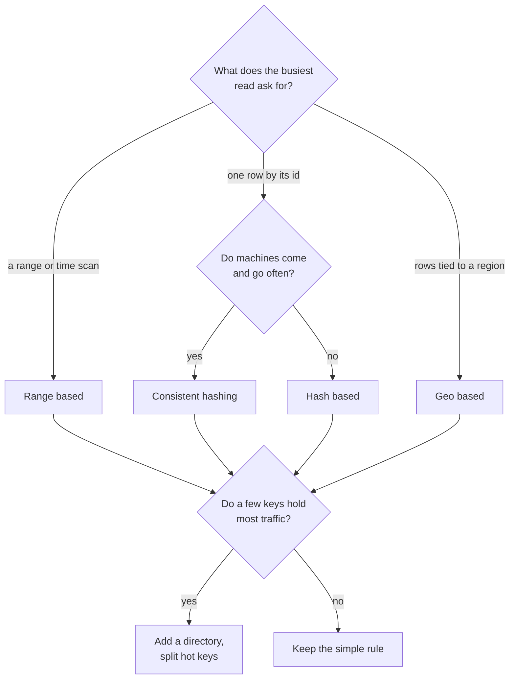

# Sharding strategies

How to split one dataset across many machines, and how to defend the choice in an interview. Sharding splits one dataset across many machines, and a machine can hold one shard or many. A strategy is the rule that maps a row to a shard, and it decides which queries stay fast and which fall apart. (The [sharding pattern page](../patterns/sharding-partitioning.md) covers the mechanics.)

## Quick comparison

| Strategy | Rule | Best for | Adding a shard | Main risk |
|----------|------|----------|----------------|-----------|
| Range based | Key ranges (A to F, G to M) | Range and time scans | Split one range | Newest range takes all writes |
| Hash based | hash(key) mod N | Point lookups, fixed shard count | Most rows move | Resharding cost |
| Consistent hashing | Key and node on a ring | Point lookups, changing machines | Roughly 1/N of keys move | Uneven load without virtual nodes |
| Directory based | A lookup table holds the mapping | A few keys hotter than the rest | Move any key you choose | The lookup service can go down |
| Geo based | Row lives near its users | Regional rules, regional latency | Add a region | Rows move when a user moves |

## The one-question shortcut

Ask: what do you shard on, and which query breaks when you choose wrong?

- Range or time scan → range based.
- Point lookup by id, fixed machine count → hash based.
- Point lookup by id, machines come and go → consistent hashing.
- A few keys hold most of the traffic → directory based, placed by hand.
- Law or latency ties rows to a region → geo based.

## How to choose

**Range based.** Rows are cut into ordered ranges, and each range is one shard. It is right when reads ask for a span: orders from last week, logs from one hour. It is wrong when the key only grows. Shard by timestamp and every write lands on the newest shard while the rest sit idle.

**Hash based.** You hash the key and take the result modulo the number of shards. It spreads distinct keys evenly and is easy to reason about. It is wrong when the machine count changes. Moving N from 8 to 9 changes the answer for almost every key. The fix is to hash into many fixed logical partitions and map partitions to machines, so adding a machine moves partitions, not rows.

**Consistent hashing.** Keys and machines sit on one ring, and a key goes to the next machine clockwise. It is right when machines come and go often. Adding one machine to a ring of ten moves roughly a tenth of the keys, not all of them. That even share assumes each machine takes many virtual positions on the ring. Without them the ring is lumpy, and one neighbour absorbs a departing machine's whole load. The [consistent hashing page](../patterns/consistent-hashing.md) has the details.

**Directory based.** A small service stores the mapping from key to shard. It is the most flexible rule: you can move one noisy key and touch nothing else. It is wrong when you cannot afford the extra hop, so cache the mapping and replicate the service.

**Geo based.** Rows live in the region of the users who read them. This is right when a law says data stays inside a country. It also fits when a cross-ocean round trip, roughly 100 milliseconds, is too slow. It is wrong when one query needs rows from three regions.

## What interviewers probe

- **Hot shards and celebrity keys.** One account with 200 million followers does not fit the average, and no hash spreads a single key. Fixes: split it into sub-keys (user id plus a bucket number), put a [cache](../patterns/caching.md) in front, or move that key with a directory.
- **Resharding cost.** Say how a split runs while traffic flows: double write to old and new, backfill, verify, then flip reads.
- **Cross-shard joins.** A join across shards means a read sent to every shard, and the slowest shard sets your latency. Answers: denormalize, keep related rows on the same shard, or build a read model.
- **Cross-shard transactions.** One shard gives you a normal transaction. Two shards need two-phase commit or a saga, which costs latency and adds half-finished states ([distributed transactions](../patterns/distributed-transactions.md)).
- **Queries without the shard key.** Searching by email when you shard by user id hits every shard. You need a global secondary index or a lookup table.
- **Changing the shard key.** It is a full data move, so choose the key as if you cannot change it.

## How to talk about it in an interview

Do not say "I will shard by user id so it scales". Say "reads are almost all point lookups by user id, and we add machines often, so consistent hashing with virtual nodes. Two things break: a celebrity feed, which I split into 16 sub-keys, and search by email, which gets its own lookup table."

## Go deeper

- The mechanics: [sharding and partitioning](../patterns/sharding-partitioning.md), [consistent hashing](../patterns/consistent-hashing.md)
- Related: [replication](../patterns/replication.md), [indexing](../patterns/database-indexing.md)
- Pick the store first: [Postgres vs DynamoDB vs Cassandra](postgres-vs-dynamodb-vs-cassandra.md)
- Real systems sharding this way: [Cassandra](../deep-dives/cassandra-wide-column-db.md) (consistent hashing ring) and [Dynamo](../deep-dives/dynamo-key-value-store.md) (the paper the ring comes from)
- Questions that use this choice: [design Twitter](../questions/design-twitter.md), [design Uber](../questions/design-uber.md)
- Every pattern, in depth: [System Design Patterns](https://www.designgurus.io/course/system-design-patterns?utm_source=github&utm_medium=repo&utm_campaign=grokking-system-design&utm_content=cheat-sheets-sharding-strategies)
- Full course: [Grokking the System Design Interview](https://www.designgurus.io/course/grokking-the-system-design-interview?utm_source=github&utm_medium=repo&utm_campaign=grokking-system-design&utm_content=cheat-sheets-sharding-strategies)
