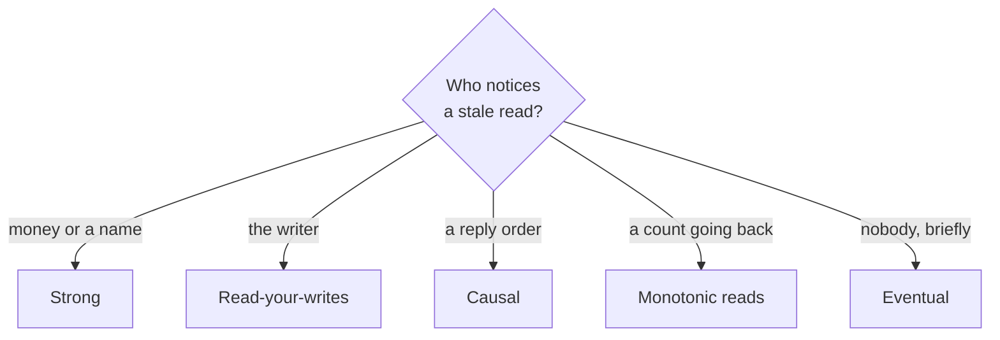

# Strong vs eventual consistency

> Which read is allowed to be stale, and who would notice: the question that picks a consistency model.

How to choose a consistency level, and how to justify it in an interview. The choice is made per piece of data, not once for the whole system. The [consistency models page](../patterns/consistency-models.md) defines each model; this sheet is the decision: which reads may return old data, and which must not.

## Quick comparison

| Model | What it promises | What it costs | Good fit | Where it hurts |
|-------|------------------|---------------|----------|----------------|
| Strong (linearizable) | Every read returns the newest write | Replicas must agree before a write is acknowledged | Bank balance, seat booking, unique username | Slow cross-region writes; the minority side of a split stops taking writes |
| Eventual | All copies agree later, once writes stop | Almost nothing, read any replica | Like counts, view counts, follower counts | Two users see two different numbers |
| Causal | A write lands after the writes it saw | Track and ship what each write saw | Comment threads, replies, edits | Unrelated writes still land in any order |
| Read-your-writes | You always see your own last write | Leader reads, or a version token per user | Profile edits, your own new post | Breaks if tied to a tab instead of the user |
| Monotonic reads | One user never sees time go backward | Keep a session on one replica | Timelines, message lists, counters | Breaks when that replica dies |

## The one-question shortcut

Ask: which read is allowed to be stale, and who would notice?

- Money, stock, or a unique name, so anyone would notice: strong.
- Nobody notices a few seconds of lag: eventual.
- Only the writer would notice: read-your-writes.
- The reader would notice broken order, a reply before its parent: causal.
- The reader would notice a number jumping backward: monotonic reads.

## How to choose

Start from the product, not the database. Pick the weakest model each surface can tolerate, because weaker is cheaper and more available under failure:

1. Strong (linearizable): the system behaves as if there is one copy, so every read returns the newest write. If a balance is $250, two ATMs must not both hand out $200. You pay in coordination: the write is not acknowledged until enough replicas agree. A cross-region write adds a wide-area round trip ([latency numbers](latency-numbers.md)).
2. Eventual: copies agree once writes stop, with no promise about when. A video can read 1,204 likes on one replica and 1,207 on another, and nothing breaks. Reads come from any replica, so they are cheap and survive replica failures. Keep the authoritative record of money and inventory out of this bucket.
3. Causal: a write lands after the writes it depended on, so a reply never appears before the comment it answers. Unrelated comments still arrive in either order, and users do not notice. You pay in metadata, because each write carries what it saw, usually as [logical clocks](../patterns/logical-clocks.md).
4. Read-your-writes: someone renames their profile, reloads, sees the old name, decides the save failed, and saves again. Send that user's reads to the leader for a few seconds, or carry the write's version with the read. Tie the rule to the user, not the browser tab, or it breaks on a second device.
5. Monotonic reads: without them, a refresh can show 43 likes and then 41, because the second read hit a slower replica. The data is correct and the product looks broken. Pin the session to one replica, or send a version so a lagging replica can refuse the read.

## What interviewers probe

- The split: during a partition you keep either consistent reads or available writes, not both ([CAP theorem](../patterns/cap-theorem.md)). Say which side still takes writes.
- The read path: leader or follower? Follower reads are stale by the [replication](../patterns/replication.md) lag, which is not bounded during a write spike.
- Quorum math: with 3 replicas, writing to 2 and reading from 2 makes the read set overlap the write set ([quorum](../patterns/quorum.md)). The read sees the newest acknowledged write once it takes the highest version. Overlap is not linearizability, and concurrent writes still need a conflict rule.
- Mixed models: one product needs several, and the boundary is the interesting part. A strong wallet write and an eventual feed update disagree until the feed catches up.
- Conflict handling: when two replicas accept different writes, last write wins quietly discards one. Name what is lost and whether the product can afford it.

## How to talk about it in an interview

Do not say "I will use eventual consistency because it scales". Say "the wallet balance is linearizable, because a double spend is real money lost. The like count is eventual, because a reader who sees 1,204 instead of 1,207 loses nothing. The user's own profile edit gets read-your-writes, because that is the stale read people report as a bug." Naming the model per surface, with the cost you accept, is the senior signal.

## Go deeper

- The models in depth: [consistency models](../patterns/consistency-models.md) and [logical clocks](../patterns/logical-clocks.md)
- The read and write math behind them: [quorum](../patterns/quorum.md), [replication](../patterns/replication.md), and [CAP theorem](../patterns/cap-theorem.md)
- Real systems at each end: [Dynamo](../deep-dives/dynamo-key-value-store.md) (eventual, always writable) and [Spanner](../deep-dives/spanner-global-sql.md) (strong, across regions)
- Questions that lean on this choice: [design a payment system](../questions/design-payment-system.md), [design the YouTube likes counter](../questions/design-youtube-likes-counter.md)
- Every pattern, in depth: [System Design Patterns](https://www.designgurus.io/course/system-design-patterns?utm_source=github&utm_medium=repo&utm_campaign=grokking-system-design&utm_content=cheat-sheets-strong-vs-eventual-consistency)
- Full course: [Grokking the System Design Interview](https://www.designgurus.io/course/grokking-the-system-design-interview?utm_source=github&utm_medium=repo&utm_campaign=grokking-system-design&utm_content=cheat-sheets-strong-vs-eventual-consistency)
