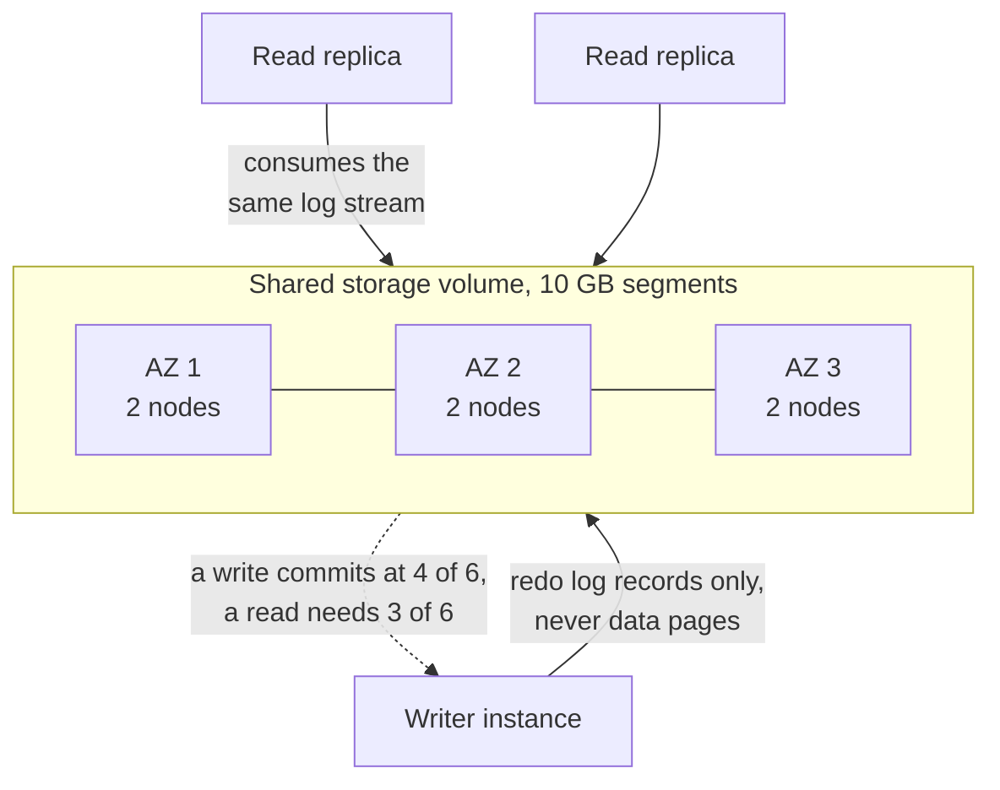

# Aurora: rethinking the database for the cloud

> Amazon's cloud-native relational database, built on one idea: the log is the database, so replicate the log, not the pages.

## What it is

Aurora is a managed relational database from AWS. It runs a MySQL or PostgreSQL compatible engine on top of a storage service that Amazon wrote from scratch.

The common misunderstanding is that Aurora is MySQL on faster disks. It is not. The storage layer understands the database redo log, which is the record of every change written before the change is applied. The storage nodes build the data pages themselves.

The engine on top keeps the parts you know: the SQL parser, the query planner, transactions, and locks. It also keeps the buffer cache, the in-memory copy of recently used pages. Everything below the log was replaced. So the split is clean: the engine decides what changed, and storage decides how bytes are stored on disk.

## The problem it solves

A normal database writes the same change several times. It writes the redo log, then the data page, then a double write buffer. That buffer is a safety copy that protects against a page written only half way. It also writes the replication log and some metadata.

Now put that database in the cloud and mirror the disk for safety. Every one of those writes crosses the network, more than once. The network, not the CPU and not the disk, becomes the limit on transactions per second.

There is a second failure. After a crash, a normal engine must replay its log from the last checkpoint before it will answer queries. A busy database can be unavailable for minutes while it does that.

Aurora's observation is that the [write-ahead log](../patterns/write-ahead-log.md) already contains everything needed to produce a page. So send only the log, and let storage do the rest.

## Key design ideas

Only redo log records cross the network. The storage tier builds the pages itself, which is what removes most of the write traffic.

| Idea | How it works |
|------|--------------|
| The log is the database | The engine never ships a data page. It ships small redo records that say "at this position in this page, this changed". A page is 16 KB in MySQL and 8 KB in PostgreSQL. One redo record is far smaller, so the bytes sent over the network drop sharply |
| Storage materializes pages | Each storage node keeps the log records for its own segment and applies them to produce the current page. It does this in the background, and on demand when a read asks for a page version it has not built yet |
| Six copies across three availability zones | The volume is cut into segments. Each segment is stored on 6 nodes, 2 in each of 3 availability zones (separate datacenters in one region). Losing one zone means losing exactly 2 copies |
| Write [quorum](../patterns/quorum.md) of 4 of 6 | A write is durable once 4 nodes have it. Losing a whole zone leaves 4 copies, so writes keep going with no pause and no failover of the storage layer |
| Read quorum of 3 of 6 | Reads need 3 copies to agree on the newest version. Losing a whole zone plus one more node leaves 3, so no committed data is lost. The two numbers overlap (4 plus 3 is more than 6), which is what guarantees a read sees the latest write |
| 10 GB segments | A segment is the unit of repair, and 10 GB is small enough to copy from peers in seconds. A short repair time means the chance of a second and third failure arriving inside that window is very small |
| Crash recovery with no replay | Storage is always applying the log, so there is no checkpoint to replay. A restarted engine asks storage for the highest log position that reached a write quorum, throws away anything after it, and starts serving |
| Read replicas share one volume | Up to 15 read replicas attach to the same storage volume, so a new replica copies no data at all. This is [replication](../patterns/replication.md) for reads without a second copy of the bytes |

## Notable techniques

- The foreground write path is two steps. A storage node puts the incoming log record on an in-memory queue, writes it to local durable storage, and acknowledges. Building pages, checking for gaps, backing up, and garbage collecting all happen off the latency path.
- Storage nodes gossip (talk to their peers) to fill gaps. A node that missed some records asks the other 5 for them, so a slow node repairs itself instead of delaying the writer.
- The commit point is a single number. The engine tracks the highest log position that has reached a write quorum on every segment. A transaction commits once that number passes its last record. Commits are grouped, so many transactions are made durable together.
- Normal reads skip the quorum. The writer knows which storage node has all the records for each segment, so it reads from one node instead of 3. The read quorum is for recovery, not for everyday traffic.
- Replicas apply the same log stream to their own buffer cache, and drop records for pages they do not hold in memory. Lag is measured in tens of milliseconds, not seconds, because nothing is being re-executed.
- The log is also the backup. Records stream continuously to object storage. That is what makes point-in-time restore and rewinding the database to an earlier moment possible, with no separate backup job.
- Adding or replacing a node changes the quorum membership in a versioned step, with both the old and new sets valid during the move. Repair never needs to stop writes.

## Trade-offs

One instance accepts all writes. That single writer is the ceiling: to write more, you buy a bigger instance, you do not add instances. Past that point you shard the application yourself ([sharding](../patterns/sharding-partitioning.md)), or you move to a design like [Spanner](spanner-global-sql.md) that splits writes across many leaders.

The engine above the log is still MySQL or PostgreSQL. So every familiar single-node problem is still there. A hot row that every transaction updates still serializes. Long transactions still hold locks, and a bad query plan is still a bad query plan. Aurora fixes the storage layer, not your schema.

There is only one logical copy of the data. Replicas share the volume, so a mistaken DELETE affects all of them at once. Protection against human error comes from backups and rewinds, not from the replicas.

The quorum lives inside one region. Copying to another region is asynchronous, so a regional disaster can lose recent writes. Aurora is also AWS-only infrastructure. The design is worth studying anywhere, but the product runs in one cloud.

Finally, storage bills per read and write operation. A workload with a poor cache hit rate can cost much more than the same data on a plain instance. The [trade-off](../cheat-sheets/trade-offs.md) here is real money, not just latency.

## Go deeper

- Related deep dive: [Spanner](spanner-global-sql.md)
- For the full deep dive: [Advanced System Design Interview, Volume II](https://www.designgurus.io/course/grokking-system-design-interview-ii?utm_source=github&utm_medium=repo&utm_campaign=grokking-system-design&utm_content=deep-dives-aurora-cloud-native-database)
- Full course: [Grokking the System Design Interview](https://www.designgurus.io/course/grokking-the-system-design-interview?utm_source=github&utm_medium=repo&utm_campaign=grokking-system-design&utm_content=deep-dives-aurora-cloud-native-database)
