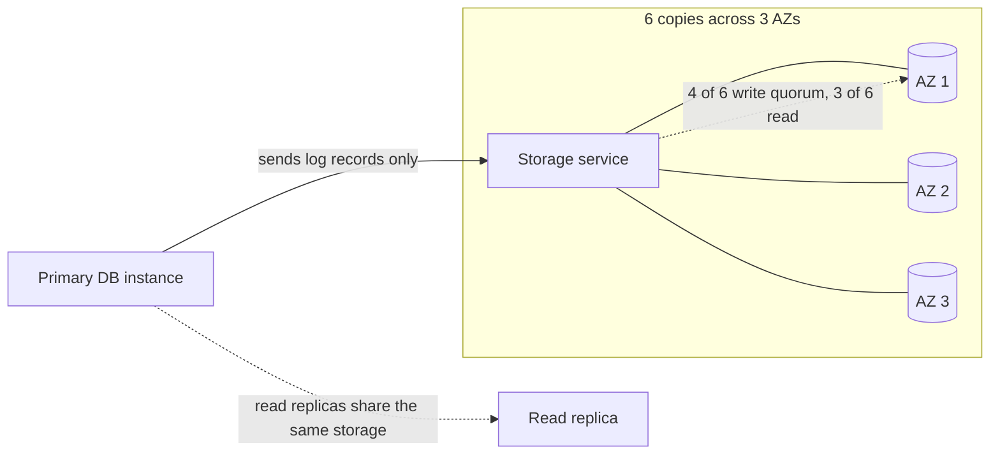

# Aurora: rethinking the database for the cloud

> Amazon's cloud-native relational database, built on one idea: the log is the database, so replicate the log, not the pages.

## What it is

Aurora is AWS's managed relational database (MySQL and PostgreSQL compatible) that separates compute from storage. The database engine runs on one tier; a purpose-built, multi-tenant storage service spreads data across three availability zones. It is the canonical example of designing a database around cloud failure domains rather than porting a single-box design.

## The problem it solves

Running MySQL on cloud disks with synchronous mirroring multiplies write traffic: the engine writes data pages, double-write buffers, and logs, and each is mirrored. Network becomes the bottleneck and failover is slow. Aurora's observation: the [write-ahead log](../patterns/write-ahead-log.md) already contains everything, so ship only log records and let storage materialize pages.

## Key design ideas

| Idea | How it works |
|------|--------------|
| The log is the database | The engine sends only redo log records to storage; storage nodes apply them to build pages in the background. Write traffic drops by an order of magnitude |
| 6-way replication, 4/6 write [quorum](../patterns/quorum.md) | Each 10 GB segment lives on 6 storage nodes across 3 AZs; writes commit at 4 of 6 and reads need 3 of 6, so the volume survives a whole AZ failing without losing writes, and an AZ plus one more node without losing reads |
| Segmented storage | 10 GB segments limit blast radius; a lost segment re-replicates in seconds from peers, making the storage tier self-healing |
| Compute-storage separation | Up to 15 read replicas attach to the same shared storage volume ([replication](../patterns/replication.md) without data copies); replica lag is milliseconds because replicas consume the same log stream |

## Notable techniques

- No database-level checkpointing or double writes: page materialization is the storage tier's continuous background job.
- Crash recovery is nearly instant: storage already has the log applied (or applies on demand), so the engine does not replay hours of log on restart.
- Backtrack and point-in-time restore fall out of keeping the log as the source of truth.

## Trade-offs

Writes still flow through a single writer instance (single-writer architecture), so write scaling means a bigger instance, not more of them; that is the line where Spanner-style systems ([Spanner](spanner-global-sql.md)) take over. The storage quorum spans AZs in one region; cross-region disaster recovery uses asynchronous replication with the usual lag. And it is proprietary AWS infrastructure: the design is instructive everywhere, the product runs in one cloud.

## Go deeper

- For the full deep dive: [Advanced System Design Interview, Volume II](https://www.designgurus.io/course/grokking-system-design-interview-ii)
- Full course: [Grokking the System Design Interview](https://www.designgurus.io/course/grokking-the-system-design-interview)