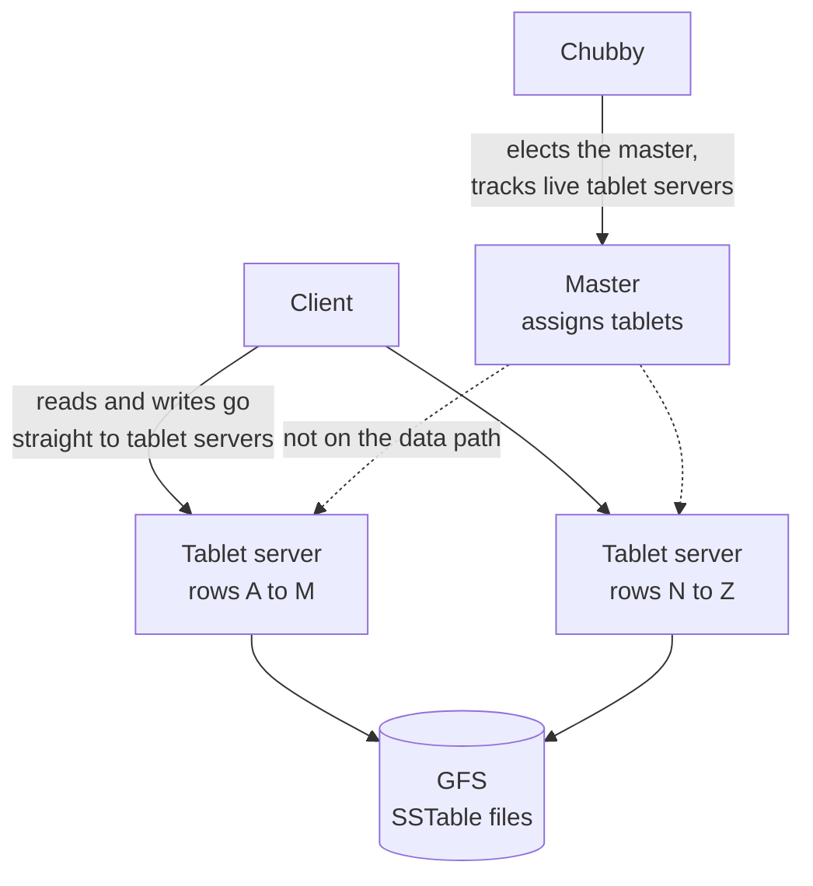

# BigTable: a wide-column store

> A table can hold petabytes of rows, and every read into it starts from one place: the row key.

## What it is

BigTable is a distributed store for structured data. The name says "column", and that is the part people get wrong. BigTable is a sorted map, which means a set of key and value pairs held in key order. Each value is found by three things together: a row key, a column key, and a timestamp. The value itself is a plain string of bytes, and BigTable never looks inside it.

Two other words from the original paper carry real weight. Sparse means a row pays nothing for a column it lacks, so one row can hold three columns and the next ten thousand. Sorted means rows sit in order of their row key, compared byte by byte, across the whole table.

Row keys are arbitrary strings up to 64 KB, and most are 10 to 100 bytes long.

## The problem it solves

Imagine a table of every web page on the internet, keyed by URL. One relational database cannot hold it. Splitting it across machines by hand works for a while, until traffic shifts. One range takes all the traffic, one machine falls behind, and a person has to move data while users wait.

BigTable makes the split automatic. The client sees one table. The system decides which machine serves which rows, moves ranges off a busy machine, and re-serves them when one dies.

## Key design ideas

Three systems share the work. Tablet servers serve the data, GFS stores the files, and Chubby decides who is in charge.

| Idea | How it works |
|------|--------------|
| The row key is the only index | There is no secondary index (a second lookup path built on some other field). A read either names one row key or walks a range of them, so the row key decides your access patterns forever. The classic example is a web table keyed by the reversed host name, `com.cnn.www/index.html`, which stores every page of one site together |
| Tablets | A table is cut by row range into tablets. A tablet is the unit of placement, splitting and recovery, and holds roughly 100 to 200 MB. When it grows past that it splits in two, and the master can move one half to another server. This is [range sharding](../patterns/sharding-partitioning.md) done by the system, not by you |
| Column families | Column keys are grouped into families, written as `family:qualifier`. A family is declared in the schema and is the unit of access control and disk accounting. A table has few families (hundreds at most), but a family holds unlimited column keys, made by writing to them |
| Timestamps | Each cell keeps several versions, indexed by a 64-bit timestamp in microseconds, newest first. A rule per family says what to keep: the last N versions, or only values newer than N days |
| The write path | A write appends to a commit log, then goes into the memtable (a sorted table of recent writes held in memory). The commit log is a [write-ahead log](../patterns/write-ahead-log.md), so a crash loses nothing already acknowledged |
| Flush and compaction | When the memtable grows too large it is frozen and written out as an SSTable, an immutable sorted file. Compaction merges several SSTables into fewer, so later reads touch fewer files |
| Coordination | [Chubby](chubby-distributed-locking.md) holds the master lock, the list of live tablet servers, the schema, and the pointer to the first tablet. It is the source of truth for [leader election](../patterns/leader-election.md) |
| Durable storage | Tablet servers keep no permanent state. Logs and SSTables live in [GFS](gfs-distributed-file-system.md), which replicates every file, so a dead server loses no data |

## Notable techniques

- Membership through locks, not guesses. Each tablet server takes an exclusive lock on its own file in one Chubby directory. The master reads that directory to learn who is alive. A server that loses its lock stops serving at once. The master then takes that lock and deletes the file, so the old server can never serve those rows again. That prevents two servers owning one tablet.
- A three-level lookup, like a tree index. A Chubby file points at the root tablet, the root tablet points at tablets of a METADATA table, and those point at user tablets. Three levels address about 17 billion tablets. Clients cache these locations and fetch them ahead of time, so the master stays off the read path.
- Single-row atomicity. Every read or write under one row key happens all at once, even when it touches many columns. There is also a read-modify-write on one row. Across two row keys there is no transaction at all.
- Locality groups. You can mark a set of column families as one group, and each group gets its own SSTable. A job that reads only page metadata never touches page contents on disk. A group can also be marked in-memory, so it is loaded into the tablet server and served with no disk access.
- Compression per block. SSTables are cut into blocks (64 KB by default) and each block is compressed alone, so a read decompresses one block, not the file. Sorted rows put similar data next to each other, which helps a lot. A two-pass scheme reached about 10 to 1 on the web table, against about 3 to 1 for a general compressor.
- [Bloom filters](../patterns/bloom-filters.md) per SSTable. A Bloom filter is a small structure that answers "this key is definitely absent" or "it may be present". Reads for rows that do not exist then skip the file with no disk seek.
- Immutability makes concurrency simple. SSTables never change, so readers need no lock on them. Only the memtable changes, and it copies a row before changing it, so reads and writes run together. A delete writes a tombstone, which is a marker meaning "this cell is gone". The data leaves disk only in a major compaction, which rewrites everything into one SSTable.
- One commit log per server, not per tablet. Thousands of separate log files would mean thousands of parallel GFS writes. Recovery instead sorts the shared log by table and row, so each new owner reads only its own part.

## Trade-offs

Scans are cheap because rows sit in sorted order on disk, so a range read is one seek and then a stream of bytes. Any other query is expensive, because nothing else is indexed. Filtering on a column value means reading every row and discarding most.

There are no joins and no transactions across rows. Work that needs two rows to change together, like moving money between two accounts, does not belong here. [Spanner](spanner-global-sql.md) was built partly to answer that.

The row key choice is very hard to reverse. Keys that rise in order, like a timestamp in front, send every new write to one tablet server and leave the rest idle. Fixing that later means rewriting the table.

BigTable also depends on the systems under it. If Chubby is unreachable for a long period, BigTable stops serving, and a GFS problem is a BigTable problem. On a small dataset, this coordination costs more than it returns.

## Go deeper

- Related deep dive: [Cassandra, a wide-column database](cassandra-wide-column-db.md), which keeps this data model but replaces the master and Chubby with [gossip](../patterns/gossip-protocol.md) and [quorum](../patterns/quorum.md) reads
- For the full deep dive: [Advanced System Design Interview, Volume II](https://www.designgurus.io/course/grokking-system-design-interview-ii?utm_source=github&utm_medium=repo&utm_campaign=grokking-system-design&utm_content=deep-dives-bigtable-wide-column-store)
- Full course: [Grokking the System Design Interview](https://www.designgurus.io/course/grokking-the-system-design-interview?utm_source=github&utm_medium=repo&utm_campaign=grokking-system-design&utm_content=deep-dives-bigtable-wide-column-store)
