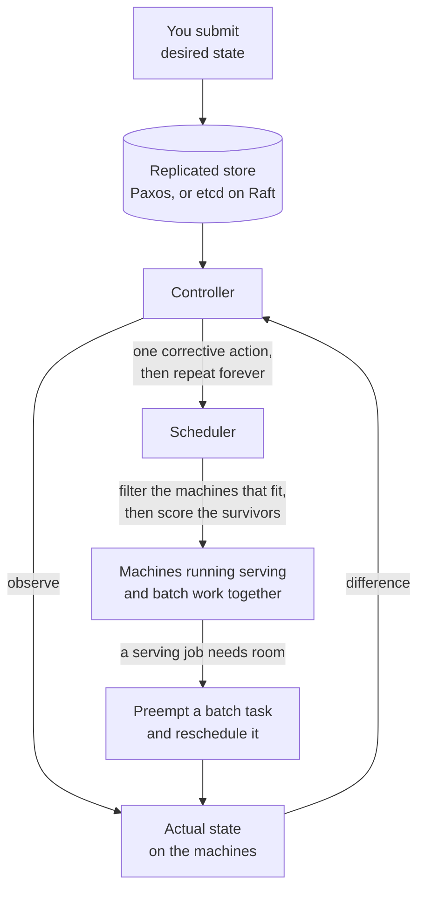

# Borg and Kubernetes: cluster management

> Run every job in a datacenter on a shared pool of machines, and keep them running when machines die.

## What it is

Borg is the cluster manager that runs Google's workloads on shared pools of machines. Kubernetes is its open-source descendant, written largely by people who had built and operated Borg. The landmark idea is a change in ownership: stop assigning fixed machines to individual teams, and treat the datacenter as one pool of CPU and memory that a scheduler hands out on demand.

## The problem it solves

Static partitioning (giving each team its own permanent set of machines) wastes enormous capacity. Every team sizes for its own peak, so most machines sit mostly idle most of the time. On top of that, every team separately rebuilds the same machinery: restarting a crashed process, finding the current address of a service that moved, rolling out a new version without dropping traffic. A cluster manager buys back the idle capacity and builds that machinery once.

## Key design ideas

There is no deploy command anywhere in this picture. A controller compares what should be running against what is running, takes one action, and repeats.

| Idea | How it works |
|------|--------------|
| Declarative desired state | You submit a description of what should be running, not commands to run; the system continuously drives reality toward that description |
| Reconciliation loop | A controller compares desired state to observed state, takes one corrective action, and repeats forever |
| Scheduling | For each pending task, filter the machines down to those that could feasibly host it (fit, constraints, priority), then score the survivors and pick the best |
| Bin packing | Latency-sensitive serving jobs and low-priority batch jobs are placed on the same machines, so batch work soaks up capacity serving jobs are not currently using |
| Preemption | Jobs carry priorities: when a serving job needs room, a batch task on that machine is evicted and rescheduled elsewhere |
| Consistent control plane store | All cluster state lives in a replicated, strongly consistent store (Paxos in Borg, etcd in Kubernetes) |

That last row is where consensus enters. etcd replicates its log with [Raft](raft-consensus.md), and the control plane uses the same store for [leader election](../patterns/leader-election.md), so exactly one copy of each controller is acting at a time.

## Notable techniques

- Reconciliation is the architecture, not an implementation detail. A controller is only a loop watching desired versus observed state, so anyone can add a new object type plus a new controller and get the same self-healing behavior. This is why Kubernetes is extensible rather than fixed.
- Health checking and automatic restart. An agent on each machine probes its tasks and restarts unhealthy ones, while the control plane tracks machine liveness with [heartbeats](../patterns/heartbeats.md) and reschedules the tasks of a machine that goes silent.
- Naming and service discovery. Because tasks move, clients never hold a machine address. They resolve a stable name to the current set of endpoints, and the system updates that set as tasks start and stop.
- Requests versus limits. A job declares what it needs (the request, which the scheduler reserves) and a ceiling it may not exceed (the limit, enforced at runtime). The gap between the two is where overcommit happens.
- Resource reclamation. Most jobs request far more than they ever use, because engineers pad their estimates for safety. Borg measures actual usage, predicts what a task really needs, and resells the difference to batch work. A large share of the utilization win comes from this one observation.

## Trade-offs

You get large utilization gains and one uniform way to operate everything, paid for with real complexity. Colocated jobs interfere: a batch task can saturate shared cache, memory bandwidth, or disk and damage a serving job's tail latency (the noisy-neighbor problem), so isolation work never fully ends. Preemption means low-priority work must be written to be killed and resumed at any moment. And the control plane becomes the most critical system you operate, because when it is unavailable, nothing self-heals. Scheduling at this scale is also a genuinely hard optimization problem, and both systems answer it with heuristics that are fast and good enough rather than with optimal placements.

## Why it matters in interviews

This is the source material behind [design a distributed job scheduler](../questions/design-distributed-job-scheduler.md) and behind the common question of how Kubernetes actually works. It also underpins [design a code deployment system](../questions/design-code-deployment-system.md), where a rolling update is just a controller advancing desired state a few tasks at a time and pausing when health checks fail. [Design a GPU cluster scheduler](../questions/design-gpu-cluster-scheduler.md) is the modern version of the same problem, with resources that are scarcer, chunkier, and much harder to subdivide.

## Go deeper

- For the full deep dive: [Advanced System Design Interview, Volume II](https://www.designgurus.io/course/grokking-system-design-interview-ii?utm_source=github&utm_medium=repo&utm_campaign=grokking-system-design&utm_content=deep-dives-borg-kubernetes)
- Full course: [Grokking the System Design Interview](https://www.designgurus.io/course/grokking-the-system-design-interview?utm_source=github&utm_medium=repo&utm_campaign=grokking-system-design&utm_content=deep-dives-borg-kubernetes)
