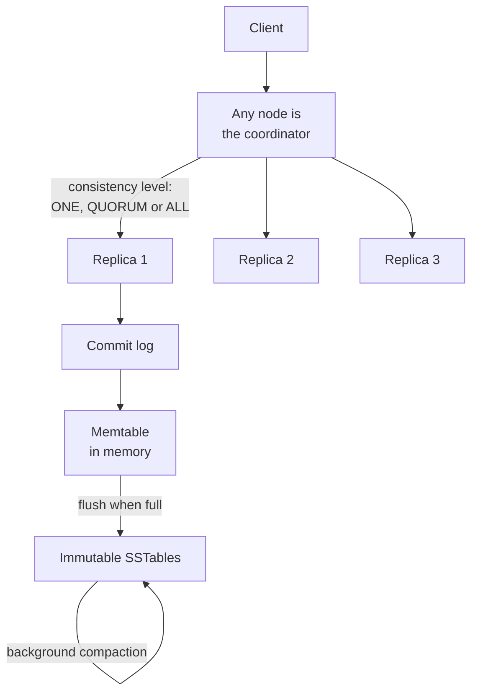

# Cassandra: a wide-column NoSQL database

> A database with no leader at all: every node is equal, so any node can accept your write and any node can answer your read.

## What it is

Cassandra joins two famous designs into one system. It takes its distribution (how data spreads across machines and stays available) from [Dynamo](dynamo-key-value-store.md). It takes its storage engine (how data is written on one machine) from [Bigtable](bigtable-wide-column-store.md).

The usual misunderstanding is that Cassandra is a general NoSQL database you can query in many ways. It is not. CQL, its query language, looks like SQL, but it has no joins and no planner that goes looking for your rows. You choose the query first, then build a table shaped to answer that one query.

Wide column means one partition (a group of rows that live together on the same set of nodes) can hold a very large number of rows, kept in sorted order. A column with no value costs no storage.

## The problem it solves

A single-leader database has one machine that accepts every write. That machine is both a bottleneck and a single point of failure. When it dies, writes stop until a new leader is elected, and that pause lasts seconds or minutes.

Now add a second region. Every writer far from the leader pays a network round trip of 100 milliseconds or more on every single write.

Think of a service that records every ad click or every device metric. It writes constantly, it can never pause, and it runs in several regions at once. Cassandra removes the leader, so there is nothing to fail over to and no one machine to queue behind. [Design an ad click aggregator](../questions/design-ad-click-aggregator.md) and [design metrics and monitoring](../questions/design-metrics-monitoring.md) are the same shape of workload.

## Key design ideas

A ring of equal nodes on the outside. An append-only, log-structured store on the inside.

| Idea | How it works |
|------|--------------|
| Consistent hashing ring | Each partition key is hashed into a token, a number inside one fixed range. The ring is that range, and every node owns slices of it. A key goes to the first node clockwise from its token, plus the next nodes for the extra copies. Adding a node moves only the keys in the slices it takes over ([consistent hashing](../patterns/consistent-hashing.md)) |
| Virtual nodes | A node does not own one large slice. It owns many small slices spread around the ring, called virtual nodes. When a node dies, many nodes each pick up a little of its data at the same time, so recovery is fast and the load stays even |
| Any node can be the coordinator | The client may send a request to any node. That node is the coordinator for this one request: it hashes the key, finds the replicas, sends the request to them, and collects the replies. The next request can use a different coordinator, so no node is special and no node needs protecting |
| Tunable consistency per query | N is the number of copies, set per keyspace. Each query says how many replicas must answer: ONE, QUORUM (more than half, so 2 when N is 3), or ALL. Keep the read count plus the write count above N (R + W > N). Then the replicas that took the write and the replicas that answer the read share at least one node, so the read sees the newest value ([quorum](../patterns/quorum.md)) |
| Partition key and clustering key | The primary key has two parts. The partition key decides which nodes hold the row. The clustering key decides the sort order of rows inside that partition. A query must supply the whole partition key, because without it Cassandra cannot know which node to ask. That one rule is why the query is designed before the table |
| Log-structured write path | A write is appended to the commit log on disk (a recovery log, read back only after a crash). It is then inserted into the memtable, a sorted table held in memory. Nothing on disk is ever changed in place, which is why writes stay fast ([write-ahead log](../patterns/write-ahead-log.md)) |
| Last write wins | Every stored value carries the timestamp of the write that produced it. When two replicas disagree, the higher timestamp wins. There is no manual conflict resolution, and a clock that runs ahead can hide a newer write |

## Notable techniques

- Flush and compaction. When the memtable is full, it is written out as an SSTable, a sorted file that is never modified again. A read may then have to look in several SSTables for one key. Compaction merges SSTables in the background. It keeps the newest value for each column, drops the rest, and writes one new file. The default strategy merges files of similar size. Another keeps files in levels, so a read touches few of them.
- Bloom filters. Each SSTable carries a [Bloom filter](../patterns/bloom-filters.md), a small structure that can answer "this key is definitely not in this file". A read skips those files without touching the disk. The filter sometimes says yes when the answer is no, which costs one wasted lookup, but it never says no when the answer is yes.
- Hinted handoff. If a replica is down when a write arrives, the coordinator keeps a hint: a copy of the write plus the name of the node that missed it. When that node returns, the hint is delivered. Hints are held for three hours by default, then dropped, because a node down that long should be repaired instead.
- Read repair. On a read, the coordinator asks one replica for the value and the others for a digest (a hash of what they hold). If the hashes disagree, it sends the newest value to the replicas that are behind. Normal reading slowly heals the data.
- Anti-entropy repair with Merkle trees. Two replicas must compare a whole range of data without shipping all of it. Each builds a Merkle tree, a tree of [checksums](../patterns/checksums.md) where every parent hashes its children. They compare the two roots. Matching roots mean matching data, and nothing is sent. Otherwise they walk down and exchange only the small ranges that differ. This repair must be scheduled and run, and it is real operational work.
- Gossip. Once a second, each node swaps state with a few other nodes, so membership and health spread with no central registry ([gossip protocol](../patterns/gossip-protocol.md)). Failure detection is not a fixed timeout. Each node learns how fast a peer usually replies, then grows more suspicious as the silence runs longer than usual.
- Replication per data center. The number of copies is set separately for each region ([replication](../patterns/replication.md)). LOCAL_QUORUM asks for a quorum inside the local data center only. A write then never waits for a trip across an ocean, and the copies still travel to the other regions.
- Lightweight transactions. Sometimes you truly need compare-and-set, for example "create this username only if nobody has it". Cassandra then runs Paxos across the replicas for that key. It is correct, and it costs about four round trips, so it is for rare operations.

## Trade-offs

Deletes are the part that surprises people. A delete removes nothing. It writes a tombstone, a marker saying this value was deleted at this timestamp. The marker is necessary. Without it, a replica that was down during the delete would later hand the old value back, and the deleted row would return. So tombstones are kept for ten days by default, long enough for repair to reach every replica, and only then can compaction drop them.

That makes some workloads a poor fit. A queue-like table, where rows are added and deleted quickly, fills its partitions with tombstones. A read then scans many markers to return few rows, gets slower every day, and can time out.

Cassandra is also bad at joins, at group-by aggregates, and at any query the table was not designed for. Secondary indexes exist, but they ask every node in the cluster, so they do not scale the way the partition key does. Reading across partitions needs ALLOW FILTERING, which tells Cassandra to read many rows and throw most of them away.

It is a weak choice for a small dataset, and for money movement and other work that needs strong consistency on every operation ([CAP theorem](../patterns/cap-theorem.md), [consistency models](../patterns/consistency-models.md)). It also needs operators, because compaction tuning and scheduled repair never end. Partitions above a few hundred megabytes hurt both reads and repair. [Postgres vs DynamoDB vs Cassandra](../cheat-sheets/postgres-vs-dynamodb-vs-cassandra.md) sets the choice side by side.

## Go deeper

- Related deep dive: [Dynamo: a key-value store](dynamo-key-value-store.md)
- Choosing a sharding strategy: [sharding strategies](../cheat-sheets/sharding-strategies.md)
- For the full deep dive: [Advanced System Design Interview, Volume II](https://www.designgurus.io/course/grokking-system-design-interview-ii?utm_source=github&utm_medium=repo&utm_campaign=grokking-system-design&utm_content=deep-dives-cassandra-wide-column-db)
- Full course: [Grokking the System Design Interview](https://www.designgurus.io/course/grokking-the-system-design-interview?utm_source=github&utm_medium=repo&utm_campaign=grokking-system-design&utm_content=deep-dives-cassandra-wide-column-db)
