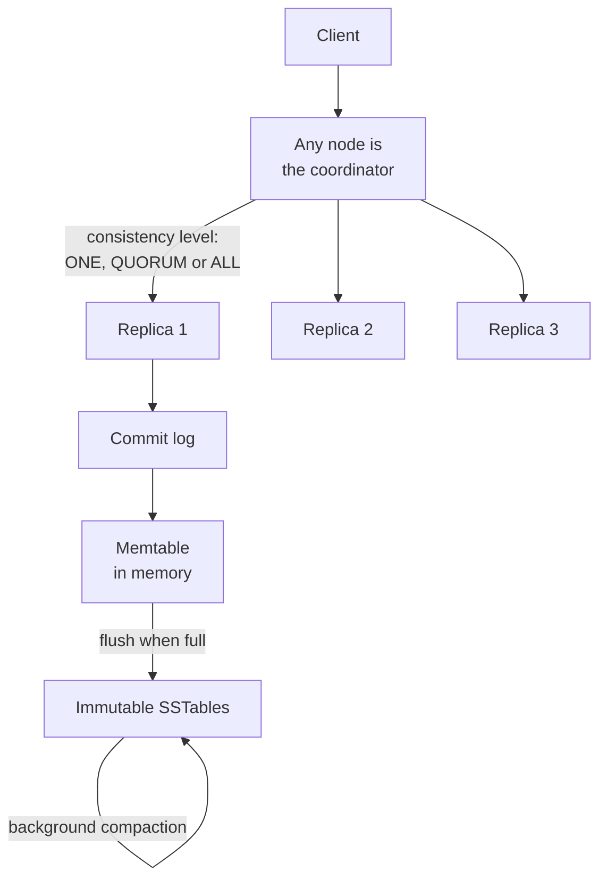

# Cassandra: a wide-column NoSQL database

> A distributed database that blends Dynamo's availability with a BigTable-style data model, with no single point of failure.

## What it is

Cassandra is a wide-column store designed for high write throughput, linear scalability, and high availability across data centers. It borrows its distribution model from [Dynamo](dynamo-key-value-store.md) and its data model from [BigTable](bigtable-wide-column-store.md).

## The problem it solves

Applications that write a lot and must stay available across regions, where a single-leader database becomes a bottleneck and a single point of failure.

## Key design ideas

A peer-to-peer ring on the outside, an append-only log-structured store on the inside.

| Idea | How it works |
|------|--------------|
| Peer-to-peer ring | No leader; every node is equal, using [consistent hashing](../patterns/consistent-hashing.md) |
| Data model | Keyed by a partition key, with rows clustered and sorted within a partition |
| Tunable consistency | Per-query consistency level (ONE, QUORUM, ALL) balances latency and correctness |
| LSM-tree storage | Writes hit an in-memory memtable plus a commit log, later flushed to immutable SSTables |

## Notable techniques

- Write path is append-only and fast: log plus memtable, no in-place updates, with background compaction merging SSTables.
- Gossip spreads membership and state; no central coordinator.
- Multi-data-center replication is first class.

## Trade-offs

Fast writes and high availability, at the cost of strong consistency by default and the operational work of compaction and repair. Range queries across partitions are limited.

## Go deeper

- For the full deep dive: [Advanced System Design Interview, Volume II](https://www.designgurus.io/course/grokking-system-design-interview-ii?utm_source=github&utm_medium=repo&utm_campaign=grokking-system-design&utm_content=deep-dives-cassandra-wide-column-db)
- Full course: [Grokking the System Design Interview](https://www.designgurus.io/course/grokking-the-system-design-interview?utm_source=github&utm_medium=repo&utm_campaign=grokking-system-design&utm_content=deep-dives-cassandra-wide-column-db)