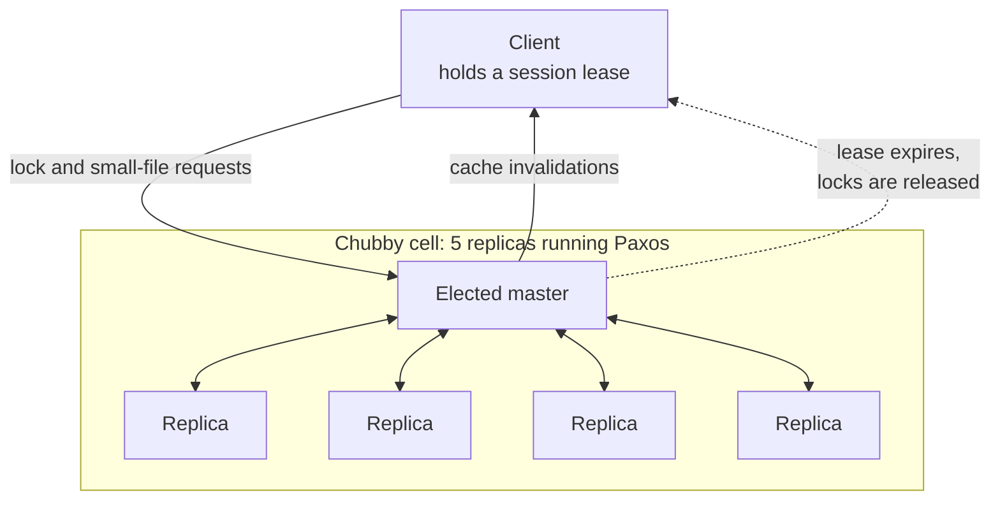

# Chubby: a distributed locking service

> Five machines run Paxos so that thousands of other machines can agree on one leader, one config value, and one address.

## What it is

Chubby is a coordination service inside Google. It gives clients two things: advisory locks, and a small file namespace that looks like a filesystem. A path looks like /ls/cell/application/file.

The files are deliberately tiny. One file holds at most 256 KB. It is a place for a leader's address, a config flag, or a pointer to real data, not for the data itself.

Here is the correction most readers need. The name says lock service, but locking is not the main use. The paper reports that Chubby became Google's primary internal name service (a directory that tells a client where a service runs right now). Configuration is the other heavy use.

So the honest description is this. Chubby is a highly available, strongly consistent store for small values that many machines must agree on. Locking is one feature of that store.

## The problem it solves

A service with one primary and several backups must pick exactly one primary. When the pick goes wrong, two machines both believe they are the primary. Both accept writes. The two copies of the data drift apart, and no automatic process can merge them again. That failure is called split brain.

Avoiding it needs consensus (a protocol where a group of machines agrees on one value even when some of them fail). Consensus is hard to write and harder to test.

Chubby's answer is to write it once. One team builds and runs the consensus, and every other system calls it over the network. [Leader election](../patterns/leader-election.md) becomes an ordinary remote call.

## Key design ideas

All client traffic hits one elected master. The other four replicas exist so the master can be replaced, not to share the load.

| Idea | How it works |
|------|--------------|
| Paxos under a small database | Each of the five replicas keeps a local database. Paxos, a consensus protocol, copies the log of changes to all of them in the same order. A change commits once a majority, so three of the five, has written it. Two replicas can die and the cell keeps serving. See [quorum](../patterns/quorum.md) |
| One master, holding a lease | The replicas elect one master and give it a master lease, which is a promise not to elect anyone else for a few seconds. The master keeps renewing it. While it holds that lease, it can answer reads out of its own memory, because no second master can exist |
| Coarse-grained locks | A Chubby lock is meant to be held for hours or days, not milliseconds. This single decision makes the rest viable. Load on the service follows how often locks change hands, not how many clients exist. A short master failover also becomes survivable, because holders keep their locks across it |
| Sessions and KeepAlive calls | A client holds a session with a lease, 12 seconds by default. The client sends a KeepAlive call. The master holds that call open until the lease is nearly over, then replies and grants a new lease. The same call carries events back to the client |
| Session expiry releases locks | If the master stops hearing from a client, the session expires. Chubby then drops every lock that client held and closes its open handles. A frozen or disconnected client cannot block the whole fleet forever |
| Client cache with master-driven invalidation | Clients cache file contents and metadata in memory. The master records which client may be caching which file. Before a write finishes, the master sends invalidation messages to exactly those clients and waits for them to drop the entry. Repeat reads then cost nothing and can never be stale |
| Lock sequencers | On taking a lock, a client can ask for a sequencer. That is a short opaque string holding the lock name, the mode, and a generation number that grows on every fresh acquisition. The client attaches it to each request it sends to a storage server. That server refuses any sequencer older than the newest one it has seen |

That last row fixes a real failure. A client can pause, for example during a long garbage collection, and lose its lease. It then wakes up and sends a write it prepared before the pause.

Without sequencers that write lands after another client owns the lock. The generation number makes the late write plainly old, so the storage server drops it. This is the fencing idea described in [distributed locking](../patterns/distributed-locking.md).

## Notable techniques

- The grace period. When a client loses contact with the master, it does not fail right away. It marks the session as in danger, empties its cache, and waits, 45 seconds by default. If it reaches a new master inside that window, the session continues and the application never sees an error.
- Lock delay for servers that cannot check sequencers. A lock released because a session died, rather than by a clean call, goes to nobody for up to one minute. The old holder's in-flight requests get time to drain.
- Locks are advisory, not enforced. Chubby does not sit in front of your data, so it cannot stop a client that never asked for the lock. Correctness needs every participant to check.
- Events instead of polling. A client can subscribe to a file and be told when it changes, when the master fails over, or when a lock frees up. These events ride back on the open KeepAlive call, which is a [heartbeat](../patterns/heartbeats.md) doing two jobs at once.
- Reads and writes take different paths. A write runs a Paxos round across the cell, so it is slow. A read is answered from the master's memory, then cached on the client. This is why read volume never reaches Paxos. See [caching](../patterns/caching.md).
- Proxies and partitioning. Most of the master's work is KeepAlive traffic from idle clients, so a proxy can hold those sessions for a group of clients. The namespace can also be split across several masters by hashing the directory name.

## Trade-offs

Chubby buys strong consistency and very high availability. It pays for that in throughput and in coupling.

Write throughput is low by design. Every write is a consensus round, ordered by one master, on one machine. It is a poor fit for anything with a high write rate.

It is bad at fine-grained locking. A lock taken and released thousands of times a second would need a far larger cell. It would also make every master failover visible to users.

It is bad at holding data. The 256 KB limit is a wall, and Google had to add quotas because teams still tried to store real data in it.

A cell serves one datacenter. Clients in another region pay wide-area round trips on every write and every session renewal.

The largest cost is that everything depends on it. [GFS](gfs-distributed-file-system.md) and [Bigtable](bigtable-wide-column-store.md) use Chubby to elect their masters, so a Chubby outage stops far more than Chubby. Teams also get session loss wrong. They treat the namespace as a normal filesystem, then behave badly when a lease drops.

## Go deeper

- Related deep dive: [ZooKeeper coordination](zookeeper-coordination.md)
- For the full deep dive: [Advanced System Design Interview, Volume II](https://www.designgurus.io/course/grokking-system-design-interview-ii?utm_source=github&utm_medium=repo&utm_campaign=grokking-system-design&utm_content=deep-dives-chubby-distributed-locking)
- Full course: [Grokking the System Design Interview](https://www.designgurus.io/course/grokking-the-system-design-interview?utm_source=github&utm_medium=repo&utm_campaign=grokking-system-design&utm_content=deep-dives-chubby-distributed-locking)
