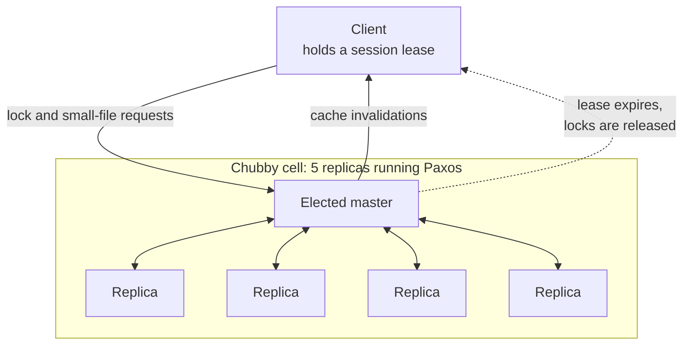

# Chubby: a distributed locking service

> Google's coarse-grained lock and small-file service, used for coordination and leader election across a fleet.

## What it is

Chubby provides distributed locks and a small, reliable key-value and file namespace. Systems use it to elect a leader, store a little critical metadata, and coordinate, without each one implementing consensus themselves. It inspired Apache ZooKeeper.

## The problem it solves

Many systems need the same hard primitive: agree on one leader, or hold a lock that survives failures. Chubby centralizes that hard consensus problem into one well-tested service others can rely on.

## Key design ideas

All client traffic hits one elected master. The other four replicas exist so the master can be replaced, not to share the load.

| Idea | How it works |
|------|--------------|
| Consensus | A cell of (usually five) replicas runs Paxos to stay consistent through failures |
| Elected master | One replica is the master and serves all requests; if it dies, the replicas elect a new one |
| Locks plus tiny files | Clients acquire locks and read or write small files in a filesystem-like namespace |
| Sessions and leases | Clients hold time-bounded sessions; a lost session releases the client's locks |

## Notable techniques

- Coarse-grained locks: designed to be held for hours, not milliseconds, so the load stays low (leader election, not high-frequency mutual exclusion).
- Caching with invalidation lets clients read without hammering the master.
- It favors reliability and consistency over raw throughput, which is the right trade for a coordination service.

## Trade-offs

Strong consistency and reliability, at the cost of throughput. It is for coarse coordination, not a high-rate data store.

## Go deeper

- For the full deep dive: [Advanced System Design Interview, Volume II](https://www.designgurus.io/course/grokking-system-design-interview-ii?utm_source=github&utm_medium=repo&utm_campaign=grokking-system-design&utm_content=deep-dives-chubby-distributed-locking)
- Full course: [Grokking the System Design Interview](https://www.designgurus.io/course/grokking-the-system-design-interview?utm_source=github&utm_medium=repo&utm_campaign=grokking-system-design&utm_content=deep-dives-chubby-distributed-locking)