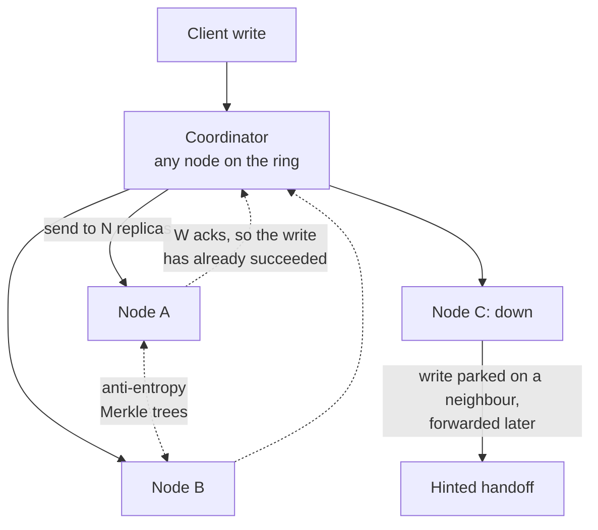

# Dynamo: a distributed key-value store

> A store that accepts your write even when the machines that own the key are down, then hands you two versions later.

## What it is

Dynamo is a key-value store. You save a value under a key, and you read it back by that key. There are no joins, no queries across a range of keys, and no transactions that span keys.

Most summaries say Dynamo is "eventually consistent" and stop there. That misses the real rule. Dynamo is always writable by design: a write is never refused just because some replicas are unreachable. The cost of that choice is moved to read time, and often all the way into your application code.

One more correction. The Dynamo paper describes a system built inside Amazon. Amazon DynamoDB is a later managed service with a different design inside, covered in [DynamoDB](dynamodb-managed-nosql.md).

## The problem it solves

Picture a shopping cart. A customer taps "add to cart" while one storage machine is rebooting and one network link is dropping packets. A store that needs a majority of replicas to agree will return an error.

That error is lost money. A cart that briefly shows an old item count is a small annoyance, and it can be repaired later.

Dynamo takes the other side of that trade. Any healthy machines that can accept the write, accept it. Copies that drift apart are found and merged later.

## Key design ideas

Any node can coordinate a write. The write is finished as soon as W replicas answer, so no single machine in this picture has to be up.

| Idea | How it works |
|------|--------------|
| Consistent hashing on a ring | Keys and nodes are hashed onto the same circle of numbers (the ring). A key belongs to the first node clockwise from the key's hash. Adding or removing one node moves only the keys in that node's arc, not the whole dataset. See [consistent hashing](../patterns/consistent-hashing.md) |
| Virtual nodes | Each machine takes many small positions on the ring (each position is a virtual node) instead of one. One position per machine would give one machine a random, possibly huge slice. Many small positions average out, so load is even, and a dead machine's work is picked up by many peers at once |
| N replicas per key | Each key is stored on the next N healthy nodes clockwise. That list is called the preference list. N is 3 in the common setup |
| R and W as knobs | A read waits for R replicas to answer, a write waits for W. A quorum is simply the number of replicas you insist on hearing from. If R plus W is greater than N, the read set and the write set must overlap on at least one node. That overlapping node holds the newest completed write, so the read sees it. The common setting is N=3, R=2, W=2. More in [quorum](../patterns/quorum.md) |
| Vector clocks | Every version carries a small list of (node, counter) pairs, one counter per node that has written it. Version X is older than version Y if every counter in X is less than or equal to the matching counter in Y. If neither is older, the two versions conflict and both are kept. This is the [logical clock](../patterns/logical-clocks.md) idea applied to stored objects |
| Sloppy quorum | If a node on the preference list is unreachable, the write goes to the next healthy node on the ring instead. The write still gets W acknowledgements, so it still succeeds |
| Gossip membership | Each node picks a random peer every second and swaps its view of who is alive and which ring positions they own. There is no central registry to fail. See [gossip protocol](../patterns/gossip-protocol.md) |

## Notable techniques

- Hinted handoff. A replacement node stores the value plus a hint, which is a note saying "this really belongs to node C". A background job keeps checking node C. When node C answers again, the value is handed over and the local copy is deleted. This turns a sloppy quorum into a short detour instead of data loss.
- Application-side merge, with the cart as the example. If a read returns two conflicting versions, Dynamo gives both to the application. The cart merges them by taking the union of the items, so an "add" made during a partition is never lost. The honest side effect is that an item the customer removed can come back, because a union of two carts cannot tell a removal from a version that never saw the item.
- Read repair. The coordinator already has replies from R replicas, so it compares their versions. Any replica holding an old version is sent the newest one on the spot. Frequently read keys heal themselves at almost no extra cost.
- Anti-entropy with Merkle trees. Rarely read keys need another repair path. Each node builds a tree of hashes over its key range: leaves hash individual keys, and each parent hashes its children. Two replicas compare root hashes first. Equal roots mean the ranges match and nothing more is sent. Different roots mean they walk down only the branches that differ, so the data exchanged is proportional to the differences, not to the size of the range.
- Bounded version history. A vector clock would grow forever if every node that touches a key added an entry. Dynamo stores a timestamp with each pair and drops the oldest when the list passes a small limit, around ten entries. That can create a false conflict, which is safe, instead of hiding a real one.
- Zero-hop routing. Every node knows the full ring from gossip, so a client library sends the request straight to a replica. There is no lookup service in the request path.
- Deletes are tombstones. A delete is written as a marker (a tombstone) that says "this key was removed", and the marker is replicated like any other version. Removing the row outright would let a replica that missed the delete resurrect the old value during repair.

## Trade-offs

Dynamo buys availability with your application's simplicity. Conflicting versions reach your code, and you must write merge logic for every value type you store. Teams that cannot face that fall back to "last writer wins", which silently throws away one of the two writes.

Sloppy quorum also weakens the rule above. R plus W greater than N only guarantees an overlap when the replicas answering are the real preference list. During a failure they may not be, so a read can miss a recent write.

Dynamo is bad at anything that needs one agreed number. Counters, balances, and "the last seat" are read-modify-write operations, and two concurrent updates give you two versions, not one sum. Use a store with real transactions for a [payment system](../questions/design-payment-system.md).

It is also bad at scanning. Keys are spread by hash, so "every order between two dates" means reading every node. There are no secondary indexes and no multi-key atomicity.

Dynamo is an AP system under the [CAP theorem](../patterns/cap-theorem.md), so name the guarantees you actually get before you pick it, as in [consistency models](../patterns/consistency-models.md). The design is the direct source of [Cassandra](cassandra-wide-column-db.md) and the natural answer to [design Amazon's shopping cart](../questions/design-amazon-shopping-cart.md).

## Go deeper

- Related deep dive: [Cassandra](cassandra-wide-column-db.md)
- For the full deep dive: [Advanced System Design Interview, Volume II](https://www.designgurus.io/course/grokking-system-design-interview-ii?utm_source=github&utm_medium=repo&utm_campaign=grokking-system-design&utm_content=deep-dives-dynamo-key-value-store)
- Full course: [Grokking the System Design Interview](https://www.designgurus.io/course/grokking-the-system-design-interview?utm_source=github&utm_medium=repo&utm_campaign=grokking-system-design&utm_content=deep-dives-dynamo-key-value-store)
