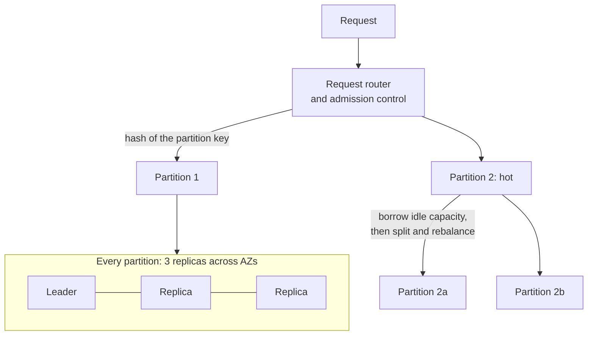

# DynamoDB: the managed database that never falls over

> Amazon's fully managed NoSQL service (the 2022 paper): predictable single-digit-millisecond latency at any scale, two decades after Dynamo.

## What it is

DynamoDB is AWS's flagship managed key-value and document database. Despite the name, it is not [Dynamo](dynamo-key-value-store.md): Dynamo was an eventually consistent library teams operated themselves; DynamoDB is a multi-tenant cloud service with strong consistency options, transactions, and an SLA. The 2022 paper's headline: during the 2021 Prime Day, DynamoDB peaked at 89 million requests per second with single-digit-millisecond latency.

## The problem it solves

Dynamo proved always-available storage but was painful: every team ran its own cluster and had to understand [quorums](../patterns/quorum.md) and conflict resolution. DynamoDB's goal is boring predictability as a service: any table, any size, same latency, no servers to manage. The interesting engineering is in multi-tenancy: thousands of customers sharing hardware without stepping on each other.

## Key design ideas

Admission control sits in front of the partitions. That is how one tenant is stopped from starving another.

| Idea | How it works |
|------|--------------|
| Partitioned, replicated storage | Tables split by key hash into partitions ([sharding](../patterns/sharding-partitioning.md)); each partition is a 3-replica group across AZs using Paxos for [leader election](../patterns/leader-election.md) and replication |
| Provisioned capacity as a first-class concept | Throughput is metered in read/write capacity units; admission control per partition keeps one tenant from starving another |
| Adaptive capacity | Hot partitions borrow unused capacity from cold ones on the same table, then the system splits hot partitions and rebalances automatically |
| On-demand mode | No capacity planning: the system observes traffic and pre-splits, absorbing spikes; the customer pays per request |

## Notable techniques

- Split for consumption, not just size: a partition that is hot but small still splits, and the split point is chosen from the observed key access distribution, not the midpoint.
- MemDS: a distributed metadata cache lets request routers find any partition without a metadata hot spot; routers cache aggressively and refresh in the background.
- Static stability: routers keep serving from cached routing state even if the metadata service is down; the data plane survives control-plane failures.
- Continuous verification: checksums on every log record and periodic scrubbing of replicas against archived [write-ahead logs](../patterns/write-ahead-log.md) catch silent corruption ([checksums](../patterns/checksums.md) taken seriously).

## Trade-offs

The data model is deliberately narrow: key-value access with secondary indexes, no joins, and queries must follow the key design ([SQL vs NoSQL](../cheat-sheets/sql-vs-nosql.md) applies in full). Strongly consistent reads cost double and route to the leader. Transactions exist but are more expensive than plain writes. The lesson for interviews: DynamoDB gets its predictability by refusing generality, and you should say which access patterns you are giving up.

## Go deeper

- For the full deep dive: [Advanced System Design Interview, Volume II](https://www.designgurus.io/course/grokking-system-design-interview-ii?utm_source=github&utm_medium=repo&utm_campaign=grokking-system-design&utm_content=deep-dives-dynamodb-managed-nosql)
- Full course: [Grokking the System Design Interview](https://www.designgurus.io/course/grokking-the-system-design-interview?utm_source=github&utm_medium=repo&utm_campaign=grokking-system-design&utm_content=deep-dives-dynamodb-managed-nosql)