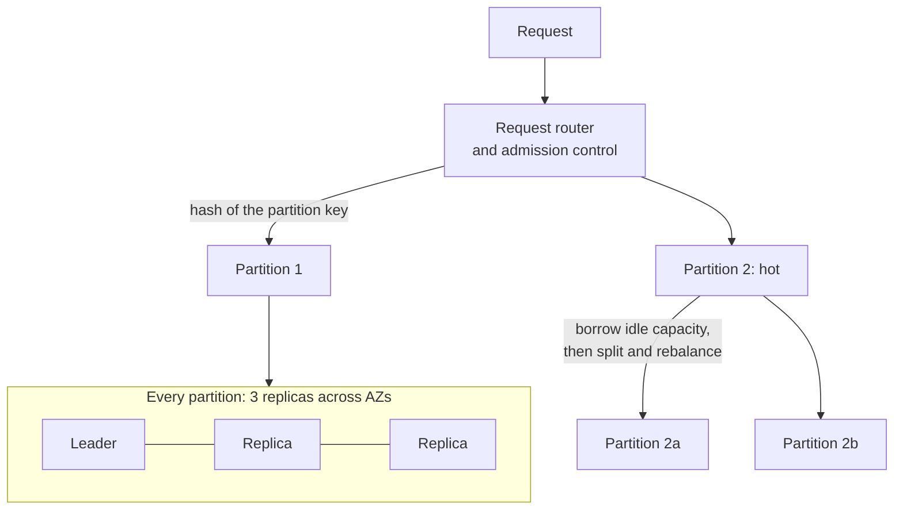

# DynamoDB: the managed database that never falls over

> A table that answers in a few milliseconds whether it holds ten items or ten billion, because the service removed almost every knob.

## What it is

DynamoDB is Amazon's managed key-value and document database. You create a table, write items, and never see a server.

Despite the name, it is not [Dynamo](dynamo-key-value-store.md). Dynamo was a library that each team ran on its own machines. Those teams had to understand [quorums](../patterns/quorum.md) (how many copies must answer before a read or write counts). They also merged conflicting versions in their own code.

DynamoDB keeps the Dynamo ideas and removes those knobs. Replication, repair, splitting, and failover happen inside the service. In their place you get one promise: single-digit millisecond latency at any table size. At one Prime Day peak it served about 89 million requests per second and held that latency.

The reframing worth carrying into an interview: DynamoDB is not a faster database. It is a database that refuses the queries that get slow.

## The problem it solves

Here is the failure teams recognize. A product runs on a relational database. The main table reaches a few hundred million rows. One query scans an index that no longer fits in memory. At the traffic peak, p99 latency goes from 10 milliseconds to 2 seconds, and nobody can say which query caused it.

The real problem is that cost per request is unpredictable. One SQL query may touch one row or the whole table, and the plan can change as the data grows.

DynamoDB removes that risk by construction. Every read must name a partition key, so it touches one partition. The work per request stays flat while the table grows from 1 GB to 100 TB.

## Key design ideas

The partition key is the whole design. Pick it well and the table grows without effort. Pick it badly and no setting will rescue you.

| Idea | How it works |
|------|--------------|
| The partition key picks the shard | The service hashes the partition key, and that hash value decides which partition stores the item ([sharding](../patterns/sharding-partitioning.md)). The router does the same hash, so it reaches the right partition in one hop, with no lookup over a range map |
| The sort key orders items inside one partition | All items with the same partition key form an item collection, stored next to each other and sorted by the sort key. That makes "the last 20 messages in this chat" one cheap read, using a range condition like "greater than this timestamp" |
| Capacity units meter the work | One write capacity unit is one write of up to 1 KB per second. One read capacity unit is one strongly consistent read of up to 4 KB per second, or two eventually consistent reads. Admission control counts these per partition, which stops one customer from starving another on shared hardware |
| Provisioned or on-demand | In provisioned mode you state the units per second you want and pay for them even when idle. In on-demand mode you pay per request, and the service watches your traffic and pre-splits partitions so it can absorb a spike. On-demand costs more per request and removes the planning work |
| Adaptive capacity | Traffic is never even across keys. The service lends unused capacity from quiet partitions to busy ones on the same table, then splits the busy partition for good. It picks the split point from the observed access spread, not the middle of the key range |
| Consistency chosen per request | The same table serves both kinds of read. An eventually consistent read may hit any of the three replicas and can return a slightly old value, and costs half as much. A strongly consistent read goes to the leader replica and always returns the last written value ([consistency models](../patterns/consistency-models.md)) |
| Three replicas across availability zones | Every partition is a group of three copies in three zones, with a leader chosen by Paxos ([leader election](../patterns/leader-election.md)). A write is committed once a majority has it in the [write-ahead log](../patterns/write-ahead-log.md), so one zone can fail with no data loss |

## Notable techniques

- Two kinds of secondary index, with different bills. A local secondary index keeps the same partition key and adds a second sort key. It lives in the same partition, so it can be read strongly consistently. It shares that partition's capacity and must be created with the table. A global secondary index uses a different partition key, so it is a separate copy of the data. It has its own capacity, it is written after the base item, and it can only be read eventually consistently. Every base write also writes to each index holding the item, so five indexes turn one write into roughly six ([database indexing](../patterns/database-indexing.md)).
- The hot partition, which almost every team hits once. A single partition is capped near 3,000 read units and 1,000 write units per second. Use today's date, or one celebrity account, as the partition key and all that traffic lands on one partition. Those requests get throttled while the rest of the table sits idle. Splitting does not help, because one key cannot be split. The fix is in the key: add a small suffix so one logical key becomes many partition keys, and read all of them back.
- Streams for change data capture. Every item change can be emitted as a record with the old image, the new image, or both. Records are kept for 24 hours, stay in order per partition key, and each change appears once. You attach a function to the stream to update a search index, keep a running count, or publish an event. That replaces writing to the database and the queue separately and hoping both succeed ([outbox pattern](../patterns/outbox-pattern.md), [event sourcing and CQRS](../patterns/event-sourcing-cqrs.md)).
- Transactions with a hard edge. One call applies up to 100 items, all or nothing, in one region, and the service runs the two-phase protocol for you ([distributed transactions](../patterns/distributed-transactions.md)). Each item costs twice the normal capacity. There is no interactive transaction: you cannot read, decide in your code, then write inside it. You declare the writes and their conditions up front. The limit is deliberate, because a lock held across partitions while your code thinks would break the latency promise.
- Single-table design. There are no joins, and a query is cheap only inside one partition. So teams put several entity types in one table and shape the keys so related items share a partition key: the customer record and that customer's last orders arrive in one read. The cost is readability, because the table stores the access patterns rather than the data model.
- Routers that survive the control plane. They cache the map from key to partition and keep serving from that cache when the metadata service is down. Every log record also carries a [checksum](../patterns/checksums.md), which catches silent corruption on disk.

## Trade-offs

You buy flat latency by giving up query freedom. There are no joins and no ad hoc queries. Anything the key design did not plan for becomes a full table scan, which is slow and expensive. Analytics and reporting belong somewhere else.

The shape of the data is limited too. One item is at most 400 KB, and a query returns at most 1 MB per page. Large files belong in object storage, with only the pointer stored here.

Changing your mind is hard. The keys are the schema, so a new access pattern usually means a new index or a data migration. Multi-region tables settle conflicting writes by keeping the last writer, so a cross-region ledger of money is a poor fit ([SQL vs NoSQL](../cheat-sheets/sql-vs-nosql.md), [Postgres vs DynamoDB vs Cassandra](../cheat-sheets/postgres-vs-dynamodb-vs-cassandra.md)).

## Go deeper

- Related deep dive: [Dynamo, the key-value store it is named after](dynamo-key-value-store.md)
- For the full deep dive: [Advanced System Design Interview, Volume II](https://www.designgurus.io/course/grokking-system-design-interview-ii?utm_source=github&utm_medium=repo&utm_campaign=grokking-system-design&utm_content=deep-dives-dynamodb-managed-nosql)
- Full course: [Grokking the System Design Interview](https://www.designgurus.io/course/grokking-the-system-design-interview?utm_source=github&utm_medium=repo&utm_campaign=grokking-system-design&utm_content=deep-dives-dynamodb-managed-nosql)
