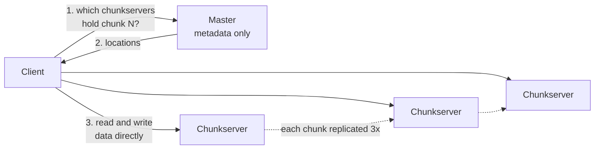

# GFS: the Google File System

> Files of many gigabytes, written by appending and read from start to end, stored on cheap machines that are expected to break.

## What it is

GFS stores very large files across thousands of ordinary servers. People hear "file system" and expect something general, and that expectation is the common mistake. GFS is not a general purpose file system. It drops several promises a normal file system makes, and buys one thing in return: high throughput for files that are written once, appended to many times, and read in long sequential passes.

It also starts from a different assumption about hardware. In a cluster of thousands of cheap machines, something is broken at any moment. So failure is not an error path in GFS. It is the normal path, handled continuously by monitoring, re-replication, and checksums.

GFS is the storage layer under [BigTable](bigtable-wide-column-store.md) and under [MapReduce](mapreduce-batch-processing.md), and it is the direct blueprint for [HDFS](hdfs-file-storage.md).

## The problem it solves

A web crawler writes a stream of fetched pages. A logging pipeline writes a stream of events. Hundreds of processes want to add records to the same file at once, and later one batch job reads that whole file from start to end.

On a normal file system every writer must lock the file, move to the end, write, and unlock. That puts every writer in a line behind one lock and one machine's disk. Give each writer its own file instead and you get millions of tiny files, and the bookkeeping for them becomes the new bottleneck.

GFS removes the line. Many clients append to one file at the same time, with no lock and no agreed position.

## Key design ideas

The master answers where, never what. Data never passes through it, which is why a single master can serve a very large cluster.

| Idea | How it works |
|------|--------------|
| One master, metadata in memory | The master holds the file namespace, the map from file to chunks, and the location of every chunk. All of it sits in RAM, so a lookup is a memory read, never a disk read. It keeps under 64 bytes of metadata per chunk, which is what makes that affordable |
| Chunks of 64 MB | Each file is cut into fixed pieces of 64 megabytes, and each piece is a plain file on a chunkserver's disk. Large pieces mean few pieces: a file of 1 terabyte is about 16,000 chunks, not millions. That keeps the master's memory small, makes questions to the master rare, and lets a client stream a lot of data over one open connection |
| The master never touches file data | Clients ask the master which machines hold a chunk, cache that answer, then read and write the bytes straight from the chunkservers. The master sends only small messages, so its network card never caps cluster throughput |
| Leases give one replica the write order | For each chunk the master gives one replica a lease (a time limited permission to act as the primary, 60 seconds, renewable). The primary puts all concurrent changes into one order, and the other replicas apply that same order. The master is never asked about an individual write, so writes do not queue behind it |
| Record append | A client says "add these bytes to this file" and does not choose a position. The primary picks the offset, tells the replicas, and returns that offset. Many writers can append at once because nobody competes for a position |
| At least once, not exactly once | If any replica fails to write, the client retries the whole append. Bytes from the failed try stay on disk as junk or padding. A record can appear more than once, and readers must be ready for that |
| Three replicas, spread across racks | Each chunk sits on three chunkservers by default, and the master places them so they are not all in one rack. A rack shares a switch and often a power feed, so a whole rack can fail as one unit |
| An operation log with checkpoints | Every namespace change is appended to a log and copied to several machines before the master replies. This is the [write-ahead log](../patterns/write-ahead-log.md) idea. The master periodically writes a compact checkpoint, so recovery replays only the log after it |

Chunk locations are the one thing the master does not put in that log. It asks every chunkserver what it holds at startup, then keeps learning from [heartbeats](../patterns/heartbeats.md). The chunkserver is the authority on its own disk.

## Notable techniques

- Data travels in a chain, not a star. The client sends bytes to the nearest chunkserver, which forwards them to the next while it is still receiving. Each machine uses its full outbound bandwidth in one direction. The small control message that says "commit this write" travels separately, through the primary.
- One append is capped at a quarter of a chunk, which is 16 megabytes. If a record does not fit in the space left, the primary fills the rest with padding and tells the client to retry on a fresh chunk. That bounds how much space padding can waste.
- Every chunk carries a version number that the master raises on each new lease. A chunkserver that was down during a write reports an old version, so the master spots the stale copy, skips it for reads, and collects it later.
- Chunkservers store a 32 bit [checksum](../patterns/checksums.md) for every block of 64 kilobytes and verify it before returning data. Disks corrupt data silently, and this is how a bad copy is caught instead of served.
- When a chunk drops below three copies, the master queues it for re-[replication](../patterns/replication.md), most urgent first. A chunk down to one copy is repaired before a chunk down to two.
- Deletion is lazy. A deleted file is renamed to a hidden name, and the space is reclaimed a few days later. That gives an accidental delete a recovery window, and turns cleanup into a background sweep.
- Read only shadow masters serve metadata while the real master is down. Their view lags a little, so they help for files that are not changing.

## Trade-offs

GFS is very good at one shape of work and openly bad at the rest.

It is bad at small files. A small file is one chunk on three machines, so if many clients want it, those three machines carry all the load. It is bad at low latency, because it is tuned for bulk throughput, which makes it a poor fit behind an interactive request. It is bad at random writes into the middle of a file. Those work, but they are slow and weaker than an append.

The relaxed [consistency model](../patterns/consistency-models.md) pushes real work onto applications. A reader can see duplicate records and padding, so writers must put a unique identifier or a checksum in every record, and readers must filter. Google accepted that because its own readers were batch jobs that could filter easily.

The single master is acceptable for one reason: it is off the data path, and its metadata fits in memory. Both limits eventually bind. Memory caps the number of files, and one machine caps the rate of metadata operations, which is exactly the rate millions of small files demand. The successor, Colossus, spreads metadata across many servers and replaces three full copies with erasure coding (splitting data into pieces plus extra parity pieces), which cuts the storage bill.

## Go deeper

- Related deep dive: [HDFS file storage](hdfs-file-storage.md), plus [Chubby](chubby-distributed-locking.md) for the [leader election](../patterns/leader-election.md) that keeps one master in charge
- For the full deep dive: [Advanced System Design Interview, Volume II](https://www.designgurus.io/course/grokking-system-design-interview-ii?utm_source=github&utm_medium=repo&utm_campaign=grokking-system-design&utm_content=deep-dives-gfs-distributed-file-system)
- Full course: [Grokking the System Design Interview](https://www.designgurus.io/course/grokking-the-system-design-interview?utm_source=github&utm_medium=repo&utm_campaign=grokking-system-design&utm_content=deep-dives-gfs-distributed-file-system)
