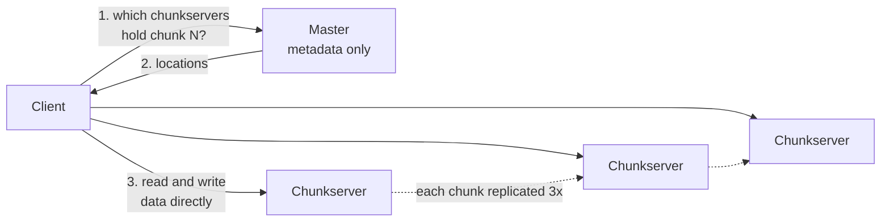

# GFS: the Google File System

> A distributed file system built for very large files, append-heavy workloads, and frequent hardware failure on commodity machines.

## What it is

GFS stores huge files across thousands of commodity servers, treating failure as normal rather than exceptional. It is the storage layer beneath systems like [BigTable](bigtable-wide-column-store.md), and the blueprint for [HDFS](hdfs-file-storage.md).

## The problem it solves

Google needed to store enormous files (think many gigabytes), written mostly by appends and read in large streams, on cheap hardware that fails constantly. Traditional file systems did not fit that profile.

## Key design ideas

The master answers where, never what. Data never passes through it, which is why a single master can serve a very large cluster.

| Idea | How it works |
|------|--------------|
| Single master | One master holds all metadata (the namespace and chunk locations) |
| Chunks | Files are split into large chunks (64 MB), each stored on chunkservers |
| Replication | Every chunk is replicated (typically three times) across machines and racks |
| Master off the data path | Clients ask the master where a chunk is, then read and write directly from chunkservers |

## Notable techniques

- Large chunks reduce metadata and suit big sequential reads and appends.
- Keeping the master out of the data path prevents it from becoming a bandwidth bottleneck.
- A relaxed consistency model and an efficient append operation match the append-heavy workload.
- Designed for failure: constant monitoring, re-replication, and checksums.

## Trade-offs

Great for large files and high-throughput sequential access, poor for many small files or low-latency random writes. The single master simplifies design but must be protected and scaled carefully.

## Go deeper

- For the full deep dive: [Advanced System Design Interview, Volume II](https://www.designgurus.io/course/grokking-system-design-interview-ii?utm_source=github&utm_medium=repo&utm_campaign=grokking-system-design&utm_content=deep-dives-gfs-distributed-file-system)
- Full course: [Grokking the System Design Interview](https://www.designgurus.io/course/grokking-the-system-design-interview?utm_source=github&utm_medium=repo&utm_campaign=grokking-system-design&utm_content=deep-dives-gfs-distributed-file-system)