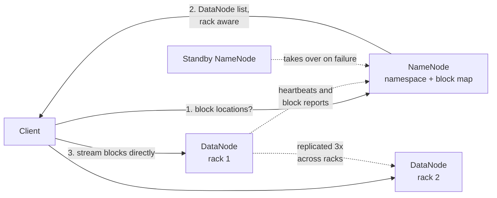

# HDFS: the Hadoop Distributed File System

> The open-source distributed file system at the heart of the Hadoop ecosystem, modeled on the ideas of GFS.

## What it is

HDFS stores very large files across a cluster of commodity machines, for high-throughput batch processing. It is essentially an open-source realization of the [GFS](gfs-distributed-file-system.md) design.

## The problem it solves

Storing and streaming huge datasets for analytics, where throughput matters far more than low-latency random access, on hardware that is expected to fail.

## Key design ideas

The same split as GFS: metadata through the NameNode, bytes straight from the DataNodes.

| Idea | How it works |
|------|--------------|
| NameNode | A master node holds the namespace and block metadata (the equivalent of the GFS master) |
| DataNodes | Worker nodes store the actual data blocks |
| Large blocks | Files are split into large blocks (commonly 128 MB) and distributed |
| Replication | Each block is replicated (default three) with rack awareness for fault tolerance |

## Notable techniques

- Write-once, read-many: files are written and then read repeatedly, which simplifies consistency.
- Rack awareness places replicas across racks so a rack failure does not lose data and reads stay local when possible.
- Clients stream data directly from DataNodes; the NameNode only serves metadata.
- The NameNode is the critical component, so it is made highly available with a standby.

## Trade-offs

Optimized for large files and high-throughput batch reads, not for many small files or low-latency access. It mirrors GFS's strengths and limits.

## Go deeper

- For the full deep dive: [Advanced System Design Interview, Volume II](https://www.designgurus.io/course/grokking-system-design-interview-ii?utm_source=github&utm_medium=repo&utm_campaign=grokking-system-design&utm_content=deep-dives-hdfs-file-storage)
- Full course: [Grokking the System Design Interview](https://www.designgurus.io/course/grokking-the-system-design-interview?utm_source=github&utm_medium=repo&utm_campaign=grokking-system-design&utm_content=deep-dives-hdfs-file-storage)