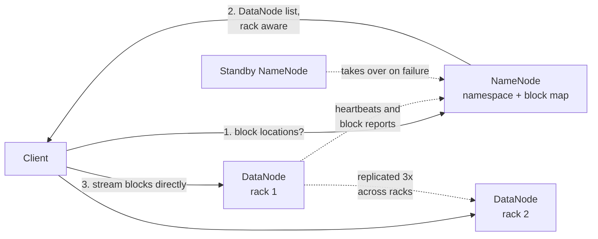

# HDFS: the Hadoop Distributed File System

> One machine remembers where every block lives, a thousand machines hold the bytes, and nothing already written can be changed.

## What it is

HDFS spreads very large files across many ordinary machines. It is an open implementation of the [Google File System](gfs-distributed-file-system.md) design, tuned for batch analytics (jobs that read a whole dataset from start to end).

People often picture it as a shared network drive for big data. That picture is wrong in one important way. HDFS is write-once-read-many: you create a file, stream it to the end, and close it. After that you may append to the end, but you can never edit a byte in the middle.

Almost every simple thing about HDFS follows from that rule. A block never changes after it is written, so a replica is either complete and correct or it is thrown away.

## The problem it solves

Say you keep 100 terabytes of logs and want one report over all of them. A single hard disk streams roughly 100 to 200 megabytes per second, so reading that much through one machine would take more than a week.

The second problem is failure. In a cluster of a thousand disks, a disk dying today is normal.

HDFS answers both. Split each file into large blocks, put every block on three machines, and let a thousand disks read in parallel. Then send the computation to the machine that already holds the block.

## Key design ideas

The core split is between naming and bytes. Metadata is small and needs one authoritative answer, so one service owns it. Data is huge and needs many pipes, so every worker machine serves it directly.

| Idea | How it works |
|------|--------------|
| NameNode holds metadata only | One server keeps the directory tree, file permissions, and the list of blocks in each file. It keeps all of this in memory, so a lookup is a memory read and not a disk read. File data never passes through it, which is why one machine can serve thousands of clients |
| DataNodes hold blocks | Every worker machine stores blocks as plain files on its local disks. A client asks the NameNode where a block is, then opens a connection straight to a DataNode. Bandwidth grows as you add machines |
| Blocks of 128 megabytes | A file is cut into big blocks, commonly 128 megabytes. Big blocks mean few blocks, so the NameNode's map stays small. They also mean a reader streams instead of seeking, because one seek is paid once per 128 megabytes |
| Rack-aware placement of three replicas | A rack is a cabinet of machines behind one switch. The default policy puts the first replica on the writer's own machine, and the second on a machine in a different rack. The third goes on another machine in that same second rack. Using two racks means a whole rack can lose power without losing data. Keeping replicas two and three together means only one copy crosses the slow link between racks |
| The write pipeline | The client does not send three copies. It sends to one DataNode, which forwards to the second, which forwards to the third. Data moves as 64 kilobyte packets, so all three links stay busy at once, and acknowledgements travel back along the chain. The client's uplink carries the data once, not three times |
| Heartbeats and block reports | Each DataNode sends a small heartbeat every three seconds to say it is alive. Every few hours it also sends a block report, a full list of the blocks it holds. A dead machine is detected in roughly ten minutes. Block reports are how the NameNode learns the block map, so it never stores block locations on disk |
| A standby NameNode plus a journal quorum | The active NameNode writes every namespace change to a group of JournalNodes, usually three. A change counts as durable once a quorum (a majority, so two out of three) has written it. The standby NameNode reads that same journal and applies the changes. It holds a nearly current copy of the metadata, so it can take over in under a minute |

Only one NameNode may be active. The cluster uses [leader election](../patterns/leader-election.md) through [ZooKeeper](zookeeper-coordination.md), plus fencing (forcibly cutting off the old active node). A network partition therefore cannot leave two NameNodes both writing. The journal itself is the [write-ahead log](../patterns/write-ahead-log.md) idea applied to a namespace, made fault tolerant by a [quorum](../patterns/quorum.md).

## Notable techniques

- Data locality. The scheduler asks the NameNode which machines hold a block, then runs the task on one of those machines. In [MapReduce](mapreduce-batch-processing.md) this is why a large scan costs almost no network traffic.
- Checksums on every read. The client computes a [checksum](../patterns/checksums.md) over each small chunk of data and compares it to the one stored beside the block. A silently corrupted disk is caught at read time, the client retries a different replica, and the NameNode schedules a fresh copy.
- Automatic re-replication. When heartbeats stop, the NameNode counts how many replicas each of that machine's blocks still has, and copies the under-replicated ones somewhere else. This is [replication](../patterns/replication.md) driven by a repair loop, not by a fixed pairing of machines.
- Safe mode at startup. A restarted NameNode has no block map at all, so it refuses writes until enough DataNodes have reported in. Without this pause it would treat most blocks as missing and start copying them for no reason.
- One writer per file. The NameNode grants a lease (a time-limited exclusive right to write one file) and the client renews it. If the client dies, the lease expires, and the NameNode closes the file at its last complete block.
- Erasure coding instead of three copies. Data is split into pieces plus parity pieces, which cuts storage overhead from three times the data to around one and a half times. Rebuilding a lost piece costs reads across many machines, so it suits cold data.
- Federation for metadata scale. Several NameNodes each own part of the directory tree and share the same DataNodes, which is [partitioning](../patterns/sharding-partitioning.md) applied to metadata.

## Trade-offs

The weakness follows straight from the strength. All metadata lives in one machine's memory, and each file, directory, and block costs roughly 150 bytes there. So ten million files of one megabyte each cost far more NameNode memory than ten thousand files of one gigabyte, while holding the same data. This is the small files problem, and the usual answer is to pack many small files into large container files before loading them.

HDFS is bad at low latency. A read costs a NameNode round trip and then a DataNode round trip, so a single small read is measured in milliseconds, not microseconds. It is not a store for user-facing requests.

It cannot do random writes at all. No in-place updates, no seek and overwrite. Anything mutable must live somewhere else, or in a layer on top that writes new files and marks old rows dead.

Finally, HDFS ties storage to the machines that compute. Object stores separate the two, so you can grow either one alone, which is part of [designing S3-style object storage](../questions/design-amazon-s3.md).

## Go deeper

- Related deep dive: [GFS, the Google File System](gfs-distributed-file-system.md)
- For the full deep dive: [Advanced System Design Interview, Volume II](https://www.designgurus.io/course/grokking-system-design-interview-ii?utm_source=github&utm_medium=repo&utm_campaign=grokking-system-design&utm_content=deep-dives-hdfs-file-storage)
- Full course: [Grokking the System Design Interview](https://www.designgurus.io/course/grokking-the-system-design-interview?utm_source=github&utm_medium=repo&utm_campaign=grokking-system-design&utm_content=deep-dives-hdfs-file-storage)
