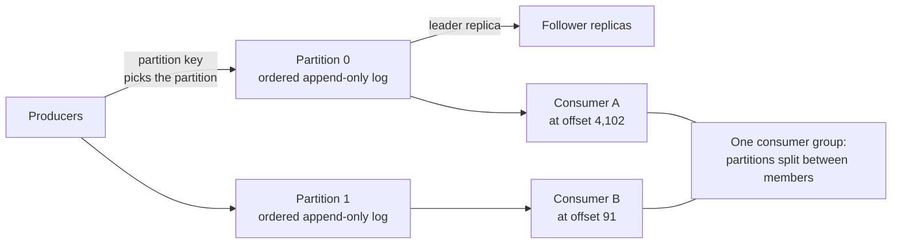

# Kafka: a distributed messaging system

> Every event is written to disk and kept after it is read, which is why Kafka is fast and why you can replay last week.

## What it is

Kafka is a replicated, partitioned, append-only log. Producers add events to the end of a log. Consumers read forward from a position they pick.

The common misunderstanding is that Kafka is a queue. A queue hands a message to one consumer and then deletes it. Kafka deletes nothing when a message is read.

A broker (one Kafka server) keeps every record until a retention limit passes, whether ten consumers read it or none. Each consumer stores its own position, called an offset (the number of a record inside its partition). Reading is only that number moving forward.

That difference is why one Kafka topic can replace a [message queue](../patterns/message-queues.md), an audit log, and a replay tool.

## The problem it solves

Wiring services directly together fails in a familiar way. An order service calls the search indexer, the billing service, and the fraud checker. When the fraud checker is down for twenty minutes, orders either fail or that data is lost.

A queue that deletes on delivery fixes the outage but not the mistake. Suppose the indexer had a bug and wrote wrong data for three hours. Those messages are gone, so there is nothing left to rebuild from.

Kafka gives both problems the same answer. The fraud checker restarts and continues from its own offset. The indexer moves its offset back three hours and processes the same records again. [Event sourcing](../patterns/event-sourcing-cqrs.md) applies the same idea inside one service.

## Key design ideas

The partition is the unit of everything: ordering, storage, replication, and parallel reading. That is why the partition key is the real design decision.

| Idea | How it works |
|------|--------------|
| Topics and partitions | A topic is a named stream, split into partitions. Each partition is its own sequence of append-only files, with its own order. A topic with 12 partitions is 12 independent logs, spread over up to 12 brokers ([sharding](../patterns/sharding-partitioning.md)) |
| Offsets | Every record gets the next whole number position in its partition, and it never changes. The broker does not track who read what. Each group saves its own offset per partition, in a Kafka topic kept for that |
| Ordering and the partition key | Order holds inside one partition and nowhere else. The producer hashes the record key to choose the partition, so records with the same key land in the same log, in order. Key by user id and one user's events stay ordered. Key at random and you get even spread but no order |
| Consumer groups | Members of a group split the partitions, and one partition goes to exactly one member. Twelve partitions and four members gives three each. A thirteenth member would get nothing, so partition count is the ceiling on parallel work |
| Rebalancing | When a member joins, leaves, or stops sending [heartbeats](../patterns/heartbeats.md), a broker acting as group coordinator reassigns the partitions. The plain version pauses every member. Cooperative rebalancing moves only the partitions that must move. Static membership lets a restarting member keep its old partitions |
| Leader and in-sync replicas | Each partition has one leader replica and some followers, and all reads and writes go to the leader. Followers pull from the leader the way a consumer does. The in-sync set is the replicas that have caught up recently, within 30 seconds by default. Only a replica in that set may be promoted, so a [failover](../patterns/replication.md) cannot go back in time |
| What acks=all means | The producer can wait for nothing, for the leader alone, or for the whole in-sync set. Waiting for the whole set, with a minimum in-sync size of 2, means a write is confirmed only when two replicas hold it. Otherwise it fails. That pair of settings makes losing one broker safe |
| Retention | Records are kept for a time limit (7 days by default) or a size limit per partition, then whole files are deleted from the front. Retention is not cleanup, it is the feature: replay exists only while the data is still there |

## Notable techniques

- Sequential disk writes. Kafka appends to the end of a file and never edits a record in place. The write lands in the page cache (memory the operating system uses for recent file data) and is flushed later. Disks are slow at random seeks and fast at long sequential writes, so the disk stops being the limit.
- Zero-copy reads. To serve a consumer, the broker asks the kernel to move bytes straight from the page cache into the network socket. The data never passes through the broker's own memory. Producers compress a whole batch of records, not each one, and the broker stores that batch exactly as it arrived, so nothing is re-encoded. Turning on TLS ends zero-copy, because the bytes must then be encrypted in user space.
- Idempotent producers. A retry after a timeout can write the same record twice. With idempotence on, the producer gets an id and numbers its records per partition, and the broker drops a number it has already seen. That gives exactly-once writing to one partition. See [idempotency](../patterns/idempotency.md).
- Transactions. A producer with a transactional id writes to several partitions and commits them as one unit. A coordinator writes a commit or abort marker into each partition. Consumers set read-committed isolation and skip aborted records. Commit the consumer offsets inside the same transaction and input and output move together. That is what exactly-once processing means here, and it holds inside Kafka only.
- Log compaction and tombstones. A compacted topic keeps the newest record per key and removes older ones, instead of deleting by age. A delete is a tombstone (a record with the key and an empty value), kept long enough for every consumer to see it. The topic becomes a changelog you can rebuild state from.
- Consumer lag in place of backpressure. Consumers pull and the broker never pushes, so a slow consumer does not slow producers down. It falls behind instead, and lag (latest offset minus committed offset) is the health signal. Retention is the deadline: if lag grows past the retention limit, records are deleted before they are read. Compare with [backpressure](../patterns/backpressure.md).
- Cluster metadata. Older clusters kept broker and partition metadata in [ZooKeeper](zookeeper-coordination.md). Newer ones use a built-in controller quorum (a small set of brokers that must agree), replicated with [Raft](raft-consensus.md).

## Trade-offs

Kafka is bad at anything smaller than a partition. There is no per-message acknowledgment, so a consumer cannot accept record 5 and leave record 4 open. One record that always fails blocks its partition until you skip it.

There is no priority and no per-message delay. A task that should run in one hour does not belong in a Kafka topic.

It is also not a database. You cannot look up a record by key, because a partition has no index. Reading means scanning forward from an offset.

Partitions are not free. Each one costs open files, memory, and replication traffic on every broker. A broker failure means promoting a new leader for each of its partitions. You can add partitions but not remove them, and adding them changes which partition a key maps to, so ordering breaks across that change.

The rest of the cost is operational: rebalances, lag alerts, shrinking in-sync sets, and disks sized by retention. For small volumes with per-message routing, a broker like RabbitMQ is simpler ([Kafka vs RabbitMQ vs SQS](../cheat-sheets/kafka-vs-rabbitmq-vs-sqs.md)). A managed stream removes most of the operating work ([Kafka vs Kinesis vs Pub/Sub](../cheat-sheets/kafka-vs-kinesis-vs-pubsub.md)).

## Go deeper

- Related deep dive: [Flink stream processing](flink-stream-processing.md)
- Practice question: [design a distributed message queue](../questions/design-distributed-message-queue.md)
- Read more (free): [RabbitMQ vs Kafka vs ActiveMQ](https://www.designgurus.io/blog/rabbitmq-kafka-activemq-system-design?utm_source=github&utm_medium=repo&utm_campaign=grokking-system-design&utm_content=deep-dives-kafka-distributed-messaging)
- For the full deep dive: [Advanced System Design Interview, Volume II](https://www.designgurus.io/course/grokking-system-design-interview-ii?utm_source=github&utm_medium=repo&utm_campaign=grokking-system-design&utm_content=deep-dives-kafka-distributed-messaging)
- Full course: [Grokking the System Design Interview](https://www.designgurus.io/course/grokking-the-system-design-interview?utm_source=github&utm_medium=repo&utm_campaign=grokking-system-design&utm_content=deep-dives-kafka-distributed-messaging)
