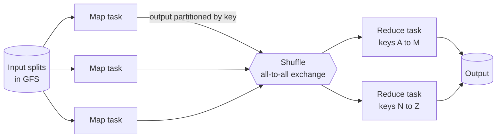

# MapReduce: batch processing at scale

> A job runs on a thousand machines for six hours, some of them die while it runs, and nobody has to wake up.

## What it is

MapReduce is a programming model plus a runtime for processing very large datasets on cheap, ordinary machines. You write two functions. Map turns each input record into key and value pairs. Reduce combines all the values that share one key. The runtime does everything else.

It is tempting to say MapReduce is "those two functions". That is the usual misunderstanding, and it undersells the system. The two functions are the small part, and they are the only part you write. The valuable part is everything around them. The runtime splits the input, places work next to the data, moves the middle data to the right machine, and re-runs whatever fails.

Two ideas carry the whole design. Move the computation to the data, instead of moving the data to the computation. And treat machine failure as an ordinary event during a job, not as an emergency that ends it.

It built Google's search index, it produced Hadoop, and its shape survives in Spark and in every [batch processing](../patterns/batch-vs-stream-processing.md) system since.

## The problem it solves

Say you have 20 terabytes of web server logs and you want a count for each URL. One machine reading at 100 megabytes a second needs more than two days just to read the bytes. So you split the work across 1,000 machines.

Now the real problem starts. With 1,000 machines running for an hour, some of them will fail. A disk dies, a machine reboots, a switch drops packets. Before MapReduce, each large computation was a custom distributed program, and most of its code handled splitting, scheduling, and failure rather than the counting. Every team wrote that code again, and every team got some of it wrong.

MapReduce wrote that machinery once. A job on a thousand machines became a few dozen lines of application code.

## Key design ideas

The shuffle in the middle is the expensive part of every job, and it is the part you write no code for.

| Idea | How it works |
|------|--------------|
| Split, then map | The input is cut into splits, each sized to match one storage block (16 to 64 megabytes in the original system). One map task reads one split. Splits stay small on purpose, so there are far more tasks than machines and the work spreads evenly |
| Partition by key | Each map task assigns every key it emits to one reduce task, using a partition function. The default is the hash of the key divided by the number of reduce tasks, keeping the remainder. Every value for one key therefore lands on exactly one reducer |
| The shuffle | Map output is written to the local disk of the map machine, in one region per reduce task. Each reduce task then pulls its own region from every map machine. With 2,000 map tasks and 500 reduce tasks, that is a million transfers. The shuffle, not your code, usually decides how long a job takes |
| Sort, then reduce | A reduce task sorts everything it pulled, by key, so all the values for one key sit next to each other. It then calls your reduce function once per key and walks the sorted data in a single pass |
| Data locality | The storage system keeps several copies of every block. The master tries to place a map task on a machine that already holds a copy. If that is not possible, it picks a machine on the same network switch. Most input is then read from a local disk and never crosses the network. The file system underneath is [GFS](gfs-distributed-file-system.md), or [HDFS](hdfs-file-storage.md) in the open-source version |
| Failure by re-execution | A failed task is simply run again somewhere else. This works because tasks are deterministic (same input, same output) and free of side effects (each writes only to its own private file). A second run cannot corrupt anything |

## Notable techniques

- Combiners cut the shuffle down at the source. A combiner is a small reduce that runs on the map machine before anything is sent. For word counting, a map task that saw "the" 10,000 times sends one pair instead of 10,000. This is safe only for operations that are associative and commutative (the order and the grouping of the steps do not change the answer). Sum and maximum qualify. Average does not, unless you carry a sum and a count and divide at the end.
- Speculative execution handles stragglers (tasks that are not failing, but are very slow). The cause is usually a sick disk, or a machine sharing its CPU with other work. Near the end of a job, the master starts a backup copy of each remaining task and keeps whichever copy finishes first. The original paper reported that switching backup tasks off made one sort job take 44 percent longer.
- The commit is atomic through rename. A reduce task writes into a private temporary file and, when it is done, renames that file to the final name. The rename is one step in the file system, so a task that ran twice leaves exactly one result and never a half-written one. That is [idempotency](../patterns/idempotency.md) bought with a file system operation instead of a protocol.
- One master holds all the bookkeeping: which task is idle, running, or finished, and which machine holds which map output. It tracks which machines are alive with [heartbeats](../patterns/heartbeats.md). Because a map task stores its output on local disk, a machine that dies forces its finished map tasks to be run again. A finished reduce task does not, because its output already sits in the shared file system.
- Bad records can be skipped. If a task dies twice on the same record, the master writes that record down and tells later attempts to skip it. One poisoned row out of a billion then costs you one row instead of the whole job.
- Skew is the failure mode nobody plans for. One very common key, like a single popular URL, sends one reduce task far more data than the others. The whole job then waits for it. Real pipelines split hot keys, or add a random suffix to spread them across reducers.

## Trade-offs

Between map and reduce there is a barrier. No reduce function can run until every map task has finished, because a late mapper might still emit one of its keys. That barrier, plus the write to disk in the middle, is why an answer arrives in minutes or hours and never in milliseconds. MapReduce is the wrong tool for interactive work, and for small data, where the startup cost is larger than the work itself.

It is also bad at repeating itself. Machine learning and graph ranking pass over the same data 30 times, and MapReduce reads it back from disk all 30 times. Anything more complex than one pass becomes a chain of separate jobs. Each writes its result to storage so the next can read it.

Later engines kept the model and removed that write. Spark and [Flink](flink-stream-processing.md) still split, shuffle, and aggregate, but they hold the middle data in memory and hand it straight to the next stage. They stay safe by recording how each piece of data was produced. A lost piece is rebuilt by re-running the small part that made it. Same model, one less round trip.

## Go deeper

- Related deep dive: [The Google File System](gfs-distributed-file-system.md)
- For the full deep dive: [Advanced System Design Interview, Volume II](https://www.designgurus.io/course/grokking-system-design-interview-ii?utm_source=github&utm_medium=repo&utm_campaign=grokking-system-design&utm_content=deep-dives-mapreduce-batch-processing)
- Full course: [Grokking the System Design Interview](https://www.designgurus.io/course/grokking-the-system-design-interview?utm_source=github&utm_medium=repo&utm_campaign=grokking-system-design&utm_content=deep-dives-mapreduce-batch-processing)
