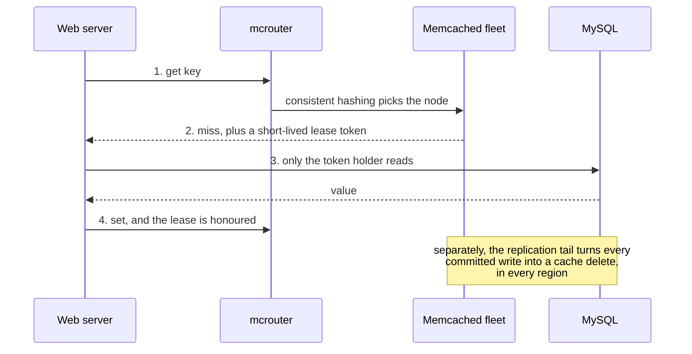

# Memcached at Facebook: caching at planet scale

> A write here does not update the cache. It deletes the entry, and a short token decides which single client is allowed to refill it.

## What it is

Memcached is a small program. It keeps key and value pairs in memory on one machine, and it does almost nothing else.

The famous Facebook paper is not really about that program. It is about the system built around many thousands of copies of it.

Facebook calls that system memcache, with a small letter. It is the caching layer for a whole website. It handles routing, server failure, invalidation (removing an entry that is no longer correct), and consistency between regions.

So the common misunderstanding is worth correcting. The lesson of this work is not "use memcached". The lesson is the several hundred fixes needed to run a [look-aside cache](../patterns/caching.md) at this size. A look-aside cache is one the application checks by itself, rather than one that sits inside the database.

## The problem it solves

Drawing one social page needs hundreds of small pieces of data. Each piece is cheap on its own. Together they are hundreds of database reads for one page view.

Reads outnumber writes by a very large factor. A MySQL fleet big enough to serve those reads directly would be far too large and too expensive.

The failure you should picture is not a slow page. It is this: a few cache servers stop answering, every request misses, and all of that read load lands on MySQL in one second. The databases then overload and stop answering, and they cannot recover, because the cache stays empty while they are overloaded.

## Key design ideas

Two details carry the whole design. A write deletes the cache entry instead of updating it. A miss hands out a lease, so only one client refills the key.

| Idea | How it works |
|------|--------------|
| Look-aside caching | The web server asks the cache first. On a miss it reads MySQL and then writes the value into the cache itself. The cache never talks to the database, which keeps the cache servers simple and replaceable |
| Delete, not update | A database write removes the cache entry instead of overwriting it. Two deletes for the same key have the same effect as one, so they can arrive late or twice and still be safe (this is [idempotency](../patterns/idempotency.md)). Two updates arriving out of order would leave the wrong value in place forever |
| Leases | On a miss the server returns a 64-bit token tied to that key. A set is accepted only if the client gives back a token that is still valid. This one mechanism fixes two separate failures, described below |
| mcrouter | A routing proxy sits between web servers and cache servers. It does [consistent hashing](../patterns/consistent-hashing.md) to pick the owner of a key, batches requests, and reroutes around dead servers, so every client stays simple |
| Gutter pool | About one percent of the cache machines in a cluster are kept idle. When a server stops answering, clients send its keys to the gutter pool instead, so the miss storm never reaches the database |
| Invalidation from the commit log | A daemon reads the MySQL commit log, the ordered record of committed writes. It turns each write into a cache delete, in every region |

## Notable techniques

- Leases against the stale set. A slow client reads a value from MySQL. Somebody else then updates that row. Only afterwards does the slow client write its old value into the cache, where it stays until the next write. A delete makes every outstanding token for that key invalid, so the late set is simply rejected.
- Leases against the thundering herd. A popular key that is deleted is missed by thousands of clients at the same instant, and all of them read the same row. The cache gives out a token for one key at most once every ten seconds. The other clients are told to wait a moment and retry, and by then the key is usually filled.
- Serving something slightly old on purpose. A deleted value is kept for a short time on the side. A client waiting on another client's lease can be handed that recent old value, when the product accepts it.
- Why the gutter pool, and not simply spreading the dead server's keys over the survivors. Key popularity is very uneven. Spreading the keys can move one very hot key onto one healthy server and overload that server too, and then the next one. Gutter entries are given a very short expiry time, so the pool stays small and never holds stale data for long. It is [circuit breaker](../patterns/circuit-breaker.md) thinking applied to a cache.
- Regional pools and replication. Inside a region, each frontend cluster keeps its own copy of the hottest small keys, because a hot key is cheap to copy. Big items and rarely read items live once in a regional pool that all clusters share, which saves a lot of memory.
- Invalidation comes from the database, not from the application. If web servers sent the deletes, a delete lost during a crash would leave a wrong value cached with no way to find it. Reading the commit log means every committed write produces a delete. Those deletes can be replayed after a failure, and batched before they cross between regions. This is the [outbox pattern](../patterns/outbox-pattern.md) idea, read straight from the log.
- Cold cluster warmup. A brand new cluster has an empty cache, so it would send every read to MySQL for days. Instead, its clients read misses from a warm cluster's cache. One race is handled by hand. After a delete in the cold cluster, sets for that key are blocked for two seconds. A stale value therefore cannot be copied from the warm side.
- UDP for gets, TCP for sets and deletes. A get goes straight from the web server over UDP, which has no connection to set up and no connection state to keep. A lost or out of order reply is treated as a miss, which is safe, because a miss costs only one database read. Sets and deletes must not be lost, so they go over TCP through mcrouter. The proxy also keeps the number of open connections down. Every connection costs memory on the cache server, and thousands of web servers times thousands of cache servers is far too many.

## Trade-offs

This design buys read throughput and gives up freshness. Delete on write means eventual [consistency](../patterns/consistency-models.md): there is always a window where a reader sees the old value, and replication between regions makes that window longer.

It is a bad fit for anything that must be exactly right at read time. Balances, stock counts, and seat reservations should not be served this way, because no transaction joins the cache and the database.

Look-aside also pushes the protocol into every client. The cache is correct only while every application that touches it follows the rules. One careless service can leave a wrong value in a key for everyone.

Memcached itself stores opaque bytes with no data structures and no persistence, so a restart leaves a machine empty. Compare it with [Redis](redis-internals.md), which takes the opposite bargain ([Redis vs Memcached](../cheat-sheets/redis-vs-memcached.md)).

Finally, almost nobody needs this. Regional pools, gutter, commit log invalidation, and warmup answer problems that appear only when one cache tier serves a whole planet.

## Go deeper

- Related deep dive: [Redis internals](redis-internals.md), and the interview version of this problem, [design a distributed cache](../questions/design-distributed-cache.md)
- Choosing a caching strategy: [caching strategies](../cheat-sheets/caching-strategies.md)
- For the full deep dive: [Advanced System Design Interview, Volume II](https://www.designgurus.io/course/grokking-system-design-interview-ii?utm_source=github&utm_medium=repo&utm_campaign=grokking-system-design&utm_content=deep-dives-memcached-at-facebook)
- Full course: [Grokking the System Design Interview](https://www.designgurus.io/course/grokking-the-system-design-interview?utm_source=github&utm_medium=repo&utm_campaign=grokking-system-design&utm_content=deep-dives-memcached-at-facebook)
