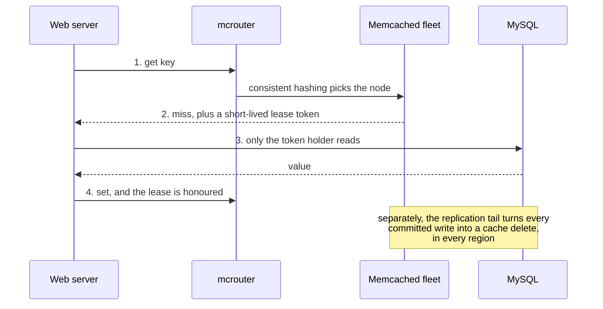

# Memcached at Facebook: caching at planet scale

> How Facebook turned a simple in-memory cache into the layer that let a social network read from MySQL at billions of requests per second.

## What it is

"Scaling Memcache at Facebook" is the classic paper on operating a [look-aside cache](../patterns/caching.md) at extreme scale. Memcached itself is a plain in-memory key-value store; the interesting system is everything Facebook built around thousands of instances of it: routing, invalidation, and consistency across regions.

## The problem it solves

Facebook's workload is read-dominated (orders of magnitude more reads than writes) with social-graph fan-out: rendering one page touches hundreds of small objects. MySQL alone cannot serve that read volume. A cache tier absorbs the reads, but at Facebook's size the hard problems are cache consistency with the database, thundering herds, and surviving cache failures, not caching itself.

## Key design ideas

Two details carry the whole design: a write deletes the cache entry instead of updating it, and a miss hands out a lease so only one client refills the key.

| Idea | How it works |
|------|--------------|
| Look-aside caching | Web servers read the cache first, fall back to MySQL on miss, then populate the cache |
| Delete, not update | On a database write, the cache entry is deleted (invalidated), not updated; the next read repopulates it. Deletes are idempotent and tolerate reordering |
| mcrouter | A routing proxy in front of the fleet handles [consistent hashing](../patterns/consistent-hashing.md), pooling, and failover, keeping clients simple |
| Leases | On a miss, the cache hands the client a short-lived token; only the token holder may fill the value. This kills both thundering herds and stale-set races |
| Regional invalidation | MySQL replication tail (mcsqueal) pipes committed writes into cache deletes in every region, so invalidations follow the data, not the web tier |

## Notable techniques

- Stale reads by choice: some data is served slightly stale from warm replicas rather than hammering the source on every miss; staleness is a product decision per key family.
- Gutter pool: a small spare cache fleet absorbs traffic when a cache server dies, preventing the database from taking the full miss storm ([circuit breaker](../patterns/circuit-breaker.md) thinking applied to caching).
- Cold cluster warmup: a new cluster reads through a warm cluster's cache until its own hit rate recovers.

## Trade-offs

Look-aside caching with delete-on-write gives eventual [consistency](../patterns/consistency-models.md): a window exists where reads see stale data, and cross-region replication lag widens it. Facebook accepted per-key staleness budgets instead of cache-database transactions, which is the honest answer in most interviews too: state the staleness window and who tolerates it.

## Go deeper

- For the full deep dive: [Advanced System Design Interview, Volume II](https://www.designgurus.io/course/grokking-system-design-interview-ii?utm_source=github&utm_medium=repo&utm_campaign=grokking-system-design&utm_content=deep-dives-memcached-at-facebook)
- Full course: [Grokking the System Design Interview](https://www.designgurus.io/course/grokking-the-system-design-interview?utm_source=github&utm_medium=repo&utm_campaign=grokking-system-design&utm_content=deep-dives-memcached-at-facebook)