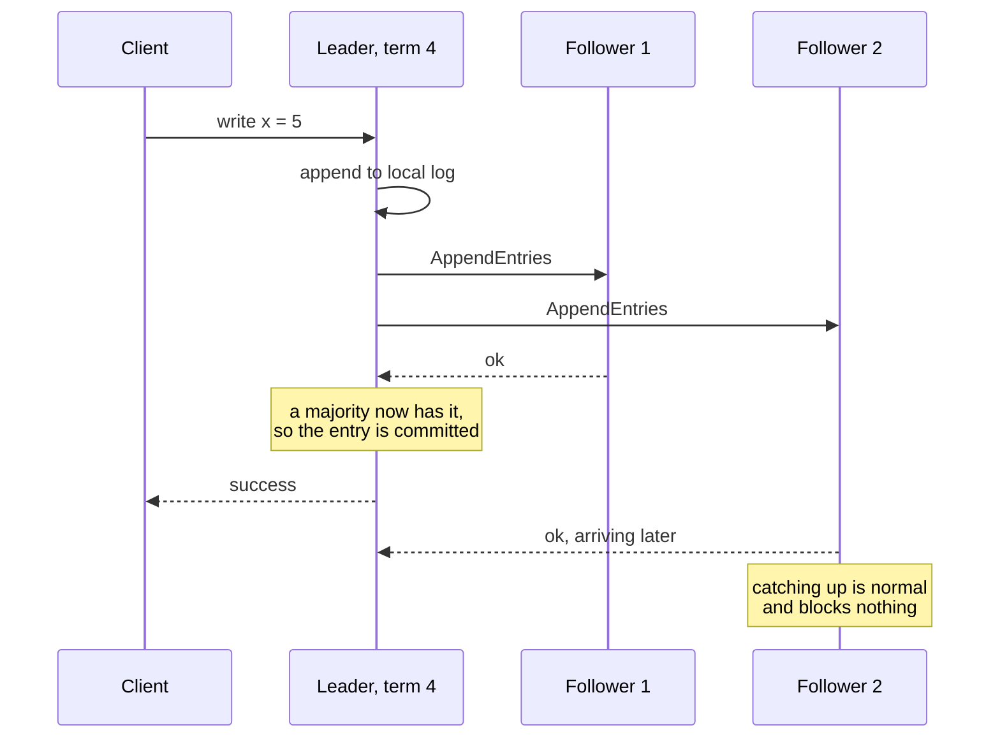

# Raft: understandable consensus

> The consensus algorithm designed to be teachable: how a cluster of machines agrees on a single log even as nodes crash.

## What it is

Raft is a consensus algorithm: it keeps a replicated log identical across a cluster, so a group of machines behaves like one reliable machine. It was designed explicitly to be easier to understand than Paxos, and it won: etcd, Consul, CockroachDB, TiDB, and Kafka's KRaft mode all run Raft.

## The problem it solves

Every coordination need in a distributed system (configuration, [leader election](../patterns/leader-election.md), [distributed locking](../patterns/distributed-locking.md), metadata) reduces to the same core problem: getting machines to agree on a sequence of decisions despite crashes and network partitions. Paxos solved it first but was notoriously hard to implement correctly. Raft decomposes the problem into pieces engineers can hold in their heads.

## Key design ideas

The commit point is the moment a majority has the entry, not the moment every follower has replied.

| Idea | How it works |
|------|--------------|
| Strong leader | All writes flow through one elected leader; followers just replicate. This collapses most of the protocol's complexity |
| Leader election | Followers that stop hearing [heartbeats](../patterns/heartbeats.md) time out and stand for election; majority vote wins; randomized timeouts prevent split votes |
| Log replication | The leader appends to its log, ships entries to followers, and commits once a majority ([quorum](../patterns/quorum.md)) has them ([write-ahead log](../patterns/write-ahead-log.md) replicated) |
| Terms | Logical time in numbered terms; each term has at most one leader; stale leaders discover a newer term and step down |
| Election safety | A candidate must have a log at least as up to date as each voter's, so a leader can never be missing committed entries |

## Notable techniques

- Commitment rule: an entry is committed once stored on a majority; a majority intersection argument guarantees any future leader has it.
- Membership changes use joint consensus (old and new configurations overlap) so reconfiguration cannot elect two leaders.
- Log compaction via snapshots keeps the log from growing forever.
- Read handling: even reads must be checked against leadership (lease or a quorum round trip), otherwise a deposed leader serves stale data.

## Trade-offs

All writes serialize through one leader, so a Raft group's write throughput is one machine's; systems scale by running many Raft groups ([sharding](../patterns/sharding-partitioning.md)), which reintroduces cross-group coordination. Availability requires a majority: a 3-node cluster tolerates one failure, and a partitioned minority stops accepting writes (the CP corner of the [CAP theorem](../patterns/cap-theorem.md)).

## Go deeper

- For the full deep dive: [Advanced System Design Interview, Volume II](https://www.designgurus.io/course/grokking-system-design-interview-ii?utm_source=github&utm_medium=repo&utm_campaign=grokking-system-design&utm_content=deep-dives-raft-consensus)
- Full course: [Grokking the System Design Interview](https://www.designgurus.io/course/grokking-the-system-design-interview?utm_source=github&utm_medium=repo&utm_campaign=grokking-system-design&utm_content=deep-dives-raft-consensus)