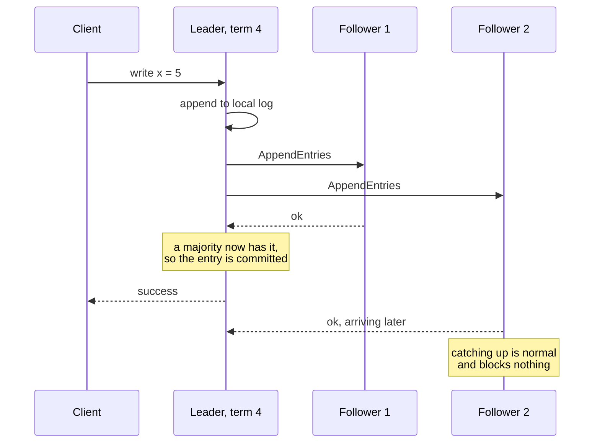

# Raft: understandable consensus

> Consensus cut into three parts you can hold in your head: elect one leader, copy its log, and never elect a leader that is missing a committed entry.

## What it is

Raft is a consensus algorithm. Consensus means a group of machines agrees on the same sequence of decisions, even while some crash. Raft keeps an identical log (an ordered list of commands) on every server, so the group behaves like one reliable machine.

The common misunderstanding is that Raft is a faster or stronger Paxos. It is not. It gives the same safety guarantee for about the same number of messages. Its real contribution is the split into three parts you can build and test one at a time: leader election, log replication, and safety. Paxos was correct first, but teams kept shipping broken versions of it.

Raft does not store your data. It replicates a log of commands. Your state machine (the code that applies them, for example a key value store) reads that log in order. Same commands, same order, same state on every server. etcd, Consul, CockroachDB, TiDB, and Kafka's KRaft mode all run it.

## The problem it solves

You run a primary database and two replicas. The primary stops answering, and something promotes a replica. Two failures follow.

First, the old primary may still be alive behind a broken network link, still taking writes. Two machines now believe they are the primary, and two clients read two different values. This is split brain.

Second, the promoted replica may be behind. If it never received the last 200 writes, those writes are gone, even though clients were told they succeeded.

Raft removes both by rule. At most one leader can exist in a term, and a server missing a committed entry cannot win an election.

## Key design ideas

The commit point is the moment a majority has the entry, not the moment every follower has replied.

| Idea | How it works |
|------|--------------|
| Terms as a logical clock | Time is cut into numbered terms, each starting with an election. Every message carries the sender's term number, and a server that sees a higher number becomes a follower. So a leader that was cut off steps down as soon as it hears from the new world. This is a [logical clock](../patterns/logical-clocks.md): it orders events without trusting wall clocks |
| One strong leader | Clients write only to the leader. Followers never take writes from anyone else and never merge logs with each other. Data flows one way, leader to follower, which removes most of the cases a general consensus protocol must handle |
| Randomized election timeouts | A follower that hears no [heartbeat](../patterns/heartbeats.md) for a random wait (a common range is 150 to 300 milliseconds) becomes a candidate and asks for votes. A heartbeat is an AppendEntries message with no entries, sent well below that timeout. The randomness means one server almost always wakes first and wins before the others start. With a fixed timeout, servers would stand at the same instant, split the vote, and repeat |
| Log replication | The leader appends the command to its own log on disk, sends it to all followers, and commits it once a majority ([quorum](../patterns/quorum.md)) has stored it. Only then does it apply the command and answer the client. This is a [write-ahead log](../patterns/write-ahead-log.md) copied to several machines |
| The log matching property | Every AppendEntries message carries the index and term of the entry just before the new ones. A follower rejects the message if its log has nothing matching there. The leader then walks back one entry at a time until the logs agree, and overwrites the follower's conflicting tail. The result is strong: if two logs hold an entry with the same index and term, they are identical up to that point |
| The election restriction | A vote request carries the candidate's last log index and term. A server refuses the vote if its own log is more current. To win, a candidate needs a log at least as current as a majority of servers. A committed entry already sits on a majority. Any two majorities share a server, so the winner must already hold it. This single rule is what makes Raft safe |
| Committing entries from earlier terms | A new leader may hold entries from an old term that were copied widely but never committed. Counting copies is not enough there, because such an entry can still be overwritten. So a leader counts copies only for entries from its own term. It commits one entry of its own first (often an empty placeholder), and the older entries become committed with it |

## Notable techniques

- Snapshots stop the log from growing forever. A server writes its current state to a snapshot file. It records the index and term of the last entry included, then deletes the log before that point. This is compaction (throwing away old records that no longer change the answer). On restart it loads the snapshot and replays only the tail. A follower behind the leader's oldest surviving entry is sent the whole snapshot.
- Joint consensus makes membership changes safe. Switching straight from the old set of servers to the new one is dangerous. For a short moment each set can form its own majority and elect its own leader. Raft passes through a transitional configuration that needs a majority of the old set and of the new set at once.
- Reads need a leadership check. A leader that was partitioned away still thinks it leads, and would return old values. It can confirm with one round of heartbeats to a majority before answering. Or it can hold a lease (a time-limited promise that no other leader can be elected before a set moment). That is faster, but it assumes clock drift stays small.
- Pre-vote handles the returning outcast. An isolated server keeps timing out and raising its term. When the network heals, that high term forces a healthy leader to step down for nothing. With pre-vote, a server first asks whether it could win, without raising any term.
- A majority is required because any two majorities share at least one member. That member carries the committed history into the next term. This fixes sizing: 3 servers survive 1 failure, 5 survive 2, 7 survive 3. An even count buys nothing, since 4 still survive only 1. Most systems run 3 or 5.

## Trade-offs

Every write goes through one leader, so a Raft group's write rate is one machine's write rate. Systems grow by running many independent groups, one per [shard](../patterns/sharding-partitioning.md), which brings back the hard problem of coordinating across groups.

Each write costs a disk flush on the leader plus a round trip to the nearest majority. Inside one datacenter that is small. Across continents it is tens to hundreds of milliseconds per write. Raft is a poor fit for chatty writes spread around the world.

Availability needs a majority. A partitioned minority keeps its data but refuses writes, the consistent and partition tolerant corner of the [CAP theorem](../patterns/cap-theorem.md). If a minority must keep serving, Raft is the wrong tool.

Raft is also bad at moving bulk data. Use it for small, valuable state: configuration, [leader election](../patterns/leader-election.md), [distributed locks](../patterns/distributed-locking.md), shard maps, group membership. Kafka shows the boundary: KRaft mode runs Raft for cluster metadata, not for the message data.

Finally, Raft assumes servers crash, not that they lie. Corrupted disk blocks or hostile code break the guarantees, so real deployments add [checksums](../patterns/checksums.md) on top.

## Go deeper

- Related deep dive: [ZooKeeper coordination](zookeeper-coordination.md)
- For the full deep dive: [Advanced System Design Interview, Volume II](https://www.designgurus.io/course/grokking-system-design-interview-ii?utm_source=github&utm_medium=repo&utm_campaign=grokking-system-design&utm_content=deep-dives-raft-consensus)
- Full course: [Grokking the System Design Interview](https://www.designgurus.io/course/grokking-the-system-design-interview?utm_source=github&utm_medium=repo&utm_campaign=grokking-system-design&utm_content=deep-dives-raft-consensus)
