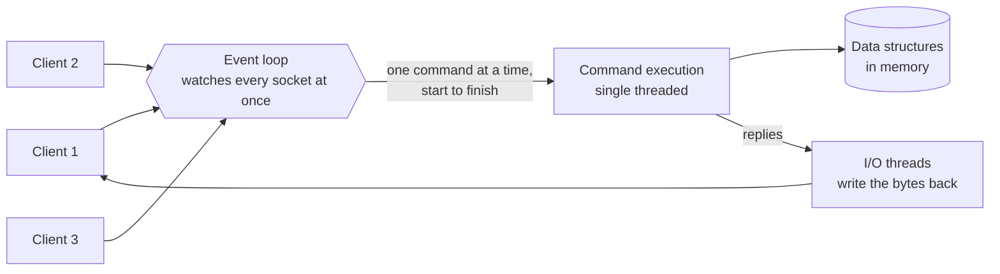

# Redis internals

> How a single-threaded in-memory server serves a million operations a second, and what it does to survive a restart.

## What it is

Redis is an in-memory data structure server. Calling it a cache undersells it: it stores strings, hashes, lists, sets, sorted sets, streams, and bitmaps, and the operations on those types run inside the server rather than in your application. You do not fetch a list, change it, and write it back. You send one command and the server does the work. That makes it a common answer for [caching](../patterns/caching.md), but also for counters, queues, rate limiters, and leaderboards.

## The problem it solves

An application that reads and writes shared state on every request cannot pay a disk round trip each time. It also cannot safely do read-modify-write over the network: two clients that read a counter, add one, and write it back will lose an update. Redis keeps the whole dataset in memory and runs each command to completion on the server, so every operation is atomic (it happens all at once, with no other command interleaved) without the application holding a lock.

## Key design ideas

One command runs start to finish before the next begins. That single fact is where the atomicity comes from, and why there are no locks inside the server.

| Idea | How it works |
|------|--------------|
| Single-threaded command execution | One command runs at a time, start to finish. That is where atomicity comes from, and it means no locks and no contention inside the server. Later versions threaded the network I/O (reading bytes off sockets and writing replies back), not the command loop itself |
| Event loop over non-blocking I/O | One thread watches thousands of connections at once through the operating system's readiness API, so idle connections cost almost nothing |
| Encodings that change with size | Each type has a compact form for small values and converts when it grows. A small hash is stored as a flat list of field and value pairs and scanned linearly; past a size or length limit it converts to a real hash table. Small objects stay compact and cache-friendly |
| Sorted sets are a skip list plus a hash table | The hash table finds a member's score in constant time; the skip list keeps members ordered by score, so range and rank queries are logarithmic. That pairing is why [a gaming leaderboard](../questions/design-gaming-leaderboard.md) is a natural Redis design |
| The RESP wire protocol | A text protocol with length prefixes in front of every value, cheap enough to parse that parsing never becomes the bottleneck |

## Notable techniques

- RDB snapshots: Redis forks (makes a child copy of the process) and the child writes a point-in-time dump of the dataset to disk. Copy-on-write memory means the parent keeps serving while the child writes something consistent. Snapshots are cheap, but every write since the last one is lost in a crash.
- AOF, the append-only file: every write command is appended to a log and replayed on restart. This is the [write-ahead log](../patterns/write-ahead-log.md) idea applied to commands instead of pages. The log is rewritten periodically, compacted down to the smallest set of commands that rebuilds the current data, so it does not grow without bound. How often the log is flushed to disk (every write, once a second, or never) is the durability setting.
- [Replication](../patterns/replication.md) is asynchronous by default: the primary replies to the client before replicas have the write. Sentinel handles failure detection and promotes a replica, and Cluster mode [shards](../patterns/sharding-partitioning.md) the keyspace into 16384 hash slots spread across nodes. Clients cache the slot map and talk to the owning node directly, and rebalancing means moving slots.
- Expiry is lazy plus sampled, not a timer per key. A key with a time to live is checked when something touches it, and a background job repeatedly samples random keys that have one. Millions of expiring keys cost very little, at the price of freeing memory slightly late.
- Pipelining sends many commands without waiting for each reply, so throughput stops being bound by network round-trip time. Lua scripts and MULTI/EXEC give a whole block of commands that same one-at-a-time execution.

## Trade-offs

Speed and atomicity come by construction, and memory is the bill. The dataset is bounded by the RAM you can afford. One command thread per node is a hard ceiling: a single slow command blocks every other client, which is why commands that walk the whole keyspace or a huge collection (KEYS, or SMEMBERS on a large set) are dangerous in production and SCAN exists instead. Asynchronous replication means a failover can lose the most recent writes, so Redis is a poor system of record for payments. And in Cluster mode a multi-key command must touch keys that all live in one slot, which forces you to design keys around that.

Memcached takes the opposite bargain: no data structures, no persistence, but a multi-threaded server ([Redis vs Memcached](../cheat-sheets/redis-vs-memcached.md)). Choosing between them, and deciding what happens when a node dies, is the substance of [designing a distributed cache](../questions/design-distributed-cache.md).

## Go deeper

- Related deep dive: [Memcached at Facebook](memcached-at-facebook.md)
- For the full deep dive: [Advanced System Design Interview, Volume II](https://www.designgurus.io/course/grokking-system-design-interview-ii?utm_source=github&utm_medium=repo&utm_campaign=grokking-system-design&utm_content=deep-dives-redis-internals)
- Full course: [Grokking the System Design Interview](https://www.designgurus.io/course/grokking-the-system-design-interview?utm_source=github&utm_medium=repo&utm_campaign=grokking-system-design&utm_content=deep-dives-redis-internals)
