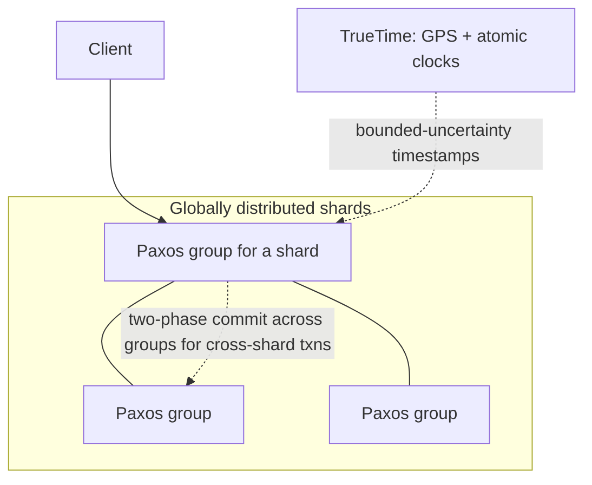

# Spanner: globally consistent SQL

> Google's globally distributed database that offers SQL, transactions, and strong consistency across continents.

## What it is

Spanner is Google's globally replicated relational database. It was the first system to offer externally consistent (linearizable) distributed transactions at global scale, which the CAP folklore said was impractical. It backs Google's ads and billing systems and inspired CockroachDB and YugabyteDB.

## The problem it solves

Sharded MySQL gave Google scale but no cross-shard transactions, and Bigtable gave scale but weak per-row semantics. Ads billing needs both: global scale and real transactions with consistent reads. Spanner's bet was that engineers waste too much time working around missing transactions, so the database should pay the cost instead.

## Key design ideas

| Idea | How it works |
|------|--------------|
| TrueTime | GPS and atomic clocks in every datacenter expose time as an interval with bounded uncertainty; Spanner waits out the uncertainty before commit, making timestamp order match real-time order |
| Paxos groups | Data is sharded into splits; each split is replicated across datacenters by its own Paxos group ([replication](../patterns/replication.md), [quorum](../patterns/quorum.md)) |
| Two-phase commit over Paxos | Cross-split transactions run 2PC, but each participant is a replicated Paxos group, so the classic 2PC coordinator-failure blocking problem largely disappears |
| Lock-free snapshot reads | Any replica can serve a consistent read at a past timestamp without locks, thanks to multi-version storage plus TrueTime timestamps |

## Notable techniques

- Commit wait: after choosing a commit timestamp, the leader waits until TrueTime guarantees that timestamp has passed everywhere (a few milliseconds), buying external consistency with a small latency tax.
- Directory-based data movement: related rows move between splits together, keeping locality for co-accessed data.
- Read-only transactions never block writes, which is why analytical reads on live data are practical.

## Trade-offs

Write latency includes cross-region Paxos round trips plus commit wait, so Spanner is slower per write than a single-region database; you pay latency for consistency (the PACELC view of the [CAP theorem](../patterns/cap-theorem.md)). It also depends on specialized clock hardware, which is why open-source clones use hybrid logical clocks with weaker guarantees.

## Go deeper

- For the full deep dive: [Advanced System Design Interview, Volume II](https://www.designgurus.io/course/grokking-system-design-interview-ii)
- Full course: [Grokking the System Design Interview](https://www.designgurus.io/course/grokking-the-system-design-interview)