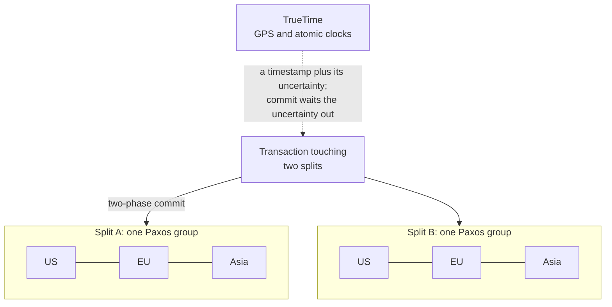

# Spanner: globally consistent SQL

> A database that reads physical clocks, admits how wrong they might be, and waits that error out before it says "committed".

## What it is

Spanner is Google's relational database, spread across datacenters on several continents. It gives you SQL, schemas, secondary indexes, and transactions that cross the planet.

The common line is that Spanner "beat the CAP theorem". That is the wrong frame. Spanner is a CP system: when a network partition cuts replicas off, the affected data stops taking writes. Google's position is that its private network makes that rare, not impossible.

What Spanner really solved is ordering. It gives external consistency: if transaction A finishes before transaction B starts, measured by a clock on the wall, then every reader everywhere sees A before B. That holds even when A ran in Belgium and B ran in Taiwan, and the two never exchanged a message.

It does this with physical clocks that have a known error bound. Most distributed databases treat machine clocks as untrustworthy and ignore them. Spanner measures how wrong a clock can be, publishes that number, and designs around it.

## The problem it solves

Here is the failure you already know. Your service writes a row in the United States. You tell a coworker in Singapore that the change is saved. They refresh the page, and their read returns the old value.

[Logical clocks](../patterns/logical-clocks.md) do not fix this. They order events that are causally linked, meaning one event caused the other through a message. Your phone call to your coworker happened outside the database, so the database cannot see that link.

Google hit this for real in advertising and billing. Sharded MySQL gave scale with no transactions across shards. [Bigtable](bigtable-wide-column-store.md) gave scale with weak per-row semantics. Billing needs both scale and honest transactions, so Spanner pays that cost in the database instead of in every application.

## Key design ideas

Data is cut into splits, and each split is its own replicated group. TrueTime is the part that makes timestamps from different groups comparable.

| Idea | How it works |
|------|--------------|
| TrueTime returns an interval | A call to TrueTime does not return one timestamp. It returns a range, an earliest and a latest, and promises the true time sits inside it. The width of that range is the clock's admitted error. Code must handle an uncertain answer, so it can never quietly trust a wrong clock |
| GPS receivers and atomic clocks | Every datacenter holds time master machines. Most carry a GPS receiver with a roof antenna, and a few carry an atomic clock instead. GPS can fail for all receivers at once, from antenna damage or radio interference, while an atomic clock drifts slowly and on its own. The two kinds disagree when one of them lies, and that is how a lie is caught |
| Commit wait | After choosing a commit timestamp, the leader does not report success yet. It waits until TrueTime says that timestamp is certainly in the past everywhere, then releases the locks and answers the client. The wait is what makes the ordering real, because a transaction can never finish before its own timestamp |
| Paxos groups per split | Each split is replicated across datacenters by its own Paxos group. Paxos is a consensus protocol: a write counts as durable once a quorum (a majority of the replicas) has it. The same idea, explained step by step, is in [Raft](raft-consensus.md); see also [replication](../patterns/replication.md) and [quorum](../patterns/quorum.md) |
| Two-phase commit across groups | A transaction touching two splits runs two-phase commit, where a coordinator first asks each participant to prepare and then tells them all to commit. Each participant here is a whole Paxos group, not one machine, so a crash does not leave the transaction stuck ([distributed transactions](../patterns/distributed-transactions.md)) |
| Lock-free snapshot reads | Every row version carries its commit timestamp, and old versions are kept. A read at a past timestamp picks the newest version at or below that timestamp. It takes no locks, so reads never block writes and writes never block reads |

## Notable techniques

- The time daemon on every machine. Each machine polls several time masters, some nearby and some in other datacenters. It discards masters that disagree with the rest, and between polls it grows its own uncertainty at a deliberately pessimistic drift rate. In Google's published measurements the uncertainty follows a sawtooth shape. It is smallest right after a poll and largest just before the next one, a few milliseconds wide.
- Why a small interval matters. Commit wait lasts as long as the uncertainty, so the width of the interval is a direct tax on every write. The special hardware keeps that width at a few milliseconds. Ordinary network time over the public internet gives a much larger error.
- Paxos leader leases. A leader holds a lease, which is a right to act as leader that expires at a stated time. Leases for one split never overlap in time, so two machines cannot both believe they lead it. A bounded clock error is what makes that reasoning safe ([leader election](../patterns/leader-election.md), and the same trick in [Chubby](chubby-distributed-locking.md)).
- Safe time on every replica. Each replica tracks the newest timestamp at which it is fully up to date. A snapshot read at or below that timestamp is answered locally, with no message to the leader. A reader in Europe gets a consistent view without crossing an ocean.
- Moving data by directory. Rows that share a key prefix form a directory, and Spanner moves it between splits as one unit. Related rows stay together, so transactions over them stay inside a single Paxos group and skip two-phase commit.
- Schema changes at a future timestamp. A schema change is given a timestamp slightly in the future. Every group applies it at that instant, so the change is atomic across the database without stopping traffic.

## Trade-offs

Spanner buys ordering with latency, and you pay on every write.

There is a floor under write latency that no tuning removes. A commit pays a cross-region Paxos round trip to a majority of replicas, then commit wait on top of that. Between continents that round trip is tens of milliseconds ([latency numbers](../cheat-sheets/latency-numbers.md)), and the wait adds a few more.

So Spanner is a poor choice when low write latency is the main requirement. A cache, a hot counter, or a bidding system with a tight deadline should use something else. [Redis](redis-internals.md) is the usual answer for that side of the workload.

A bad primary key also hurts. A key that always increases, like a timestamp or a sequence number, sends every new row to the last split. That split becomes a hot spot while the other machines sit idle ([sharding](../patterns/sharding-partitioning.md)).

Read-write transactions still take locks. Contention on one popular row is a real limit, and only read-only transactions get the lock-free path.

The clock guarantee rests on hardware and on careful operation. When a machine's uncertainty grows too large, it removes itself from service rather than report a time it cannot defend. Open-source databases inspired by Spanner use hybrid logical clocks instead. Those keep a sensible order inside the database but cannot promise external consistency for events the database never saw.

That is the PACELC reading of the [CAP theorem](../patterns/cap-theorem.md): during a partition you choose consistency or availability, and otherwise you choose consistency or latency. Spanner picks consistency both times ([trade-offs](../cheat-sheets/trade-offs.md)).

## Go deeper

- Related deep dive: [Bigtable: wide column store](bigtable-wide-column-store.md)
- For the full deep dive: [Advanced System Design Interview, Volume II](https://www.designgurus.io/course/grokking-system-design-interview-ii?utm_source=github&utm_medium=repo&utm_campaign=grokking-system-design&utm_content=deep-dives-spanner-global-sql)
- Full course: [Grokking the System Design Interview](https://www.designgurus.io/course/grokking-the-system-design-interview?utm_source=github&utm_medium=repo&utm_campaign=grokking-system-design&utm_content=deep-dives-spanner-global-sql)
