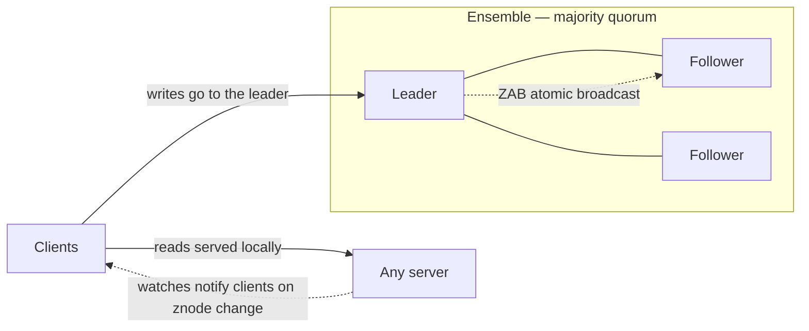

# ZooKeeper: coordination as a service

> The open-source coordination kernel: a small, consistent store of tiny files that distributed systems use for locks, leaders, and configuration.

## What it is

ZooKeeper is a replicated coordination service, the open-source answer to Google's [Chubby](chubby-distributed-locking.md). It exposes a tree of small data nodes (znodes) with strong ordering guarantees, and systems build their coordination primitives on top: [leader election](../patterns/leader-election.md), [distributed locks](../patterns/distributed-locking.md), service discovery, configuration. Kafka (before KRaft), HBase, and Hadoop all leaned on it.

## The problem it solves

Every distributed system needs a little bit of strongly consistent, highly available state: who is the leader, which servers are alive, what is the current config. Building consensus into each system is hard and error-prone, so ZooKeeper centralizes it: one battle-tested replicated service, simple primitives, and every application gets coordination without implementing consensus.

## Key design ideas

| Idea | How it works |
|------|--------------|
| Znode tree | A filesystem-like hierarchy of nodes holding small data (kilobytes); not a general datastore, a coordination surface |
| ZAB replication | An atomic broadcast protocol (a Raft relative) totally orders all writes through an elected leader across the ensemble ([quorum](../patterns/quorum.md) commit) |
| Ephemeral znodes | Nodes tied to a client session vanish when the session dies; this one feature yields liveness: a crashed lock holder loses its lock automatically |
| Sequential znodes | Auto-appended monotonic counters give fair queues and tie-breaking for elections |
| Watches | Clients set one-shot triggers on znodes and get notified on change, replacing polling |

## Notable techniques

- Recipe: leader election = every candidate creates an ephemeral sequential znode; lowest number is the leader; each node watches only its predecessor (no thundering herd on failure).
- Sessions and [heartbeats](../patterns/heartbeats.md): a client's ephemeral state outlives brief network blips but dies with the session timeout, a deliberate compromise on failure detection.
- Reads are served by any replica (fast, possibly slightly stale); `sync` forces a replica to catch up when a client needs read-your-writes.

## Trade-offs

Writes serialize through one leader, so ZooKeeper handles coordination traffic, not data traffic; using it as a database is the classic misuse. Reads can be stale unless you pay for sync. A [quorum](../patterns/quorum.md) must be alive for writes, and every consumer of ZooKeeper inherits that availability floor, which is why Kafka eventually replaced it with built-in [Raft](raft-consensus.md) (KRaft) to remove the external dependency.

## Go deeper

- For the full deep dive: [Advanced System Design Interview, Volume II](https://www.designgurus.io/course/grokking-system-design-interview-ii)
- Full course: [Grokking the System Design Interview](https://www.designgurus.io/course/grokking-the-system-design-interview)