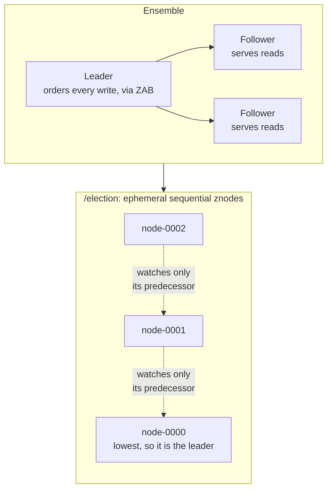

# ZooKeeper: coordination as a service

> A tiny replicated file tree, kept in one strict order by a majority vote, that other systems use to decide who is in charge.

## What it is

ZooKeeper is a small, strongly consistent, replicated store shaped like a file system. It is the open-source answer to Google's [Chubby](chubby-distributed-locking.md).

People call it a lock service or a configuration store. That is the common misunderstanding. ZooKeeper has no lock command and no leader command. It gives you a tiny file tree with very strong ordering rules, and you build locks and leaders out of it yourself. Those short pieces of client code are called recipes.

A file in that tree is called a znode (a data node). Each znode holds a small value, usually a few hundred bytes, and the server refuses anything above 1 MB by default. It is a place to put a name, an address, or a version number. It is not a place to put your data.

## The problem it solves

Two servers both believe they are the primary. Both accept writes. Their data now disagrees, and no later merge can tell you which write was correct. This is called split brain.

The second failure is the opposite one. A worker takes a lock and then crashes. Nothing releases the lock, so every other worker waits forever.

Each system could solve this itself by implementing consensus (getting a group of machines to agree on one order of events). Consensus is very hard to write correctly. ZooKeeper implements it once, in one service, and everyone else calls it.

## Key design ideas

The ensemble (the group of ZooKeeper servers) is on top, and the leader-election recipe is below it. Each candidate watches only the one ahead of it, so a failure wakes one client rather than all of them.

| Idea | How it works |
|------|--------------|
| ZAB, the atomic broadcast protocol | One server is elected leader. Every write goes to that leader, which gives it a zxid (a 64-bit transaction number that only counts upward) and proposes it to the followers. When a [quorum](../patterns/quorum.md) (more than half the servers) has written the proposal to its own disk log and replied, the leader commits it. Five servers need three replies, so two can be down and writes still work |
| One order for every write | Because one leader assigns every zxid, all servers apply the same writes in the same order. The high 32 bits of a zxid hold the epoch (the leader's term number), so a write from an old leader that comes back late is recognised and dropped |
| Ephemeral znodes | A znode created as ephemeral lives only as long as the client session that made it. When that session ends, the server deletes the znode automatically. A crashed lock holder loses its lock without anyone cleaning up |
| Sequential znodes | Ask for a sequential znode and the parent appends a number that always goes up, like `node-0000000012`. The parent's counter is the only source of that number, so two clients can never get the same one. This gives you a fair queue and a tie-break for elections |
| Watches | A client can set a watch on a znode. When the znode changes, the server sends one notification, then forgets the watch. This replaces polling, and it is cheap because the server holds only a small set per client |
| Reads from any replica | A read is answered from the local copy on the server you are connected to, with no vote and no round trip to the leader. Adding servers adds read capacity |

## Notable techniques

- Leader election as a recipe. Every candidate creates an ephemeral sequential znode under `/election`. The lowest number wins. Each loser watches only the node directly below it, not the winner. When one candidate dies, exactly one watch fires, so 200 candidates do not all wake up and re-read at the same moment. [Distributed locking](../patterns/distributed-locking.md) uses the same recipe on a different path, and [leader election](../patterns/leader-election.md) is the pattern page.
- Group membership and configuration. Each live server creates an ephemeral znode under `/members` holding its address. To list the live servers, read the children of `/members`. To be told when the list changes, set a watch on the parent. Configuration is the mirror of this: one znode holds the current value, every process watches it, and one write reaches all of them.
- Sessions and timeouts. A client and the ensemble agree on a session timeout, and the client sends [heartbeats](../patterns/heartbeats.md) to keep the session alive. If no heartbeat arrives before the timeout, the server declares the session dead and deletes its ephemeral znodes. The dangerous part is that a long garbage collection pause (when the language runtime stops your program to reclaim memory) looks exactly like a crash. Your process is alive, believes it still holds the lock, and has already lost it. So a lock from ZooKeeper should be paired with a fencing number, usually the znode version or the zxid. Shared storage checks that number and rejects a write that carries an old one.
- Watches fire once and must be re-armed. After a notification you re-read the znode and set a new watch in the same call. Between the change and your re-read the value can change again, so a watch tells you that something changed, never what it changed to. Always read the current value, and never trust the notification alone. Later versions added persistent watches that keep firing, which removes the re-arming step but not the gap.
- `sync` for reads that must be current. Your own client always sees its own writes in order, so read-your-writes costs nothing. The gap is other people's writes. If a teammate tells you through some other channel that a value changed, your replica may not have it yet. Calling `sync` first makes your server catch up with the leader before it answers. That is the price of turning a cheap local read into a current one. See [consistency models](../patterns/consistency-models.md) for the wider picture.

## Trade-offs

Every write goes through one leader and reaches disk on a majority of servers before it commits. That puts a firm ceiling on write throughput, and the ceiling does not rise when you add servers. Adding servers makes writes slower, because the quorum is larger.

ZooKeeper is therefore built for coordination traffic, not data traffic. The design assumes many more reads than writes. The whole tree also sits in memory on every server, so the tree has to stay small.

Using it as a general data store is the classic misuse. There are no range queries, no secondary indexes, and no large values. A queue of work items in ZooKeeper runs into both limits. Each item is one write through the leader, and the whole queue stays in memory.

The last cost is a shared one. Writes need a live quorum, so every system that depends on ZooKeeper inherits its availability floor. When the ensemble loses a majority, none of those systems can elect a leader. That is why [Kafka](kafka-distributed-messaging.md) replaced it with a built-in [Raft](raft-consensus.md) implementation, to remove one outside part that can fail.

## Go deeper

- Related deep dive: [Chubby, distributed locking](chubby-distributed-locking.md)
- For the full deep dive: [Advanced System Design Interview, Volume II](https://www.designgurus.io/course/grokking-system-design-interview-ii?utm_source=github&utm_medium=repo&utm_campaign=grokking-system-design&utm_content=deep-dives-zookeeper-coordination)
- Full course: [Grokking the System Design Interview](https://www.designgurus.io/course/grokking-the-system-design-interview?utm_source=github&utm_medium=repo&utm_campaign=grokking-system-design&utm_content=deep-dives-zookeeper-coordination)
