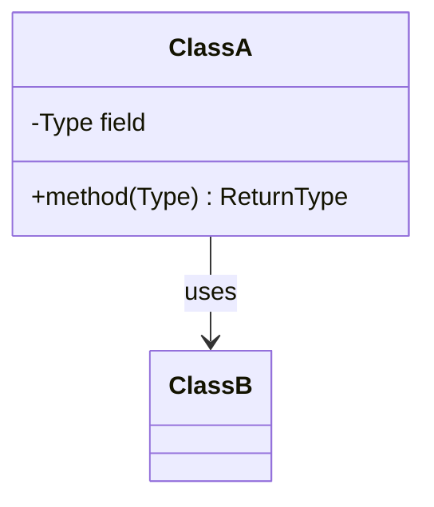

# Design <thing>

> One-line description of what the object/system does.

## Requirements

**Functional**
- ...

**Out of scope / assumptions**
- ...

## Core objects

Identify the nouns → classes, and the verbs → methods.

- `ClassA` — responsibility.
- `ClassB` — responsibility.

## Class diagram

## Key flow

Walk one use case through the objects, step by step.

## Design patterns used

- **Pattern** — where and why.

## Concurrency and edge cases

- ...

## Go deeper

- Related: [low-level design index](README.md)
- Full course: [Grokking the Low Level Design (LLD) Interview](https://www.designgurus.io/course/grokking-the-low-level-design-interview-using-ood)
