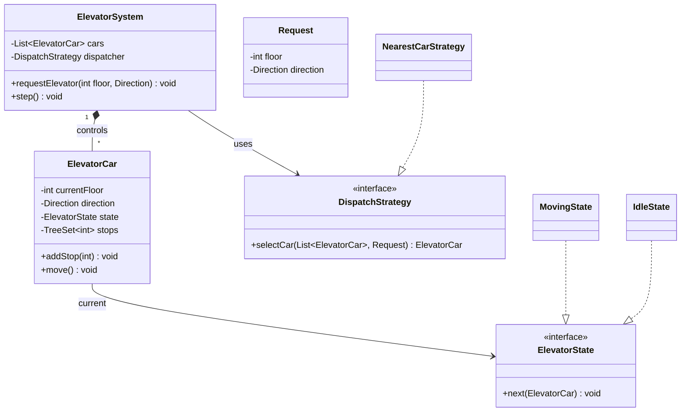

# Design an elevator system

> Control one or more elevator cars serving requests across floors: model the car's state, queue requests, and pick which car answers a call. A great test of the **State** and **Strategy** patterns.

## Requirements

**Functional**
- A building with N floors and M elevator cars.
- Two request types: **external** (a hall button, up/down on a floor) and **internal** (a floor button inside a car).
- Each car moves up/down, opens doors, and services requests in a sensible order (not FIFO — sweep in one direction).
- A dispatcher assigns external requests to the best car.

**Assumptions**
- Ignore capacity/weight and door timing details; focus on the object model and scheduling.

## Core objects

- `ElevatorSystem` — owns the cars and the `Dispatcher`; receives requests.
- `ElevatorCar` — has a current floor, a `Direction`, a `State`, and its pending stops.
- `Direction` (UP / DOWN / IDLE) and `ElevatorState` (**State pattern**: Moving, Stopped, Idle, DoorsOpen).
- `Request` — origin floor, optional destination, direction.
- `DispatchStrategy` (interface) → `NearestCarStrategy` — picks the car for an external request. **Strategy.**
- `Display` / observers that react to a car moving. **Observer.**

## Key flow

**External request** ("floor 5, going up"):
1. `ElevatorSystem.requestElevator(5, UP)` asks `dispatcher.selectCar(cars, request)`.
2. `NearestCarStrategy` scores each car — prefer a car already moving toward the floor in the same direction, else the nearest idle car — and returns the winner.
3. The chosen car `addStop(5)`. Its `stops` is a sorted set, so it services floors **in sweep order** while moving up, then reverses (the classic elevator/SCAN algorithm), instead of bouncing around.

**Per tick** (`step`): each car asks its `ElevatorState.next(car)` — Moving advances a floor and opens doors at a stop; DoorsOpen transitions back to Moving/Idle; Idle waits. The **State pattern** keeps this out of one giant `if/switch`.

## Design patterns used

- **State** — a car's behavior depends on its mode; each `ElevatorState` handles its own transitions.
- **Strategy** — `DispatchStrategy` swaps scheduling policies (nearest car, least-busy, zoning) without touching the system.
- **Observer** — floor indicators and dashboards subscribe to car movement.

## Concurrency and edge cases

- Requests arrive concurrently — the dispatcher and each car's stop set need thread-safe updates.
- Starvation: a pure "nearest car" can starve far requests; add aging or direction fairness.
- Idle placement: where do free cars park (lobby vs. spread out) to cut wait time?

## Go deeper

- Related: [low-level design index](README.md); the scheduling flavor echoes a [distributed job scheduler](../questions/design-distributed-job-scheduler.md).
- Full course: [Grokking the Low Level Design (LLD) Interview](https://www.designgurus.io/course/grokking-the-low-level-design-interview-using-ood)
