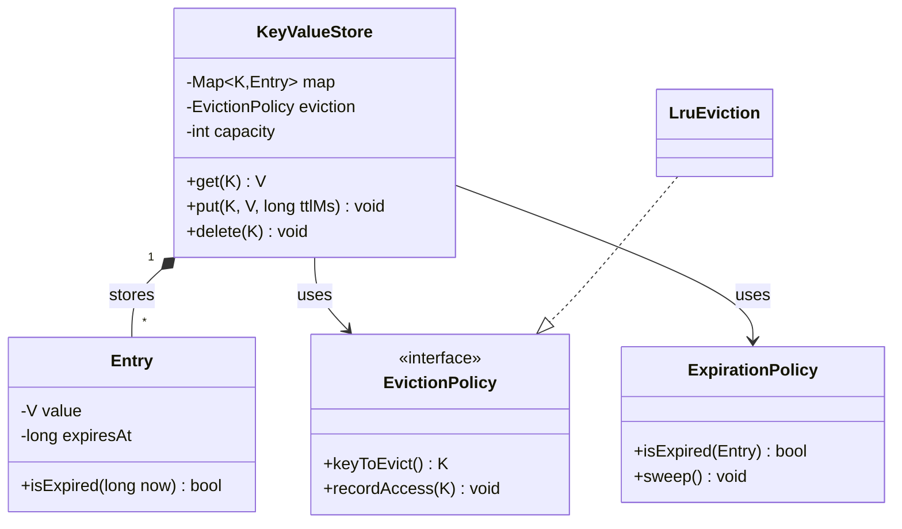

# Design an in-memory key-value store

> A thread-safe `get`/`put`/`delete` store with per-key **TTL** (expiry) and bounded size — think a single-node Redis. The LLD counterpart to the distributed [Design a distributed cache](../questions/design-distributed-cache.md).

## Requirements

**Functional**
- `put(key, value, ttl?)`, `get(key)`, `delete(key)`.
- Optional **TTL** per key; expired keys must not be returned.
- Bounded capacity with an eviction policy (LRU) when full.
- **Thread-safe** under concurrent readers and writers.

**Assumptions**
- Single process, in-memory. Persistence and replication are extensions (and where this becomes a distributed-systems problem).

## Core objects

- `KeyValueStore` — the facade: `get`/`put`/`delete`, wiring together storage, expiry, and eviction.
- `Entry` — value + `expiresAt` (or none).
- `ExpirationPolicy` — decides expiry; combines **lazy** (check on read) and **active** (a background sweeper) expiry.
- `EvictionPolicy` (interface) → `LruEviction` — which key to drop when full. **Strategy**, reusing the [LRU cache](lru-cache.md) structure.

## Key flow

- **get(key)**: look up the entry; if missing → miss. If `entry.isExpired(now)` → delete it and return a miss (**lazy expiry**). Else `eviction.recordAccess(key)` and return the value.
- **put(key, value, ttl)**: if at capacity and key is new, `eviction.keyToEvict()` and remove it. Insert `Entry(value, now+ttl)`, `recordAccess(key)`.
- **Active expiry**: a background thread periodically samples keys and drops expired ones so dead entries don't sit forever consuming memory (Redis samples rather than scanning everything).

## Design patterns used

- **Strategy** — `EvictionPolicy` (LRU/LFU/random) and `ExpirationPolicy` are swappable.
- **Facade** — `KeyValueStore` presents a simple API over storage + expiry + eviction.

## Concurrency and thread safety

This is the crux of the question:

- **A single global lock** is correct but serializes everything — a bottleneck under load.
- **Striped/segmented locking** (like Java's old `ConcurrentHashMap`): shard the keyspace into N segments, each with its own lock, so unrelated keys don't contend. This is the usual answer.
- **Read-heavy** workloads benefit from a `ReadWriteLock` (many readers, exclusive writer) — but remember `get` may *delete* an expired key, which is a write.
- Keep per-key operations atomic so a concurrent `get`/`delete` can't observe a half-updated entry.

## Concurrency and edge cases

- TTL of 0 / already-expired on insert; updating a key resets or preserves its TTL (define which).
- Eviction and expiry racing on the same key; the eviction index must stay consistent with the map.

## Go deeper

- Related: [LRU cache](lru-cache.md) (the eviction core), [caching pattern](../patterns/caching.md), [distributed cache](../questions/design-distributed-cache.md), and the real system [Memcached at Facebook](../deep-dives/memcached-at-facebook.md).
- Full course: [Grokking the Low Level Design (LLD) Interview](https://www.designgurus.io/course/grokking-the-low-level-design-interview-using-ood)
