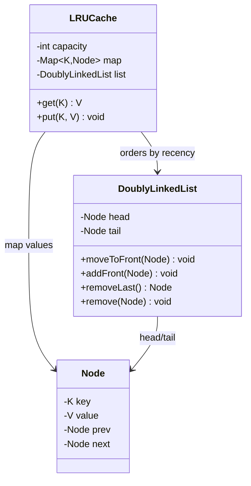

# Design an LRU cache

> A fixed-capacity cache that evicts the **least recently used** entry when full, with **O(1)** `get` and `put`. A favorite because the naive answer is O(n) and the good answer combines two data structures.

## Requirements

**Functional**
- `get(key)` returns the value and marks the key most-recently-used, or a miss.
- `put(key, value)` inserts/updates and marks it most-recently-used; if over capacity, evict the least-recently-used entry.
- Both operations must be **O(1)**.

**Assumptions**
- Single process, fixed capacity. The distributed version is [Design a distributed cache](../questions/design-distributed-cache.md).

## The key insight

You need two things in O(1): **lookup by key** and **ordering by recency**. Neither a plain array nor a plain map gives both. Combine them:

- A **hash map** `key → node` for O(1) lookup.
- A **doubly linked list** ordered most-recent → least-recent for O(1) reordering and eviction. The head is most-recently-used; the tail is the eviction candidate.

On access, unlink the node and move it to the head. On insert past capacity, drop the tail.

## Key flow

- **get(key)**: if `map` has it, `list.moveToFront(node)`, return `node.value`; else miss.
- **put(key, value)**: if present, update value and `moveToFront`. Else create a node, `map[key]=node`, `list.addFront(node)`; if `map.size > capacity`, `evicted = list.removeLast(); map.remove(evicted.key)`.

Using a **doubly** linked list (not singly) is what makes `remove(node)` O(1) — you have the node's `prev` directly, so no scan.

## Design notes and variants

- Many languages hand you this: Java's `LinkedHashMap(accessOrder=true)`, Python's `OrderedDict.move_to_end` / `functools.lru_cache`. In an interview, still explain the map + doubly-linked-list underneath.
- **LFU** (least-frequently-used) is the common follow-up — track frequency counts and evict the lowest; it needs a frequency→list index to stay O(1).
- **TTL** entries and **thread safety** (guard with a lock, or shard the cache to reduce contention) are natural extensions — see the [in-memory key-value store](key-value-store.md).

## Concurrency and edge cases

- **Thread safety**: `get` mutates order, so it's a *write* under the hood — a naive read lock isn't enough. Use a single lock, or a striped/segmented lock to cut contention.
- Capacity of 0, updating an existing key (don't double-count size), and eviction of the key you're inserting.

## Go deeper

- Related: [caching pattern](../patterns/caching.md), [distributed cache](../questions/design-distributed-cache.md).
- Full course: [Grokking the Low Level Design (LLD) Interview](https://www.designgurus.io/course/grokking-the-low-level-design-interview-using-ood)
