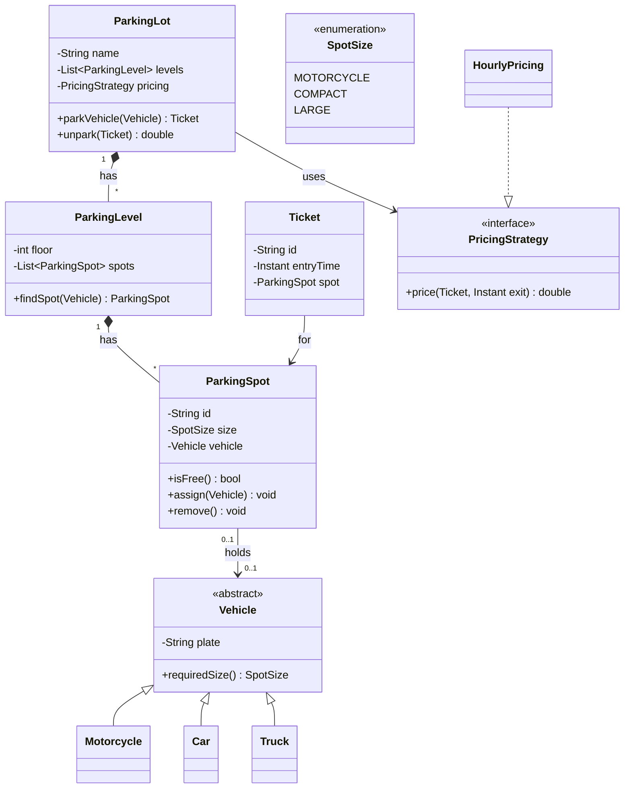

# Design a parking lot

> Model a multi-level parking lot: assign an incoming vehicle to a suitable spot, issue a ticket, and charge based on time parked. The canonical object-oriented design question.

## Requirements

**Functional**
- Multiple levels, each with many spots. Spots come in sizes (motorcycle, compact, large).
- A vehicle (motorcycle, car, truck) is assigned the smallest free spot it fits in.
- Issue a **ticket** on entry; compute a **fee** on exit based on duration and vehicle type.
- Track availability; reject entry when the lot is full.

**Out of scope / assumptions**
- Single lot (not a chain), one currency, payment success assumed. Reservations and EV charging are extensions.

## Core objects

Nouns → classes, verbs → methods:

- `ParkingLot` — the top-level controller (one instance): find a spot, issue/close tickets. **Singleton.**
- `ParkingLevel` — a floor holding many `ParkingSpot`s; knows its own availability.
- `ParkingSpot` — one space of a given `SpotSize`; can `assign`/`remove` a vehicle.
- `Vehicle` (abstract) → `Motorcycle`, `Car`, `Truck` — each knows the `SpotSize` it needs.
- `Ticket` — entry time, spot, vehicle; the record used to compute the fee.
- `PricingStrategy` (interface) → `HourlyPricing` — how a ticket becomes a fee. **Strategy.**

## Class diagram

## Key flow

**Park a vehicle:**
1. `ParkingLot.parkVehicle(vehicle)` iterates levels calling `level.findSpot(vehicle)`.
2. `findSpot` returns the smallest free spot whose `SpotSize` fits `vehicle.requiredSize()`.
3. If none, throw/return "lot full." Otherwise `spot.assign(vehicle)`, create a `Ticket`, return it.

**Unpark:**
1. `ParkingLot.unpark(ticket)` calls `pricing.price(ticket, now)` to compute the fee.
2. `ticket.spot.remove()` frees the spot; availability updates; return the fee.

## Design patterns used

- **Strategy** — `PricingStrategy` lets you swap flat/hourly/surge pricing without touching `ParkingLot` (open/closed).
- **Singleton** — one `ParkingLot` controller coordinates state.
- **Factory** (extension) — a `VehicleFactory`/`SpotFactory` centralizes creation when types grow.

## Concurrency and edge cases

- **The last spot, two cars.** Assigning a spot must be atomic — lock the spot (or use an atomic compare-and-set on `isFree`) so two threads can't claim it. See [distributed locking](../patterns/distributed-locking.md) for the multi-node version.
- **Fits-in logic.** A car can take a compact or large spot; define an ordering so you assign the *smallest* fitting spot and don't waste large spots.
- **Availability counters** per level make "is the lot full?" O(1) instead of scanning.
- **Lost ticket / clock skew** — decide the policy (max daily charge, server-side timestamps).

## Go deeper

- Related: [low-level design index](README.md); the distributed cousin is [distributed locking](../patterns/distributed-locking.md).
- Full course: [Grokking the Low Level Design (LLD) Interview](https://www.designgurus.io/course/grokking-the-low-level-design-interview-using-ood)
