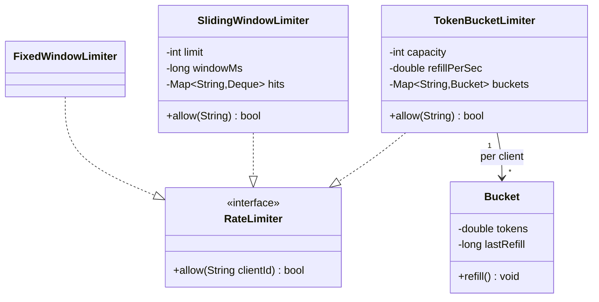

# Design a rate limiter (low-level)

> The class-level version of [rate limiting](../patterns/rate-limiting.md): an object that answers `allow(clientId)` → true/false under a configured rate, with the algorithm swappable. (The distributed, system-level version is [Design a rate limiter](../questions/design-rate-limiter.md).)

## Requirements

**Functional**
- `allow(clientId)` returns whether this request is permitted right now.
- Configurable limit (e.g., 100 requests / minute), per client.
- The algorithm (token bucket, sliding window, ...) should be swappable without changing callers.

**Assumptions**
- Single process, in-memory counters. The multi-node version shares state in Redis — see the [pattern](../patterns/rate-limiting.md).

## Core objects

- `RateLimiter` (interface) — `allow(clientId): boolean`. The contract callers depend on. **Strategy.**
- `TokenBucketLimiter`, `SlidingWindowLimiter`, `FixedWindowLimiter` — implementations.
- `Bucket` / `Window` — per-client state (tokens + last-refill, or timestamps).

## Token bucket, in words

Each client has a `Bucket` with `capacity` tokens that refills at `refillPerSec`. On `allow`: lazily refill based on elapsed time (`tokens = min(capacity, tokens + elapsed * refillPerSec)`), then if `tokens >= 1` consume one and permit, else deny. This allows short **bursts** up to `capacity` while capping the sustained rate — the property most APIs want.

## Design patterns used

- **Strategy** — `RateLimiter` interface lets you switch algorithms per route (a burst-tolerant token bucket for uploads, a strict sliding window for login).
- **Factory** (extension) — build the configured limiter from a policy object.

## Trade-offs of the algorithms

| Algorithm | Pros | Cons |
|-----------|------|------|
| Fixed window | Trivial, one counter | Boundary bursts (2× at the edge) |
| Sliding window log | Exact | Stores every timestamp (memory) |
| Sliding window counter | Smooth, cheap | Slight approximation |
| Token bucket | Allows bursts, simple | Two params to tune |

## Concurrency and edge cases

- **Thread safety**: `allow` reads-modifies-writes a bucket — guard per-client state with a lock or atomics so concurrent requests don't both consume the last token.
- **Memory**: unbounded clients → evict idle buckets (tie into an [LRU cache](lru-cache.md)) or use a TTL.
- **Clock**: use a monotonic clock for refills; the distributed version must agree on time across nodes.

## Go deeper

- Related: [rate limiting pattern](../patterns/rate-limiting.md), [system-level rate limiter](../questions/design-rate-limiter.md).
- Full course: [Grokking the Low Level Design (LLD) Interview](https://www.designgurus.io/course/grokking-the-low-level-design-interview-using-ood)
