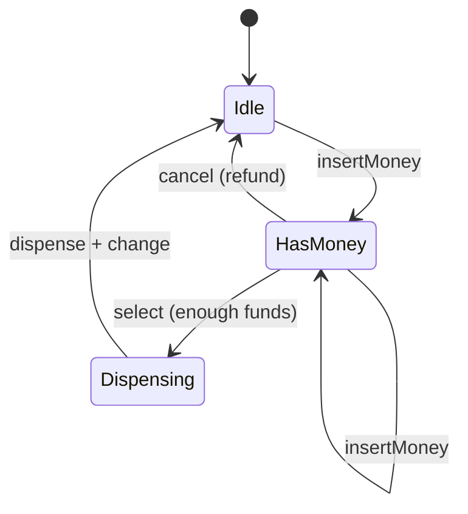
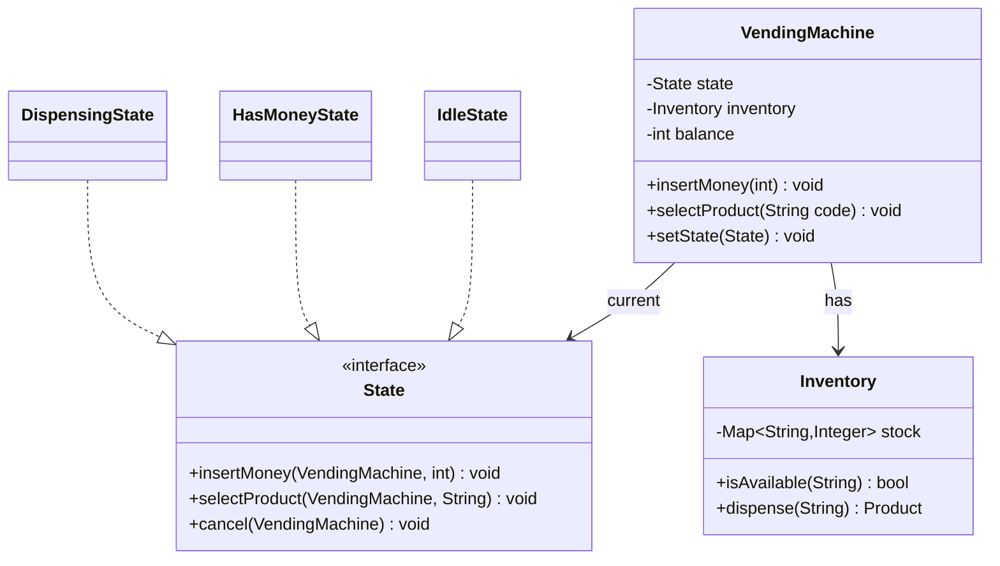

# Design a vending machine

> Accept coins, let a user pick a product, dispense it with change, and handle cancels and sold-outs. The textbook **State pattern** problem: the machine behaves differently depending on where it is in the flow.

## Requirements

**Functional**
- Show products with prices and stock.
- Insert money incrementally; select a product; dispense it and return change; or cancel and refund.
- Reject selection when under-paid or sold out.

**Assumptions**
- Single-select per transaction; the machine has a coin/note inventory for change.

## Why a state machine

The same action means different things depending on state. Pressing "select" does nothing in `Idle`, validates funds in `HasMoney`, and is ignored in `Dispensing`. Encoding that as flags and nested `if`s gets unreadable fast. Model each mode as a `State` object that knows which transitions are legal.

## Core objects

- `VendingMachine` — the context; holds current `State`, the `Inventory`, and the balance.
- `State` (interface) → `IdleState`, `HasMoneyState`, `DispensingState` — each implements the same actions (`insertMoney`, `selectProduct`, `dispense`, `cancel`) but legally for its mode.
- `Inventory` — product → count; `Product` — name, price, code.

## Key flow

1. `Idle` + `insertMoney(50)` → machine adds to balance and `setState(HasMoney)`.
2. `HasMoney` + `selectProduct("A1")` → check stock and `balance >= price`. If ok, `setState(Dispensing)`; else stay and prompt for more money or show sold-out.
3. `Dispensing` → `inventory.dispense`, return `balance - price` as change, `setState(Idle)`.
4. `cancel` in `HasMoney` refunds the balance and returns to `Idle`.

## Design patterns used

- **State** — each state object encapsulates legal transitions; adding a "maintenance" mode is a new class, not edits everywhere (open/closed).
- **Strategy** (extension) — a `ChangeStrategy` for how to make change (greedy vs. exact) when coin denominations matter.

## Concurrency and edge cases

- Concurrent inserts/selects on a shared machine — serialize per machine, or guard the balance and inventory.
- **Change unavailable**: if the machine can't make exact change, refuse the sale or warn before taking money.
- Product goes out of stock between display and select; power loss mid-dispense (persist the transaction).

## Go deeper

- Related: [low-level design index](README.md); the [elevator](elevator-system.md) is another State-pattern problem.
- Full course: [Grokking the Low Level Design (LLD) Interview](https://www.designgurus.io/course/grokking-the-low-level-design-interview-using-ood)
