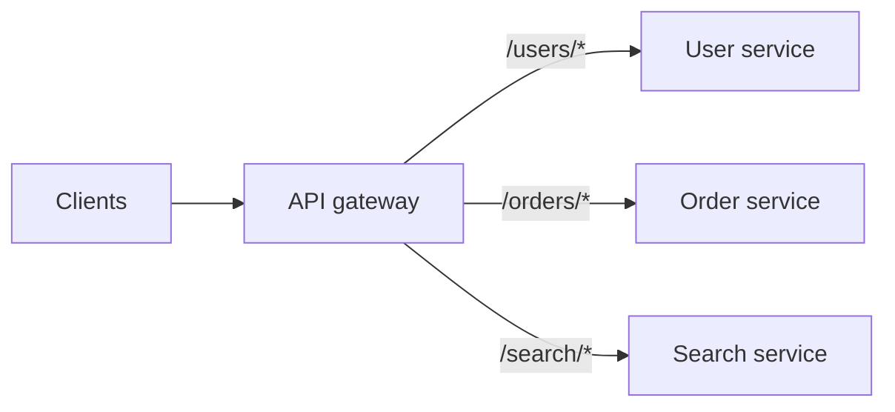

# API gateway

> A single entry point in front of your services that handles auth, rate limiting, routing, and other cross-cutting concerns once.

## What it is

An API gateway is a specialized reverse proxy (see [proxies](proxies.md)) that all client traffic passes through before reaching backend services. Instead of every microservice re-implementing authentication, rate limiting, and logging, the gateway does it once at the edge and forwards clean, authorized requests inward.

## What it handles

- **Authentication and authorization**: validate tokens, reject bad requests before they touch a service.
- **Rate limiting and quotas**: per user, key, or IP (see [rate limiting](rate-limiting.md)).
- **Routing**: map paths and versions to services; canary and blue-green traffic splits.
- **Protocol translation**: HTTP/JSON outside, gRPC inside; WebSocket termination.
- **Aggregation**: fan out one client call to several services and merge the responses (backend-for-frontend).
- **Observability**: one choke point for logging, metrics, and tracing headers.

## Gateway vs load balancer

A load balancer distributes identical traffic across copies of one service and works at L4/L7 with little application knowledge. A gateway is application-aware: it routes by path and identity, enforces API policy, and transforms requests. Real deployments use both: DNS to load balancer, load balancer to gateway fleet, gateway to services.

## Trade-offs

| Pro | Con |
|-----|-----|
| Cross-cutting concerns implemented once | Extra hop of latency on every request |
| Services stay small and focused | A choke point: must be replicated and scaled itself |
| Clients see one stable surface while services evolve | Easy to overload with logic until it becomes a monolith at the edge |

## How to talk about it in an interview

Draw it at the front of any microservices design and list two or three concrete responsibilities (auth, rate limiting, routing). Expect follow-ups on how the gateway itself scales (stateless fleet behind a load balancer) and what happens when it is down (nothing works, so run multiple instances across zones).

## Go deeper

- Full question walkthrough: [Design an API gateway](../questions/design-api-gateway.md)
- Every pattern, in depth: [System Design Patterns](https://www.designgurus.io/course/system-design-patterns)
- Full course: [Grokking the System Design Interview](https://www.designgurus.io/course/grokking-the-system-design-interview)