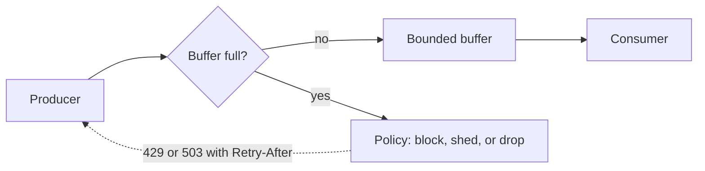

# Backpressure

> When a system cannot keep up, it must push back on its callers instead of buffering until it dies.

## What it is

Overload starts when producers send work faster than a consumer can process it. Without a plan, the excess piles up in queues and memory. Latency grows, then the process runs out of memory and dies, and the failure spreads to everything upstream. Backpressure is the set of mechanisms that surface a "slow down" signal to the source of the work.

The core rule: every buffer must be bounded, and every bounded buffer needs a policy for what happens when it fills. An unbounded queue does not remove overload. It hides overload until it is fatal.

## When the buffer fills

- **Block the producer.** The producer waits until space opens. This is the natural behavior in pull systems, where the consumer takes work only when it is ready.
- **Shed load.** Reject new work with an explicit error: HTTP 429 (too many requests) or 503 (service unavailable), plus a Retry-After header so callers know when to retry. [Rate limiting](rate-limiting.md) is the preemptive form of this: it sheds load before any buffer fills.
- **Drop data.** Discard some items. This is fine for telemetry and metrics, where fresh data is worth more than complete data. Say which drop policy you use: drop the oldest items or drop the newest.

## How it works

Pull beats push. In pull-based consumption, like a consumer reading from a [message queue](message-queues.md), backpressure is automatic: the consumer takes only what it can handle, and the backlog (consumer lag) grows where you can see it. In push-based chains, where one service calls another directly, you need explicit signals: a timeout on every call, bounded connection pools, and a [circuit breaker](circuit-breaker.md) for when a dependency stops keeping up.

Two operational notes:

- **Autoscale on the right signal.** Scale consumers on queue depth or consumer lag, not CPU. Consumers blocked on a slow downstream dependency look idle on CPU while the queue keeps growing.
- **Watch three numbers.** Queue depth, consumer lag, and time-in-queue. Alert on the trend (lag rising for ten minutes), not only on a fixed threshold.

## Trade-offs

| Pro | Con |
|-----|-----|
| Bounded buffer plus shedding gives predictable latency and memory | Some work is rejected under load, and callers must handle that |
| Overload becomes visible early, as lag and rejection counts | Picking bounds and policies takes real capacity thinking |

## How to talk about it in an interview

"What happens when the consumer falls behind?" is one of the most reliable interview probes. The strong answer names three things in a single sentence: the bound (the queue holds at most N items), the policy (past that we shed with 429 and Retry-After, or drop the oldest telemetry), and the metric (we alert on lag trend and scale consumers on it). Designing a queue yourself makes all of this concrete: see [Design a Distributed Message Queue](../questions/design-distributed-message-queue.md). The queue technology you pick also decides how much backpressure you get for free: compare [Kafka vs RabbitMQ vs SQS](../cheat-sheets/kafka-vs-rabbitmq-vs-sqs.md).

## Go deeper

- Every pattern, in depth: [System Design Patterns](https://www.designgurus.io/course/system-design-patterns?utm_source=github&utm_medium=repo&utm_campaign=grokking-system-design&utm_content=patterns-backpressure)
- Full course: [Grokking the System Design Interview](https://www.designgurus.io/course/grokking-the-system-design-interview?utm_source=github&utm_medium=repo&utm_campaign=grokking-system-design&utm_content=patterns-backpressure)
