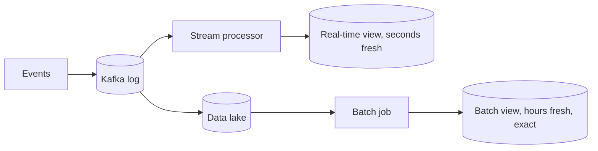

# Batch vs stream processing

> Two ways to compute over large data: process accumulated data on a schedule, or process each event as it arrives.

## What it is

- **Batch processing** runs a job over a large, bounded dataset on a schedule: nightly reports, model training, rebuilding a search index. High throughput, results delayed by hours. Tools: Spark, MapReduce, SQL warehouses.
- **Stream processing** consumes an unbounded flow of events and updates results within seconds: live dashboards, fraud detection, trending topics. Tools: Flink, Spark Streaming, Kafka Streams, usually fed by a [message queue](message-queues.md) or log like [Kafka](../deep-dives/kafka-distributed-messaging.md).

## How to choose

| Question | Batch | Stream |
|----------|-------|--------|
| How fresh must results be? | Hours are fine | Seconds to minutes |
| Accuracy requirements | Exact, easy to recompute | Approximations often acceptable |
| Complexity budget | Lower: reruns are cheap, bugs are re-runnable | Higher: state, ordering, late events, exactly-once |
| Typical examples | Billing, reports, ML training, reindexing | Fraud checks, live metrics, notifications, trending |

Many real systems combine both, as in the diagram above: a streaming path for freshness and a batch path that periodically recomputes the exact answer and corrects any streaming drift (the lambda architecture; kappa architecture keeps only the stream and replays the log when logic changes).

## Streaming's hard parts

Worth naming in an interview: **event time vs processing time** (events arrive late and out of order, handled with watermarks), **windowing** (tumbling, sliding, session windows for "per minute" style aggregations), and **exactly-once results** (achieved with checkpointed state and [idempotent](idempotency.md) sinks, since delivery itself is at-least-once).

## How to talk about it in an interview

State the freshness requirement first, then pick: "trending topics needs minutes, so stream; billing needs to be exact, so nightly batch." For analytics-flavored questions (ad click aggregation, metrics, news feeds ranking), proposing a streaming path plus a batch reconciliation path is a reliably strong answer.

## Go deeper

- Full question walkthroughs: [Design an ad click aggregator](../questions/design-ad-click-aggregator.md), [Design a metrics and monitoring system](../questions/design-metrics-monitoring.md)
- Every pattern, in depth: [System Design Patterns](https://www.designgurus.io/course/system-design-patterns)
- Full course: [Grokking the System Design Interview](https://www.designgurus.io/course/grokking-the-system-design-interview)