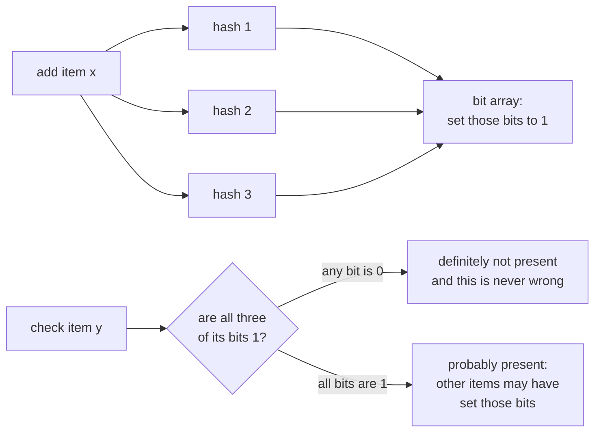

# Bloom filters

> A small, fast structure that tells you an item is "definitely not present" or "possibly present", using very little memory.

## What it is

A Bloom filter is a probabilistic set membership test. It can return false positives (it may say "possibly present" for something that is not there) but never false negatives (if it says "not present", that is certain). In exchange, it uses far less memory than storing the actual set.

## How it works

The asymmetry is the whole point. One answer is certain, the other is a probability:

A bit array plus several hash functions. To add an item, hash it with each function and set those bits to 1. To check an item, hash it the same way: if any of those bits is 0, the item is definitely not in the set; if all are 1, it is probably in the set (those bits could have been set by other items).

## Where it is used

- Skip an expensive lookup: check the Bloom filter before hitting disk or a remote store, to avoid work for keys that do not exist (databases like Cassandra use this to avoid disk reads).
- Cache filtering: avoid caching one-hit items.
- Deduplication and "have I seen this before" checks at scale (for example a web crawler avoiding re-crawling URLs).

## Trade-offs

| Pro | Con |
|-----|-----|
| Tiny memory footprint | False positives (tunable, never false negatives) |
| Very fast inserts and lookups | Cannot delete from a basic Bloom filter |
| Great as a pre-check before expensive work | Not a replacement for the real store |

The false positive rate is tunable by sizing the bit array and the number of hash functions for your expected item count.

## Go deeper

- Every pattern, in depth: [System Design Patterns](https://www.designgurus.io/course/system-design-patterns?utm_source=github&utm_medium=repo&utm_campaign=grokking-system-design&utm_content=patterns-bloom-filters)
- For harder, distributed-systems depth: [Advanced System Design Interview, Volume II](https://www.designgurus.io/course/grokking-system-design-interview-ii?utm_source=github&utm_medium=repo&utm_campaign=grokking-system-design&utm_content=patterns-bloom-filters)
- Every pattern, in depth: [System Design Patterns](https://www.designgurus.io/course/system-design-patterns?utm_source=github&utm_medium=repo&utm_campaign=grokking-system-design&utm_content=patterns-bloom-filters)
- Full course: [Grokking the System Design Interview](https://www.designgurus.io/course/grokking-the-system-design-interview?utm_source=github&utm_medium=repo&utm_campaign=grokking-system-design&utm_content=patterns-bloom-filters)