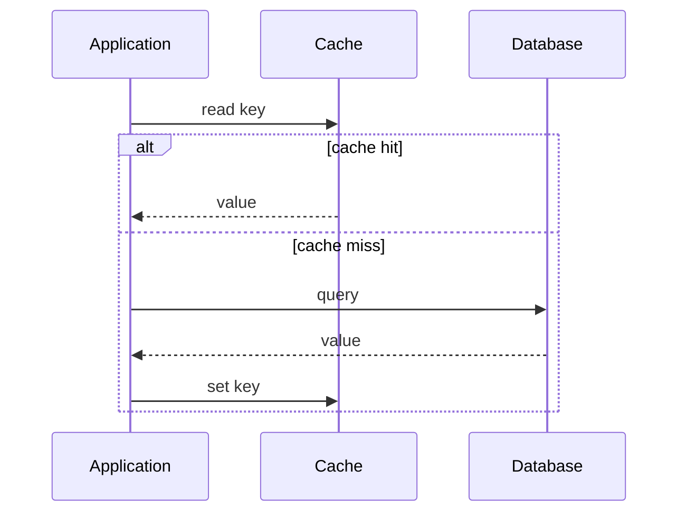
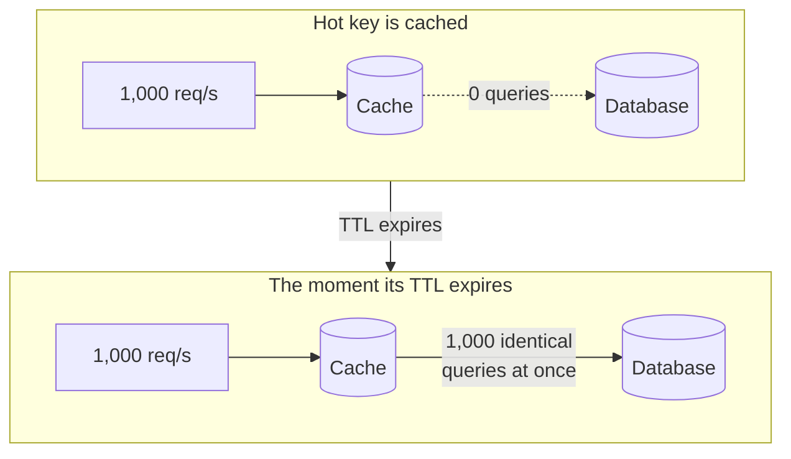

# Caching

> Store the results of expensive work close to where they are needed, so repeated reads are fast and cheap.

## What it is

A cache is a fast, usually in-memory store that holds copies of data so that future requests can be served without hitting the slower source of truth (a database, a downstream service, or a computation). Caching trades a small amount of memory and some risk of staleness for large gains in read latency and throughput.

The cache-aside read flow:

The reason this pays off is the size of the gap it skips. A main memory reference is about 100 nanoseconds and an SSD random read is about 100 microseconds, so a cache hit avoids something roughly a thousand times slower. See [latency numbers](../cheat-sheets/latency-numbers.md) for the full ladder.

## When to use it

- Read-heavy workloads where the same data is requested often.
- Expensive reads (complex queries, downstream calls, heavy computation).
- Data that tolerates being slightly stale (profiles, product catalogs, feeds).
- Hot keys that would otherwise overload the data store.

## Where caches live

- Client side (browser, app memory).
- CDN or edge (static assets, see [CDN](cdn.md)).
- Application or service layer (in-process or a shared cache like Redis or Memcached).
- Database layer (query and buffer caches).

A request can pass through several of these, so say which layer you mean. "Add a cache" is not a design; "an in-process cache in front of a shared Redis, with the CDN handling images" is.

## Caching strategies

| Strategy | How it works | Best for |
|----------|--------------|----------|
| Cache-aside (lazy) | App reads cache, on miss reads the DB and populates the cache | General read-heavy workloads |
| Read-through | The cache itself loads from the DB on a miss | Simpler app code, cache library handles loads |
| Write-through | Writes go to the cache and the DB together | Read-after-write consistency, slower writes |
| Write-back (write-behind) | Writes go to the cache, flushed to the DB later | Write-heavy, can tolerate some loss risk |

Cache-aside is the default and the one to name unless you have a reason. Write-back is the one to be careful with: an unflushed cache that loses power loses committed writes, so it needs durability of its own before you propose it.

## Sizing: think in miss rate, not hit rate

This is the part most candidates skip, and it is where the interesting numbers are.

A hit ratio sounds like a score, so 95% sounds close to 99%. For the database it is not close at all. What reaches the database is the **miss** rate, so going from 95% to 99% takes misses from 5 in 100 to 1 in 100. That is five times less database load from a four point change.

Work the example out loud. At 10,000 reads per second:

| Hit ratio | Misses reaching the database |
|-----------|------------------------------|
| 90% | 1,000 per second |
| 95% | 500 per second |
| 99% | 100 per second |
| 99.9% | 10 per second |

Two things follow. First, the last few points of hit ratio are worth far more than the first ninety. Second, a cache is a load-shedding device before it is a latency device, and the database must still be able to survive the misses.

The hit ratio you get depends on how much of the working set fits in memory. Access is usually very uneven, so a cache holding the busiest few percent of keys often serves most reads. That is why the honest sizing question is "how large is the hot set", not "how large is the data".

## Eviction policies

When the cache is full, something must go. Common policies: LRU (least recently used), LFU (least frequently used), FIFO, and TTL-based expiry. LRU is the common default.

LRU is a good default, and it has one known weakness worth naming: a large scan touches many keys once and evicts the genuinely hot ones. LFU resists that, at the cost of adapting more slowly when what is popular changes.

## The failure mode to name: the cache stampede

When a hot key expires, every request that wanted it misses at the same moment, and all of them hit the database together:

The database was doing nothing, and one expiry hands it the full read volume. Three standard fixes, and you should be able to name the trade-off of each:

- **Request coalescing:** on a miss, one request loads the value and the rest wait for it. Cheap and effective; adds a lock on the hot path.
- **Staggered TTLs:** add a small random offset to each expiry so keys do not expire together. Trivial to do and it solves the synchronized case, but not a single very hot key.
- **Early recomputation:** refresh the value slightly before it expires, in the background. Best latency, most machinery.

The related failures are worth a sentence each: a **cache miss for a key that does not exist** (answered with a negative cache entry or a [bloom filter](bloom-filters.md)), and a **cold cache after a restart**, which is why you never restart every cache node at once.

## Trade-offs

| Pro | Con |
|-----|-----|
| Much lower read latency | Risk of serving stale data |
| Less load on the data store | Cache invalidation is hard |
| Cheap to scale reads | Extra moving part to operate and monitor |

## The hard parts to mention in an interview

- Invalidation: how do you keep the cache fresh? (TTLs, write-through, explicit invalidation on update.)
- The thundering herd or cache stampede: when a hot key expires, many requests hit the DB at once. Mitigations: request coalescing, staggered TTLs, locks.
- Consistency: what is the staleness budget for this data? State it explicitly.

The staleness budget is the sentence that separates a strong answer. Do not say "we will cache it". Say how wrong the value is allowed to be, and for how long: "a profile can be 60 seconds stale, so a 60-second TTL is enough and I do not need to invalidate on write", or "a permission check cannot be stale at all, so this one is write-through and I accept the slower write".

## What to say in an interview

A complete answer names five things, in this order:

1. **What you are caching and where.** The key, the value, and the layer.
2. **The strategy.** Usually cache-aside; say so and move on.
3. **The staleness budget.** How stale is acceptable, and what happens when it is exceeded.
4. **The eviction and TTL.** What leaves, and when.
5. **The failure mode.** What happens when the cache is empty, or when it goes down entirely.

Point 5 is the one interviewers push on. If your database cannot serve the traffic with an empty cache, your cache is not an optimization, it is a load-bearing component, and it needs the availability story to match.

## Related pages

- Choosing the store itself: [Redis vs Memcached](../cheat-sheets/redis-vs-memcached.md).
- Distributing keys across cache nodes: [consistent hashing](consistent-hashing.md).
- Caching at the edge instead of in your data center: [CDN](cdn.md).
- The pattern operated at its limit, in production: [Memcached at Facebook](../deep-dives/memcached-at-facebook.md).

## Go deeper

- Read more (free): [Caching in System Design Interviews](https://www.designgurus.io/blog/caching-system-design-interview?utm_source=github&utm_medium=repo&utm_campaign=grokking-system-design&utm_content=patterns-caching)
- Every pattern, in depth: [System Design Patterns](https://www.designgurus.io/course/system-design-patterns?utm_source=github&utm_medium=repo&utm_campaign=grokking-system-design&utm_content=patterns-caching)
- Full course: [Grokking the System Design Interview](https://www.designgurus.io/course/grokking-the-system-design-interview?utm_source=github&utm_medium=repo&utm_campaign=grokking-system-design&utm_content=patterns-caching)
