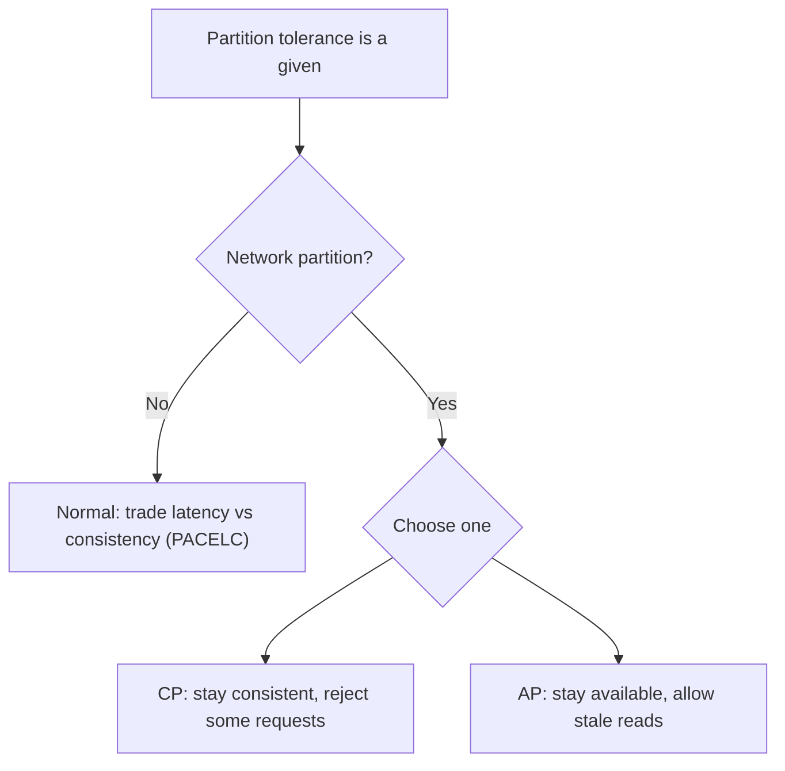

# CAP theorem

> In a distributed system, when a network partition happens, you can keep either consistency or availability, not both.

## What it is

The CAP theorem says a distributed data store can provide at most two of three guarantees: Consistency (every read sees the latest write), Availability (every request gets a non-error response), and Partition tolerance (the system keeps working despite dropped messages between nodes). Because network partitions are unavoidable in practice, partition tolerance is a given, so the real choice during a partition is between consistency and availability.

## The practical choice

- CP (consistency over availability): during a partition, refuse requests that cannot be made consistent. Example use: systems where a wrong answer is worse than no answer (banking balances).
- AP (availability over consistency): during a partition, keep serving, accepting that some reads may be stale. Example use: systems where being up matters more than being perfectly fresh (social feeds, shopping carts).

## PACELC: the more complete picture

CAP only describes behavior during a partition. PACELC extends it: if there is a Partition, choose between Availability and Consistency; Else (normal operation), choose between Latency and Consistency. Most real systems trade some consistency for lower latency even when there is no partition.

## How to talk about it in an interview

Do not recite "pick two." Instead say which guarantee the system favors during a partition and why, tied to the product. For example: "this is a feed, so I favor availability and accept eventual consistency." Mentioning PACELC and the latency-versus-consistency trade-off in normal operation is a strong senior signal.

## Go deeper

- Read more (free): [CAP Theorem vs PACELC](https://www.designgurus.io/blog/system-design-interview-basics-cap-vs-pacelc)
- Full course: [Grokking the System Design Interview](https://www.designgurus.io/course/grokking-the-system-design-interview)